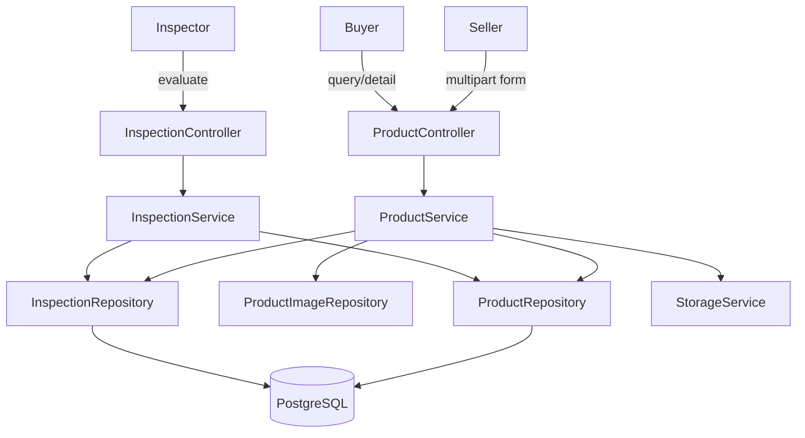

# Product + Inspection Business Rules Hardening Design

## Architecture Overview

- `ProductService` remains the enforcement point for listing validation, listing ownership, soft delete, public search visibility, and product response mapping.
- `InspectionService` remains the source of truth for inspection validity and inspection evaluation.
- Verified badge state is derived at read time from inspection validity, not stored as a separate mutable flag.

## Data Models

- `Product`
  - add soft delete marker with `deletedAt`
  - continue storing `frameSize`, `wheelSize`, `groupset`, `expiresAt`, and status
- `Inspection`
  - keep existing inspection report fields
  - validity stays time-based with `validUntil`
- `ProductResponse`
  - add public inspection summary block so product detail can expose inspection report data directly

## API Design

- `POST /api/products`
  - validate required technical fields and minimum image count
  - set `expiresAt` to 30 days ahead
- `PUT /api/products/{id}`
  - preserve ownership check
  - reset listing to `pending`
  - invalidate badge visibility by moving status away from currently approved/public states
- `DELETE /api/products/{id}`
  - soft delete listing
- `GET /api/products/my`
  - return listings for current seller only
- `GET /api/products`
  - exclude deleted listings
  - support additional technical filters
- `GET /api/products/{id}`
  - include inspection summary/report visibility when available

## Component Breakdown

- Controller layer
  - keep thin request handling
- Service layer
  - centralize validation and response mapping helpers
- Repository layer
  - add query helpers for seller listings and valid inspection lookup
- Migration layer
  - add `deleted_at` and supporting indexes/constraints only
- Test layer
  - use focused Mockito service tests for changed rules

## Design Decisions

- Use soft delete with `deletedAt` instead of hard delete to match SRS and preserve auditability.
- Derive verified state from inspection validity rather than storing a duplicate boolean on `Product`.
- Keep public inspection exposure read-only through product response mapping to avoid coupling product writes to inspection storage.
- Defer true video storage support out of MVP because the backend model does not yet support it cleanly and the team is prioritizing payment/test/admin depth first.

## Non-Functional Requirements

- Public search must not leak deleted listings.
- Ownership checks remain based on authenticated user context.
- Schema changes must be backward-compatible and additive.
- Validation errors should fail early before storage upload or database write.
