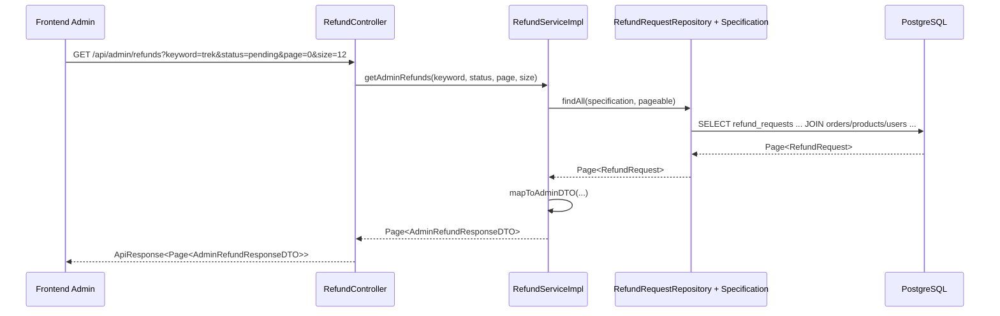

# Admin Refund List And Review Flow Basics - 2026-03-18

## Bối cảnh

Trước thay đổi này, backend đã có:

- API buyer tạo yêu cầu hoàn tiền
- API admin review một yêu cầu hoàn tiền cụ thể

Nhưng FE admin chưa thể dùng dữ liệu thật cho màn tranh chấp, vì backend còn thiếu API:

- lấy danh sách refund cho admin

Tức là admin chỉ “xử lý từng yêu cầu nếu biết sẵn `refundId`”, nhưng chưa có đường chính thống để tải cả danh sách lên màn quản trị.

## Khái niệm cần hiểu

### Refund request

`Refund request` là bản ghi yêu cầu hoàn tiền.

Ví dụ:

- buyer đã đặt cọc
- sau đó phát hiện xe có vấn đề
- buyer gửi lý do và bằng chứng
- hệ thống tạo một `RefundRequest`

### DTO

`DTO` là viết tắt của `Data Transfer Object`.

Nói đơn giản:

- đây là object dùng để gửi dữ liệu ra API
- nó không phải entity database

Trong task này có DTO mới:

- `AdminRefundResponseDTO`

DTO này giúp backend trả đúng dữ liệu admin cần xem, thay vì trả thẳng entity `RefundRequest`.

### Specification

`Specification` là cách viết điều kiện truy vấn động trong Spring Data JPA.

Nói dễ hiểu:

- thay vì viết một query cứng cho từng trường hợp
- ta có thể lắp nhiều điều kiện lọc lại với nhau

Trong task này:

- `RefundRequestSpecification` giúp lọc refund theo `keyword` và `status`

## Thay đổi chính trong backend

### File mới

- `src/main/java/com/backend/old_bicycle_project/dto/response/AdminRefundResponseDTO.java`
- `src/main/java/com/backend/old_bicycle_project/specification/RefundRequestSpecification.java`

### File được mở rộng

- `src/main/java/com/backend/old_bicycle_project/controller/RefundController.java`
- `src/main/java/com/backend/old_bicycle_project/service/RefundService.java`
- `src/main/java/com/backend/old_bicycle_project/service/impl/RefundServiceImpl.java`
- `src/main/java/com/backend/old_bicycle_project/repository/RefundRequestRepository.java`
- `src/main/java/com/backend/old_bicycle_project/repository/InspectionRepository.java`

## API mới

### `GET /api/admin/refunds`

API này cho admin lấy danh sách refund theo filter.

#### Query params

- `keyword` (tùy chọn)
- `status` (tùy chọn)
- `page`
- `size`

#### Quyền truy cập

- chỉ `ADMIN`

## Luồng đi end-to-end



## Giải thích từng lớp

### 1. Client gửi gì?

Frontend admin gửi request:

- muốn xem danh sách refund
- có thể lọc theo từ khóa hoặc trạng thái

Ví dụ:

```http
GET /api/admin/refunds?status=pending&page=0&size=12
```

### 2. Controller làm gì?

`RefundController`:

- nhận query params
- kiểm tra role qua `@PreAuthorize("hasRole('ADMIN')")`
- gọi service
- bọc kết quả vào `ApiResponse`

Controller không tự viết business logic lớn.

### 3. Service làm gì?

`RefundServiceImpl`:

- tạo `PageRequest`
- dùng `RefundRequestSpecification` để sinh điều kiện lọc
- gọi repository
- map từng `RefundRequest` sang `AdminRefundResponseDTO`

Đây là lớp quyết định “admin cần nhìn thấy gì”.

### 4. Repository làm gì?

`RefundRequestRepository`:

- được mở rộng thêm `JpaSpecificationExecutor`
- nhờ đó có thể chạy `findAll(specification, pageable)`

Repository chịu trách nhiệm truy vấn dữ liệu từ database.

### 5. Database thay đổi gì?

Task này không cần migration mới.

Database vẫn dùng các bảng đã có:

- `refund_requests`
- `orders`
- `payments`
- `products`
- `users`

Điểm mới là backend tận dụng các quan hệ sẵn có để tổng hợp dữ liệu admin cần xem.

### 6. Response trả về là gì?

Backend trả về DTO giàu thông tin hơn, gồm:

- thông tin buyer
- thông tin seller
- sản phẩm liên quan
- số tiền
- lý do refund
- trạng thái refund
- trạng thái order / funding
- có inspection hay không

## Vì sao phải kiểm tra `hasInspection`?

Trong tranh chấp của dự án này, inspection là bằng chứng quan trọng.

Theo SRS:

- kết quả từ Inspector là căn cứ ưu tiên để admin quyết định hoàn tiền

Nên admin page cần biết nhanh:

- sản phẩm đó có báo cáo kiểm định hay không

Vì vậy service dùng thêm:

- `InspectionRepository.existsByProductId(...)`

## Ví dụ nhỏ để dễ hiểu

Giả sử có 1 refund:

- sản phẩm: `Trek Domane SL6`
- buyer: `Nguyễn Văn A`
- seller: `Trần Văn B`
- status: `pending`

Trước đây admin muốn xử lý thì phải “biết sẵn refund đó”.

Sau thay đổi này, admin chỉ cần mở màn FE:

1. FE gọi `GET /api/admin/refunds`
2. backend trả về page dữ liệu
3. FE render bảng
4. admin bấm xem chi tiết hoặc review

## Lỗi dễ gặp

### 1. Trả entity thẳng ra ngoài

Nếu trả thẳng `RefundRequest`, FE thường sẽ:

- thiếu field cần thiết
- hoặc phải tự suy ra quá nhiều

DTO giúp giải quyết việc này.

### 2. Không filter bằng specification

Nếu viết tay nhiều query riêng lẻ, code sẽ nhanh bị rối.

Specification phù hợp hơn khi:

- có `keyword`
- có `status`
- có phân trang

### 3. Chỉ có API review mà không có API list

Đây chính là lỗ hổng trước task này.

FE admin không thể gắn màn tranh chấp thật nếu backend không có list endpoint.

## Tóm tắt

- Backend đã thêm `GET /api/admin/refunds`.
- API này giúp FE admin tranh chấp dùng dữ liệu thật.
- `AdminRefundResponseDTO` là lớp dữ liệu trả ra cho FE.
- `RefundRequestSpecification` giúp lọc linh hoạt theo `keyword` và `status`.
- Luồng chính của task là:

`client -> controller -> service -> repository -> database -> response`

Nếu muốn đọc code theo đúng luồng, nên xem theo thứ tự:

1. `RefundController.java`
2. `RefundService.java`
3. `RefundServiceImpl.java`
4. `RefundRequestSpecification.java`
5. `RefundRequestRepository.java`
6. `AdminRefundResponseDTO.java`
