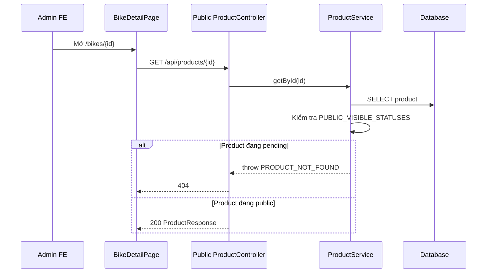
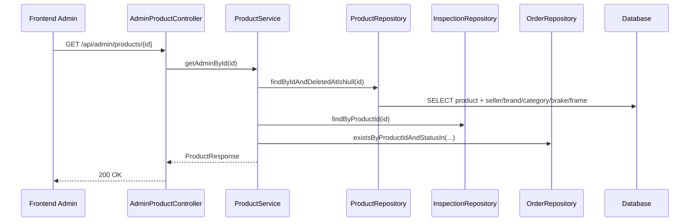
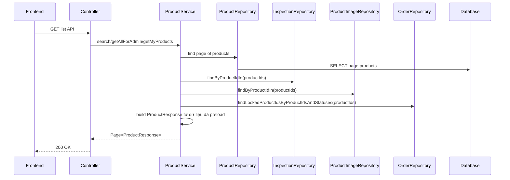
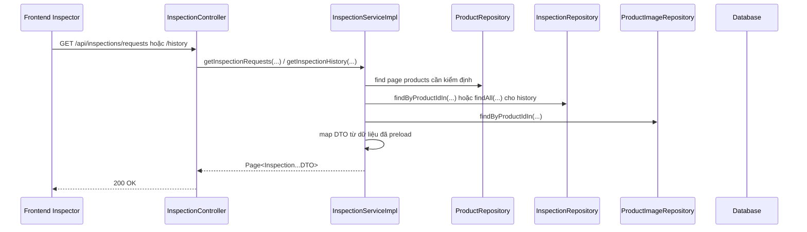

# Tối ưu danh sách Admin, Seller, Inspector và chi tiết tin chờ duyệt

## 1. Bối cảnh

Ở tranche này có 2 nhóm vấn đề người dùng nhìn thấy khá rõ:

- Trang `Duyệt tin đăng` của admin tải dữ liệu chậm hơn các tab khác.
- Admin bấm `Xem chi tiết` một tin đang `pending` thì frontend báo `Không thể tải thông tin xe`.

Nhìn bề ngoài, đây có vẻ là lỗi ở frontend. Nhưng gốc của vấn đề nằm ở cả 2 phía:

- frontend đi nhầm vào API công khai
- backend đang map dữ liệu danh sách theo kiểu phát sinh nhiều query nhỏ

## 2. `N+1 query` là gì?

`N+1 query` là một lỗi hiệu năng rất phổ biến khi dùng ORM như JPA/Hibernate.

Hiểu đơn giản:

1. backend lấy danh sách chính, ví dụ 12 sản phẩm
2. sau đó với mỗi sản phẩm lại đi hỏi thêm inspection, ảnh, trạng thái giao dịch

Nếu làm như vậy, thay vì chỉ có 1 vài query lớn, hệ thống sẽ chạy rất nhiều query nhỏ nối tiếp nhau.

Ví dụ:

- Query 1: lấy 12 product
- Query 2 tới Query 13: mỗi product lại kiểm tra inspection
- Query 14 tới Query 25: mỗi product lại kiểm tra product có giao dịch đang mở không
- Query 26 tới Query 37: mỗi product lại lấy ảnh

Kết quả là dữ liệu vẫn đúng, nhưng phản hồi chậm đi rõ rệt.

## 3. Vì sao admin xem chi tiết tin `pending` lại bị lỗi?

Trước khi sửa, luồng chạy như sau:

Điểm quan trọng:

- API `GET /api/products/{id}` là API công khai
- API công khai chỉ cho xem các trạng thái public như `active`, `pending_inspection`, `inspected_passed`, `inspected_failed`
- `pending` không phải trạng thái public

Nghĩa là product vẫn tồn tại, nhưng admin đã đi sai cửa.

## 4. Backend đã sửa như thế nào?

### 4.1. Thêm API detail riêng cho admin

File:

- `src/main/java/com/backend/old_bicycle_project/controller/AdminProductController.java`
- `src/main/java/com/backend/old_bicycle_project/service/ProductService.java`

API mới:

- `GET /api/admin/products/{id}`

API này cho admin xem tin ở trạng thái `pending`, `active`, `hidden` miễn là product chưa bị soft delete.

### 4.2. Giảm `N+1` cho danh sách product

File:

- `src/main/java/com/backend/old_bicycle_project/service/ProductService.java`
- `src/main/java/com/backend/old_bicycle_project/repository/ProductRepository.java`
- `src/main/java/com/backend/old_bicycle_project/repository/ProductImageRepository.java`
- `src/main/java/com/backend/old_bicycle_project/repository/InspectionRepository.java`
- `src/main/java/com/backend/old_bicycle_project/repository/OrderRepository.java`

Thay đổi chính:

- preload các quan hệ `to-one` bằng `@EntityGraph`
- lấy inspection theo lô bằng `findByProductIdIn(...)`
- lấy ảnh theo lô bằng `findByProductIdInOrderByProductIdAscDisplayOrderAsc(...)`
- lấy danh sách product đang bị khóa giao dịch theo lô bằng `findLockedProductIdsByProductIdsAndStatuses(...)`

Sau đó service dùng các map đã preload sẵn để build `ProductResponse`.

### 4.3. Tối ưu queue/history cho inspector

File:

- `src/main/java/com/backend/old_bicycle_project/service/impl/InspectionServiceImpl.java`
- `src/main/java/com/backend/old_bicycle_project/repository/InspectionRepository.java`
- `src/main/java/com/backend/old_bicycle_project/repository/ProductImageRepository.java`

Trước khi sửa, phần inspector có nguy cơ chậm tương tự vì mỗi item lịch sử hoặc hàng chờ lại có thể kéo theo:

- product
- seller
- inspection
- ảnh chính

Sau khi sửa:

- preload inspection theo lô
- preload ảnh chính theo lô
- preload product, seller, inspector bằng `@EntityGraph`

## 5. Luồng backend sau khi sửa

### 5.1. Admin xem chi tiết tin chờ duyệt

### 5.2. Admin hoặc seller lấy danh sách product

### 5.3. Inspector lấy hàng chờ hoặc lịch sử kiểm định

## 6. Vì sao cách sửa này nhanh hơn?

Vì bây giờ backend làm theo hướng:

1. lấy danh sách product hoặc inspection trước
2. gom toàn bộ `productId`
3. preload dữ liệu phụ bằng vài query lớn
4. map response trong RAM

So với cách cũ, số lần đi xuống database giảm nhiều hơn.

## 7. Áp dụng cụ thể trong project này

Ở project này, tối ưu được áp vào đúng các phần có khả năng bị chấm thấy rõ:

- admin listings
- seller my products
- public product search
- inspector request queue
- inspector history

Đây là các màn dễ lộ nhược điểm hiệu năng vì đều là màn danh sách.

## 8. Những hiểu lầm dễ gặp

### Hiểu lầm 1: "Trang admin chậm là do frontend"

Không hẳn.

Frontend có thể làm cảm giác chậm rõ hơn, nhưng nếu backend bị `N+1 query` thì bản chất vẫn là backend chậm thật.

### Hiểu lầm 2: "Admin có thể dùng luôn API công khai"

Không đúng.

Public API có business rule riêng. Admin thường có quyền rộng hơn nên cần API riêng hoặc nhánh xử lý riêng.

### Hiểu lầm 3: "Chỉ cần fetch join thật nhiều là xong"

Không phải lúc nào cũng đúng.

Nếu lạm dụng fetch join với collection trong query phân trang, hệ thống có thể còn nặng hơn hoặc gây dữ liệu lặp.

Vì vậy tranche này chọn cách an toàn hơn:

- `@EntityGraph` cho quan hệ `to-one`
- preload collection hoặc dữ liệu phụ theo lô riêng

## 9. Chốt ngắn

Bản sửa này giải quyết đồng thời 2 nhóm vấn đề:

- đúng nghiệp vụ hơn: admin xem được chi tiết tin `pending`
- đúng hiệu năng hơn: admin, seller, inspector list không còn map kiểu nhiều query nhỏ cho từng item

Đây là ví dụ rất điển hình cho người mới học:

- bug có thể nhìn thấy ở frontend
- nhưng gốc lại nằm ở cả phân quyền API và cách backend truy vấn dữ liệu
