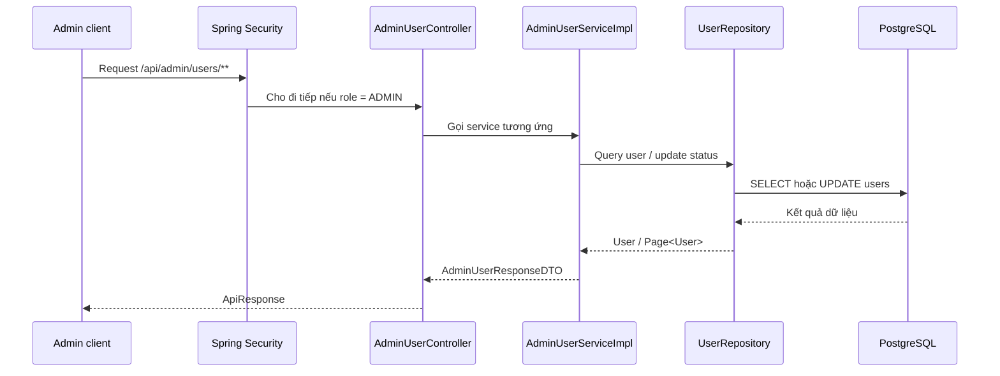

# Admin User Management Cơ Bản Trong Dự Án Old Bicycle

## Bối cảnh

Trong SRS, phần `FR-ADM-001` yêu cầu admin phải có thể quản lý tài khoản người dùng. Ở mức tối thiểu, admin cần xem danh sách user, lọc user, xem chi tiết và khóa hoặc mở lại tài khoản.

Ở tranche này, backend đã bổ sung 3 API:

- `GET /api/admin/users`
- `GET /api/admin/users/{id}`
- `PATCH /api/admin/users/{id}/status`

## Khái niệm chính

### Admin user management là gì?

Đây là luồng cho phép người có quyền `admin` quản lý tài khoản của các user khác trong hệ thống.

Ví dụ:

- xem user nào là buyer, seller, inspector
- lọc user đang `banned`
- mở lại tài khoản bị khóa

### Filter là gì?

`Filter` là điều kiện lọc dữ liệu trước khi trả về kết quả.

Ví dụ:

- chỉ lấy user có `role = seller`
- chỉ lấy user có `status = banned`
- chỉ lấy user đã `verified = true`

## Vì sao tính năng này quan trọng?

Nếu không có API admin quản lý user, hệ thống marketplace sẽ khó vận hành thật. Khi có user vi phạm, admin phải có đường backend rõ ràng để kiểm tra và xử lý tài khoản đó.

## Luồng chính trong dự án



## Giải thích từng lớp

### 1. Client gửi gì?

Admin có thể gửi:

- `GET /api/admin/users?keyword=buyer&status=active`
- `GET /api/admin/users/{id}`
- `PATCH /api/admin/users/{id}/status` với body chứa `status`

Ví dụ body:

```json
{
  "status": "banned"
}
```

### 2. Controller làm gì?

File chính:

- [AdminUserController.java](/e:/Old_bicycle_system/BE_old_bicycle_project/old_bicycle_project/src/main/java/com/backend/old_bicycle_project/controller/AdminUserController.java)

Controller nhận request rồi chuyển tiếp sang service. Controller cố ý giữ mỏng, không nhét business rule vào đây.

### 3. Service quyết định gì?

File chính:

- [AdminUserServiceImpl.java](/e:/Old_bicycle_system/BE_old_bicycle_project/old_bicycle_project/src/main/java/com/backend/old_bicycle_project/service/impl/AdminUserServiceImpl.java)

Service xử lý các quyết định nghiệp vụ như:

- tạo `PageRequest` để phân trang
- áp dụng filter keyword, role, status, verified
- ném lỗi nếu user không tồn tại
- chặn admin tự đổi trạng thái tài khoản của chính mình

Đây là điểm rất quan trọng. Nếu không chặn, admin có thể tự `banned` chính mình và bị khóa khỏi hệ thống.

### 4. Repository đọc/ghi gì?

File chính:

- [UserRepository.java](/e:/Old_bicycle_system/BE_old_bicycle_project/old_bicycle_project/src/main/java/com/backend/old_bicycle_project/repository/UserRepository.java)
- [UserSpecification.java](/e:/Old_bicycle_system/BE_old_bicycle_project/old_bicycle_project/src/main/java/com/backend/old_bicycle_project/specification/UserSpecification.java)

`UserRepository` đã được mở rộng với `JpaSpecificationExecutor<User>` để backend có thể lọc dữ liệu linh hoạt.

`UserSpecification` là nơi ghép các điều kiện filter:

- keyword
- role
- status
- verified

### 5. Database thay đổi gì?

Khi gọi:

- `GET /api/admin/users`
- `GET /api/admin/users/{id}`

thì database chỉ bị đọc.

Khi gọi:

- `PATCH /api/admin/users/{id}/status`

thì cột `status` trong bảng `users` sẽ được cập nhật thành:

- `active`
- `unactive`
- hoặc `banned`

## Ví dụ nhỏ

### Trước khi update

```text
user.status = active
```

### Admin gọi API khóa tài khoản

```json
{
  "status": "banned"
}
```

### Sau khi update

```text
user.status = banned
```

Vì entity `User` đang implement `UserDetails`, user bị `banned` sẽ không còn đăng nhập bình thường được.

## Những chỗ mới trong dự án

- [AdminUserController.java](/e:/Old_bicycle_system/BE_old_bicycle_project/old_bicycle_project/src/main/java/com/backend/old_bicycle_project/controller/AdminUserController.java)
- [AdminUserService.java](/e:/Old_bicycle_system/BE_old_bicycle_project/old_bicycle_project/src/main/java/com/backend/old_bicycle_project/service/AdminUserService.java)
- [AdminUserServiceImpl.java](/e:/Old_bicycle_system/BE_old_bicycle_project/old_bicycle_project/src/main/java/com/backend/old_bicycle_project/service/impl/AdminUserServiceImpl.java)
- [AdminUserStatusUpdateRequest.java](/e:/Old_bicycle_system/BE_old_bicycle_project/old_bicycle_project/src/main/java/com/backend/old_bicycle_project/dto/request/AdminUserStatusUpdateRequest.java)
- [AdminUserResponseDTO.java](/e:/Old_bicycle_system/BE_old_bicycle_project/old_bicycle_project/src/main/java/com/backend/old_bicycle_project/dto/response/AdminUserResponseDTO.java)
- [UserSpecification.java](/e:/Old_bicycle_system/BE_old_bicycle_project/old_bicycle_project/src/main/java/com/backend/old_bicycle_project/specification/UserSpecification.java)

## Những hiểu lầm dễ gặp

### Hiểu lầm 1: Có `UserRepository` là coi như đã có user management

Không đúng.

`Repository` chỉ là tầng đọc/ghi dữ liệu. Muốn tính năng hoàn chỉnh, vẫn cần:

- controller
- service
- security
- DTO
- test

### Hiểu lầm 2: Admin có quyền thì muốn đổi trạng thái ai cũng được, kể cả chính mình

Không nên.

Trong tranche này, backend chủ động chặn admin tự đổi trạng thái tài khoản của chính mình để tránh tự khóa quyền truy cập.

### Hiểu lầm 3: Làm xong list user là coi như xong FR-ADM-001

Chưa đúng.

Hiện mới xong phần:

- view/search/filter
- detail
- ban/unban qua status update

Vẫn còn phần:

- reset password
- view user activity

## Kết luận

Tranche này giúp phần admin user management đi từ trạng thái gần như chưa có API sang trạng thái đã dùng được cho quản trị cơ bản. Nó chưa hoàn tất toàn bộ `FR-ADM-001`, nhưng đã tạo ra đường backend rõ ràng cho:

- xem user
- lọc user
- xem chi tiết user
- đổi trạng thái tài khoản một cách an toàn hơn
