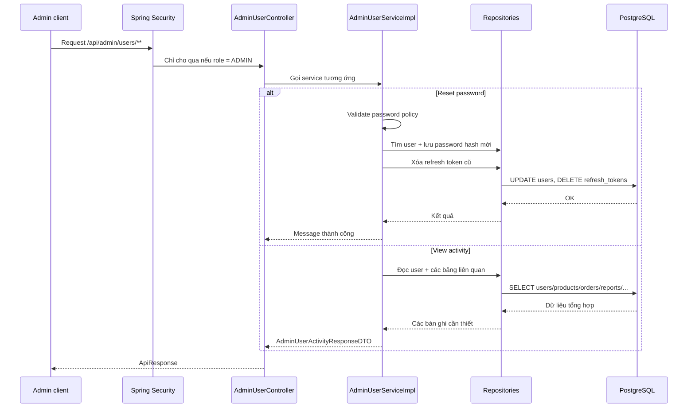

# Admin User Management Cơ Bản Trong Dự Án Old Bicycle

## Bối cảnh

Trong SRS, mục `FR-ADM-001` yêu cầu admin phải quản lý được tài khoản người dùng. Sau tranche 2, backend đã có đủ các API cốt lõi của luồng này:

- `GET /api/admin/users`
- `GET /api/admin/users/{id}`
- `PATCH /api/admin/users/{id}/status`
- `PATCH /api/admin/users/{id}/password`
- `GET /api/admin/users/{id}/activity`

Nói đơn giản, admin giờ có thể:

- xem danh sách user và lọc theo điều kiện
- xem chi tiết một user
- khóa hoặc mở lại tài khoản
- đặt lại mật khẩu cho user
- xem tóm tắt hoạt động gần đây của user đó

## Khái niệm chính

### Admin user management là gì?

Đây là nhóm chức năng cho phép người có quyền `ADMIN` quản lý tài khoản của các user khác trong hệ thống.

Ví dụ:

- kiểm tra seller nào đang bị `banned`
- xem buyer đã tạo bao nhiêu order
- đặt lại mật khẩu cho một user khi cần hỗ trợ

### User activity là gì?

`User activity` là phần tổng hợp một số dấu vết hoạt động gần đây của user.

Trong dự án này, activity hiện gồm:

- số lượng sản phẩm đã đăng
- số order với vai trò buyer
- số order với vai trò seller
- số report đã gửi
- số wishlist item
- số conversation chat
- số notification chưa đọc
- danh sách gần đây của product, order, report, notification, wishlist

Đây là cách để admin nhìn nhanh “user này đang hoạt động như thế nào” mà không phải tự query từng bảng một.

## Vì sao tính năng này quan trọng?

Nếu chỉ có danh sách user thì admin mới nhìn được mặt ngoài của tài khoản. Nhưng khi có thêm reset password và activity view, admin mới thật sự có công cụ vận hành:

- hỗ trợ user bị kẹt đăng nhập
- kiểm tra user có hoạt động bất thường hay không
- xử lý report nhanh hơn vì đã thấy bối cảnh của user

## Luồng chính trong dự án



## Giải thích từng lớp

### 1. Client gửi gì?

Admin có thể gửi:

- `GET /api/admin/users?keyword=lan&status=active`
- `PATCH /api/admin/users/{id}/password`
- `GET /api/admin/users/{id}/activity`

Ví dụ body đặt lại mật khẩu:

```json
{
  "newPassword": "NewStrong1"
}
```

### 2. Controller làm gì?

File chính:

- [AdminUserController.java](/e:/Old_bicycle_system/BE_old_bicycle_project/old_bicycle_project/src/main/java/com/backend/old_bicycle_project/controller/AdminUserController.java)

Controller chỉ nhận request, kiểm tra annotation như `@PreAuthorize("hasRole('ADMIN')")`, rồi chuyển tiếp sang service.

Điểm quan trọng là controller không tự xử lý business rule phức tạp. Nó chỉ đóng vai trò “cửa vào” của API.

### 3. Service quyết định gì?

File chính:

- [AdminUserServiceImpl.java](/e:/Old_bicycle_system/BE_old_bicycle_project/old_bicycle_project/src/main/java/com/backend/old_bicycle_project/service/impl/AdminUserServiceImpl.java)

Service xử lý phần quyết định nghiệp vụ:

- chặn admin tự đổi status của chính mình
- kiểm tra password mới có đúng policy hay không
- mã hóa mật khẩu mới trước khi lưu
- thu hồi tất cả refresh token cũ sau khi reset password
- gom dữ liệu từ nhiều bảng để tạo ra `AdminUserActivityResponseDTO`

### 4. Repository đọc/ghi gì?

Các repository chính được dùng:

- [UserRepository.java](/e:/Old_bicycle_system/BE_old_bicycle_project/old_bicycle_project/src/main/java/com/backend/old_bicycle_project/repository/UserRepository.java)
- [ProductRepository.java](/e:/Old_bicycle_system/BE_old_bicycle_project/old_bicycle_project/src/main/java/com/backend/old_bicycle_project/repository/ProductRepository.java)
- [OrderRepository.java](/e:/Old_bicycle_system/BE_old_bicycle_project/old_bicycle_project/src/main/java/com/backend/old_bicycle_project/repository/OrderRepository.java)
- [ReportRepository.java](/e:/Old_bicycle_system/BE_old_bicycle_project/old_bicycle_project/src/main/java/com/backend/old_bicycle_project/repository/ReportRepository.java)
- [NotificationRepository.java](/e:/Old_bicycle_system/BE_old_bicycle_project/old_bicycle_project/src/main/java/com/backend/old_bicycle_project/repository/NotificationRepository.java)
- [WishlistRepository.java](/e:/Old_bicycle_system/BE_old_bicycle_project/old_bicycle_project/src/main/java/com/backend/old_bicycle_project/repository/WishlistRepository.java)
- [ConversationRepository.java](/e:/Old_bicycle_system/BE_old_bicycle_project/old_bicycle_project/src/main/java/com/backend/old_bicycle_project/repository/ConversationRepository.java)

Các repository này giúp service:

- đếm số bản ghi
- lấy danh sách gần đây
- cập nhật user
- xóa refresh token cũ

### 5. Database thay đổi gì?

Với `PATCH /api/admin/users/{id}/password`:

- cột `password_hash` của bảng `users` được cập nhật
- các dòng refresh token cũ của user đó bị xóa

Với `GET /api/admin/users/{id}/activity`:

- database không bị ghi
- backend chỉ đọc dữ liệu từ nhiều bảng để trả summary

## Ví dụ nhỏ

### Ví dụ 1: Reset password

Trước khi reset:

```text
users.password_hash = old_hash
refresh_tokens = 3 token còn hiệu lực
```

Admin gọi API:

```json
{
  "newPassword": "NewStrong1"
}
```

Sau khi xử lý:

```text
users.password_hash = hash mới
refresh_tokens = 0 token cũ
```

Điều này giúp user phải đăng nhập lại bằng mật khẩu mới, và các phiên cũ không còn tiếp tục dùng được.

### Ví dụ 2: Activity view

Giả sử một seller có:

- 4 sản phẩm
- 2 order đã bán
- 1 report đã gửi
- 3 notification chưa đọc

Khi admin gọi `GET /api/admin/users/{id}/activity`, backend sẽ trả về một DTO tổng hợp để FE hiển thị trong một màn hình thay vì phải gọi 5-6 API rời rạc.

## Những file mới hoặc đã mở rộng trong tranche này

- [AdminUserController.java](/e:/Old_bicycle_system/BE_old_bicycle_project/old_bicycle_project/src/main/java/com/backend/old_bicycle_project/controller/AdminUserController.java)
- [AdminUserService.java](/e:/Old_bicycle_system/BE_old_bicycle_project/old_bicycle_project/src/main/java/com/backend/old_bicycle_project/service/AdminUserService.java)
- [AdminUserServiceImpl.java](/e:/Old_bicycle_system/BE_old_bicycle_project/old_bicycle_project/src/main/java/com/backend/old_bicycle_project/service/impl/AdminUserServiceImpl.java)
- [AdminUserPasswordResetRequest.java](/e:/Old_bicycle_system/BE_old_bicycle_project/old_bicycle_project/src/main/java/com/backend/old_bicycle_project/dto/request/AdminUserPasswordResetRequest.java)
- [AdminUserActivityResponseDTO.java](/e:/Old_bicycle_system/BE_old_bicycle_project/old_bicycle_project/src/main/java/com/backend/old_bicycle_project/dto/response/AdminUserActivityResponseDTO.java)
- [PasswordPolicyValidator.java](/e:/Old_bicycle_system/BE_old_bicycle_project/old_bicycle_project/src/main/java/com/backend/old_bicycle_project/service/PasswordPolicyValidator.java)
- [OrderRepository.java](/e:/Old_bicycle_system/BE_old_bicycle_project/old_bicycle_project/src/main/java/com/backend/old_bicycle_project/repository/OrderRepository.java)
- [ReportRepository.java](/e:/Old_bicycle_system/BE_old_bicycle_project/old_bicycle_project/src/main/java/com/backend/old_bicycle_project/repository/ReportRepository.java)
- [WishlistRepository.java](/e:/Old_bicycle_system/BE_old_bicycle_project/old_bicycle_project/src/main/java/com/backend/old_bicycle_project/repository/WishlistRepository.java)
- [ConversationRepository.java](/e:/Old_bicycle_system/BE_old_bicycle_project/old_bicycle_project/src/main/java/com/backend/old_bicycle_project/repository/ConversationRepository.java)

## Những hiểu lầm dễ gặp

### Hiểu lầm 1: Reset password chỉ cần đổi string mật khẩu

Không đúng.

Backend không được lưu plain text password. Mật khẩu mới phải được:

- kiểm tra policy
- mã hóa bằng `PasswordEncoder`
- rồi mới lưu vào database

### Hiểu lầm 2: Đổi mật khẩu xong là đủ

Chưa đủ.

Nếu không xóa refresh token cũ, các phiên đăng nhập cũ vẫn có thể tiếp tục dùng. Vì vậy reset password trong dự án này còn đi kèm bước thu hồi session cũ.

### Hiểu lầm 3: User activity là log chi tiết 100%

Không phải.

`User activity` ở đây là summary phục vụ admin vận hành nhanh. Nó không phải hệ thống audit log đầy đủ từng thao tác nhỏ.

## Kết luận

Sau tranche 2, `FR-ADM-001` đã có bộ API admin đủ dùng cho backend MVP:

- xem danh sách user
- lọc user
- xem chi tiết
- khóa hoặc mở lại tài khoản
- đặt lại mật khẩu
- xem tổng hợp hoạt động gần đây

Phần này giúp admin UI của FE có nền API rõ ràng hơn để xây màn hình quản trị user, thay vì phải ghép nhiều API nhỏ hoặc query thủ công từ database.
