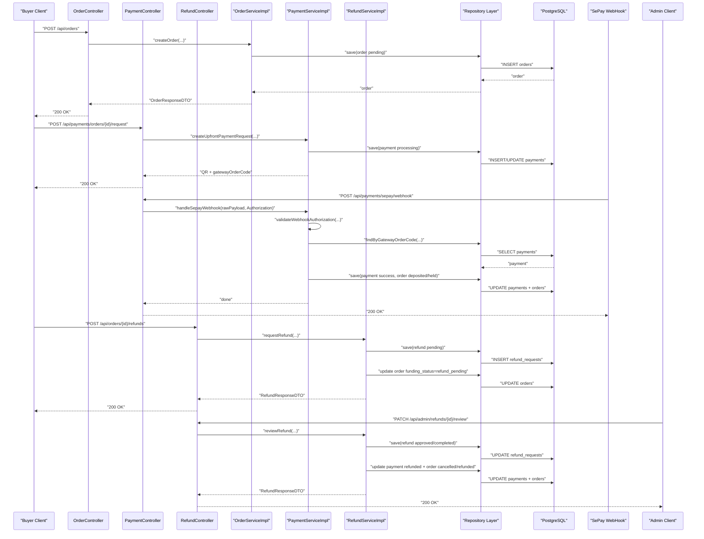

# API SRS Audit And Runtime Sweep Basics - 2026-03-17

## 1. Ý nghĩa của lượt audit này

Khi hỏi "backend đã đủ API so với SRS chưa", có 2 câu hỏi khác nhau:

1. trong code có endpoint đó hay chưa
2. endpoint đó có chạy thật đúng business flow hay không

Cho nên lượt này không chỉ đọc controller, mà còn chạy thật qua app + Supabase.

## 2. Cách đọc coverage đúng

Một API được xem là gần `Done` khi:

- có endpoint
- đúng quyền truy cập
- gọi xuống service đúng
- đọc/ghi DB đúng
- response đúng với flow nghiệp vụ

Một API chỉ nên xem là `Partial` khi:

- có endpoint nhưng business rule còn mỏng
- hoặc có service nhưng chưa chạy thật end-to-end
- hoặc cần SQL workaround/manual step mới test được

## 3. Ví dụ flow đã được sweep thật: transfer payment -> webhook -> refund

## 4. Vì sao phải test theo flow chứ không chỉ test từng endpoint rời

Ví dụ:

- `POST /api/orders` có thể pass
- `POST /api/payments/orders/{id}/request` cũng có thể pass
- nhưng nếu product đã bị `hidden` bởi report resolution trước đó thì flow payment thật vẫn fail

Nghĩa là:

- endpoint đơn lẻ có thể đúng
- nhưng flow business vẫn sai hoặc đứt

Cho nên sweep đúng phải đi theo chuỗi:

- create data
- đổi trạng thái cần thiết
- gọi API kế tiếp
- kiểm tra DB và response cuối

## 5. Những lỗi thực tế đã lộ ra nhờ runtime sweep

- `profile` và `change-password` từng bị public nhầm
- `seller reviews` từng bị chặn auth dù lẽ ra public
- JSON malformed từng rơi về `Uncategorized error`
- product mới tạo muốn test order/payment từng phải đi qua moderation trước
- một product đã bị `hidden` sau report resolution thì không thể reuse để test order nữa

Đó là lý do runtime sweep có giá trị hơn chỉ đọc source code.

## 6. Kết luận thực dụng

Sau một backend đủ lớn, việc audit nên đi theo thứ tự này:

1. đọc SRS để biết expected flow
2. đọc OpenAPI/controller để biết API hiện có
3. chạy thật các flow chính
4. phân loại:
   - `Done`
   - `Partial`
   - `Missing`
5. ưu tiên fix theo business risk, không fix theo số lượng endpoint

Trong dự án này, trọng tâm tiếp theo không còn là "có endpoint hay chưa" nữa, mà là:

- siết auth verification rule
- tăng moderation/admin depth
- tăng integration coverage cho chat/payment
