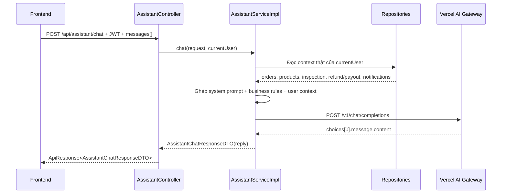

# Assistant context và Vercel AI Gateway basics - 2026-03-24

## 1. Bài toán là gì?

Dự án cần một chatbot mức 2. Điều này nghĩa là chatbot không chỉ trả lời câu hỏi chung như FAQ, mà còn phải nhìn vào **context thật của user đang đăng nhập** để giải thích:

- đơn hàng đang ở bước nào
- vì sao tin đăng chưa public
- inspection đang ra sao
- refund và payout đang chờ bước nào

Trong slice này, backend được chọn làm nơi gọi AI model. Frontend chỉ gửi hội thoại và hiển thị câu trả lời.

## 2. Vercel AI Gateway là gì?

`Vercel AI Gateway` là một cổng trung gian để backend gọi model AI qua một API chuẩn. Trong dự án này, backend gọi endpoint OpenAI-compatible:

- `POST https://ai-gateway.vercel.sh/v1/chat/completions`

Vì backend gọi server-side nên:

- API key không bị lộ ở browser
- frontend không cần giữ secret
- dễ thêm logic kiểm tra quyền và ghép context thật của user

## 3. Luồng backend hoạt động như thế nào?

## 4. Giải thích từng bước rất đơn giản

### Bước 1: Frontend gửi hội thoại

Frontend gửi:

- các tin nhắn gần đây của user
- token đăng nhập

Backend không tin hoàn toàn vào text từ frontend. Backend sẽ tự lấy thêm context thật từ database.

### Bước 2: Controller nhận request

File chính:

- [AssistantController.java](/e:/Old_bicycle_system/BE_old_bicycle_project/old_bicycle_project/src/main/java/com/backend/old_bicycle_project/controller/AssistantController.java)

Controller làm việc đơn giản:

1. nhận `POST /api/assistant/chat`
2. lấy `currentUser` từ `@AuthenticationPrincipal`
3. gọi service
4. bọc kết quả vào `ApiResponse`

### Bước 3: Service ghép context

File chính:

- [AssistantServiceImpl.java](/e:/Old_bicycle_system/BE_old_bicycle_project/old_bicycle_project/src/main/java/com/backend/old_bicycle_project/service/impl/AssistantServiceImpl.java)

Service làm 3 việc quan trọng:

1. kiểm tra backend đã có cấu hình AI Gateway chưa
2. đọc dữ liệu thật từ repository
3. ghép:
   - system prompt
   - business rules của dự án
   - user context
   - hội thoại hiện tại

Ví dụ context của seller có thể gồm:

- tổng số tin đăng
- vài tin gần đây và trạng thái của chúng
- vài đơn bán gần đây
- payout profile đã cấu hình chưa
- còn payout pending transfer không

### Bước 4: Gọi AI Gateway

Service dùng:

- [AssistantGatewayProperties.java](/e:/Old_bicycle_system/BE_old_bicycle_project/old_bicycle_project/src/main/java/com/backend/old_bicycle_project/config/AssistantGatewayProperties.java)
- `RestTemplate` từ [AppConfig.java](/e:/Old_bicycle_system/BE_old_bicycle_project/old_bicycle_project/src/main/java/com/backend/old_bicycle_project/config/AppConfig.java)

Payload gửi lên gồm:

- `model`
- `temperature`
- `max_tokens`
- `messages`

Sau đó backend đọc `choices[0].message.content` để lấy câu trả lời cuối cùng.

### Bước 5: Trả response về frontend

DTO dùng ở slice này:

- [AssistantChatRequestDTO.java](/e:/Old_bicycle_system/BE_old_bicycle_project/old_bicycle_project/src/main/java/com/backend/old_bicycle_project/dto/assistant/AssistantChatRequestDTO.java)
- [AssistantMessageDTO.java](/e:/Old_bicycle_system/BE_old_bicycle_project/old_bicycle_project/src/main/java/com/backend/old_bicycle_project/dto/assistant/AssistantMessageDTO.java)
- [AssistantChatResponseDTO.java](/e:/Old_bicycle_system/BE_old_bicycle_project/old_bicycle_project/src/main/java/com/backend/old_bicycle_project/dto/assistant/AssistantChatResponseDTO.java)

Response hiện chỉ cần:

- `reply`

vì frontend của slice đầu chưa lưu lịch sử vào database.

## 5. Vì sao phải ghép context ở backend?

Nếu để frontend tự gửi hết context của user lên model, sẽ có 3 rủi ro:

1. frontend có thể gửi thiếu hoặc sai dữ liệu
2. user có thể cố tình sửa request
3. API key AI dễ bị lộ nếu gọi model trực tiếp từ browser

Backend giải quyết được cả 3 vấn đề này:

- tự đọc dữ liệu thật từ DB
- giữ API key ở server
- giới hạn những gì assistant được phép nói

## 6. Cấu hình môi trường ở đâu?

Trong backend:

- [application.properties](/e:/Old_bicycle_system/BE_old_bicycle_project/old_bicycle_project/src/main/resources/application.properties)
- [.env.example](/e:/Old_bicycle_system/BE_old_bicycle_project/old_bicycle_project/.env.example)

Biến môi trường chính:

- `AI_GATEWAY_ENABLED`
- `AI_GATEWAY_API_BASE_URL`
- `AI_GATEWAY_API_KEY`
- `AI_GATEWAY_MODEL`
- `AI_GATEWAY_TEMPERATURE`
- `AI_GATEWAY_MAX_TOKENS`

## 7. Nếu chưa cấu hình AI Gateway thì sao?

Hệ thống sẽ không giả vờ gọi được AI.

Nó sẽ ném lỗi rõ ràng:

- `ASSISTANT_NOT_CONFIGURED`

Điều này tốt hơn việc để frontend treo hoặc trả về nội dung sai.

## 8. Lỗi thường gặp

### Hiểu nhầm 1: Chatbot mức 2 là phải có vector DB

Không đúng.

Slice này chưa cần vector DB. Nó vẫn là chatbot mức 2 vì nó đã biết đọc **context thật của user** từ database và business rules của hệ thống.

### Hiểu nhầm 2: Frontend có thể gọi thẳng model cho nhanh

Không nên.

Lý do:

- lộ key
- khó kiểm soát quyền
- khó đảm bảo chatbot chỉ dùng dữ liệu thật

### Hiểu nhầm 3: Assistant có thể tự đổi trạng thái order

Không.

Slice này chỉ cho assistant:

- giải thích
- hướng dẫn
- tóm tắt context

Assistant không tự thực hiện action thay người dùng.
