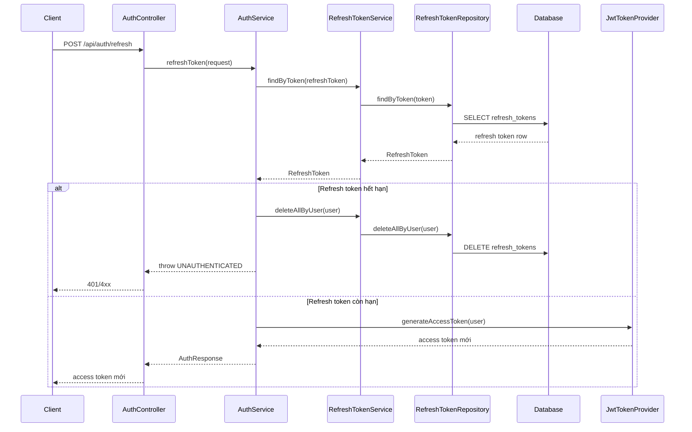
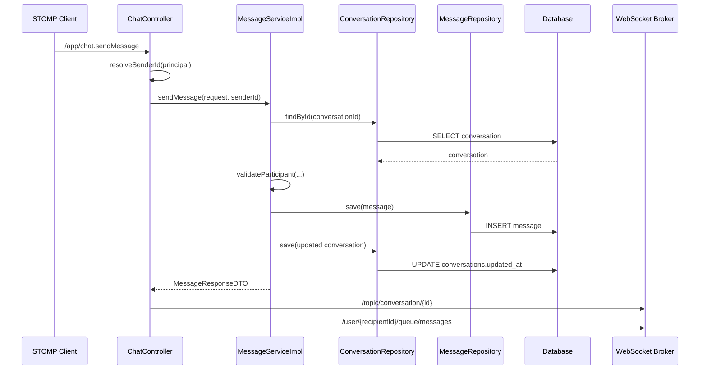
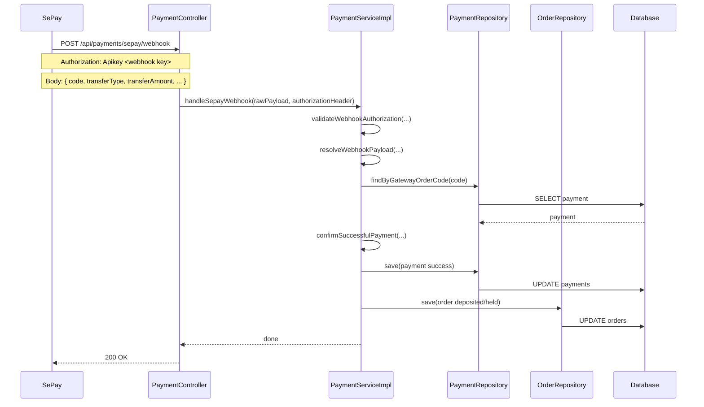

# Regression trọng tâm cho Auth, Chat, Payment: giải thích rõ cho người mới học

## 1. Regression trọng tâm là gì?

`Regression test` là kiểm tra lại những phần hệ thống dễ bị vỡ sau khi mình vừa sửa code.

Trong đợt này, ba cụm cần khóa chất lượng là:

- `auth`
- `chat`
- `payment`

Lý do:

- `auth` liên quan đăng nhập và phiên người dùng
- `chat` liên quan quyền truy cập conversation và unread flow
- `payment` vừa đổi sang `SePay webhook-only`, nên phải kiểm tra lại rất kỹ

## 2. Luồng refresh token trong Auth

Các file chính:

- `src/main/java/com/backend/old_bicycle_project/controller/AuthController.java`
- `src/main/java/com/backend/old_bicycle_project/service/AuthService.java`
- `src/main/java/com/backend/old_bicycle_project/service/RefreshTokenService.java`
- `src/main/java/com/backend/old_bicycle_project/repository/RefreshTokenRepository.java`

### Giải thích

- Client không gọi database trực tiếp.
- `AuthController` chỉ nhận request và gọi service.
- `AuthService` là nơi quyết định refresh token còn hạn hay không.
- `RefreshTokenRepository` chỉ lo đọc và xóa dữ liệu trong bảng `refresh_tokens`.

Regression batch này khóa lại hai rule quan trọng:

1. token còn hạn thì phải trả `access token` mới
2. token hết hạn thì phải revoke session cũ, không được tiếp tục dùng

## 3. Luồng gửi tin nhắn trong Chat

Các file chính:

- `src/main/java/com/backend/old_bicycle_project/controller/ChatController.java`
- `src/main/java/com/backend/old_bicycle_project/service/impl/MessageServiceImpl.java`
- `src/main/java/com/backend/old_bicycle_project/repository/ConversationRepository.java`
- `src/main/java/com/backend/old_bicycle_project/repository/MessageRepository.java`

### Giải thích

- `principal` từ WebSocket phải map được về `UUID` người gửi.
- Nếu principal lỗi hoặc không phải UUID hợp lệ, controller phải chặn sớm.
- Service phải kiểm tra người gửi có thật sự là buyer hoặc seller của conversation không.
- Sau khi lưu message, hệ thống mới broadcast lại lên WebSocket broker.

Regression batch này khóa lại ba rule quan trọng:

1. principal không hợp lệ phải trả `UNAUTHENTICATED`
2. người ngoài conversation không được gửi tin nhắn
3. gửi thành công thì phải lưu message, cập nhật conversation, và publish notification

## 4. Luồng SePay WebHook trong Payment

Các file chính:

- `src/main/java/com/backend/old_bicycle_project/controller/PaymentController.java`
- `src/main/java/com/backend/old_bicycle_project/service/impl/PaymentServiceImpl.java`
- `src/main/java/com/backend/old_bicycle_project/repository/PaymentRepository.java`
- `src/main/java/com/backend/old_bicycle_project/repository/OrderRepository.java`

### Giải thích

Luồng `webhook-only` hiện tại làm ba việc cốt lõi:

1. xác thực request bằng `Authorization`
2. đọc `gatewayOrderCode` từ `code`
3. chỉ cập nhật payment/order khi giao dịch là `tiền vào` và số tiền đủ

`validateWebhookAuthorization(...)` lấy key kỳ vọng từ config local:

- `application.properties`
- bind sang `SepayProperties`
- rồi `PaymentServiceImpl` gọi `sepayProperties.getWebhookApiKey()`

Nếu header không khớp:

- request bị reject
- payment không đổi trạng thái
- order không bị đánh dấu thanh toán thành công giả

Regression batch này khóa lại bốn rule quan trọng:

1. auth sai thì reject
2. thiếu tiền thì reject
3. giao dịch `transferType = out` thì bỏ qua
4. webhook lặp lại không được làm hỏng trạng thái đã `success`

## 5. Regression đang bảo vệ điều gì?

Nếu không có regression test, các lỗi kiểu này rất dễ quay lại:

- refresh token hết hạn nhưng vẫn lấy được access token mới
- WebSocket principal lỗi làm nổ controller bằng exception thô
- người ngoài conversation vẫn gửi được message
- webhook SePay với key giả vẫn update order thành `deposited`
- webhook gửi lặp lại làm order/payment đổi trạng thái sai

## 6. Batch này kiểm tra những file test nào?

- `src/test/java/com/backend/old_bicycle_project/service/AuthServiceTest.java`
- `src/test/java/com/backend/old_bicycle_project/controller/ChatControllerTest.java`
- `src/test/java/com/backend/old_bicycle_project/service/impl/MessageServiceImplTest.java`
- `src/test/java/com/backend/old_bicycle_project/service/impl/PaymentServiceImplTest.java`

## 7. Chốt ngắn

Batch regression trọng tâm này không nhằm “có thêm tính năng”.

Nó nhằm đảm bảo:

- `auth` không hỏng phiên đăng nhập
- `chat` không hỏng ownership và unread flow cơ bản
- `payment` không ghi nhận thanh toán giả sau khi chuyển sang `webhook-only`
