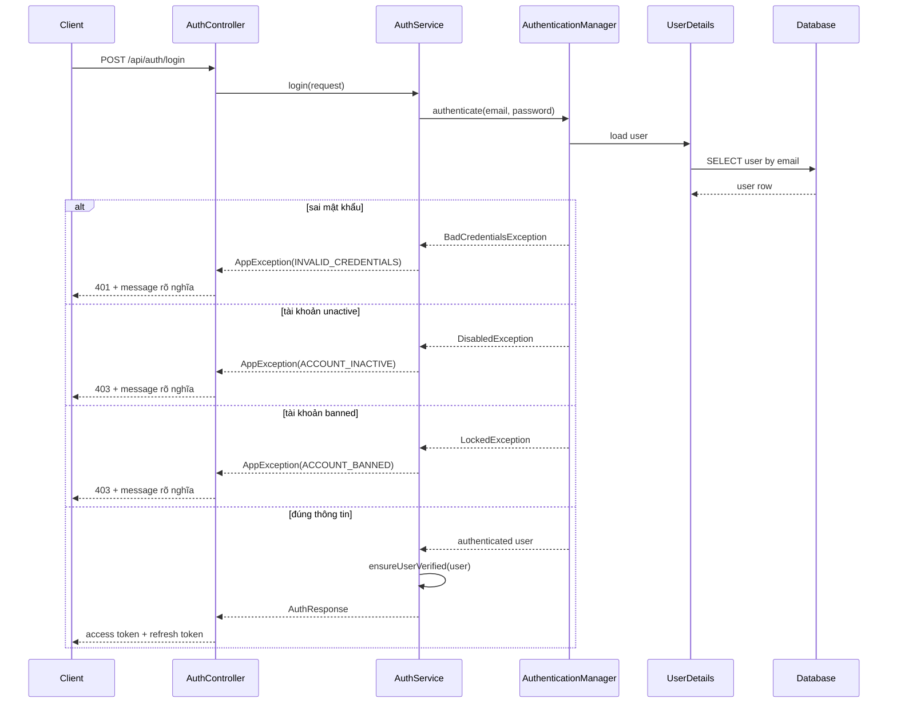

# Login lỗi `9999 Uncategorized error`: vì sao xảy ra và đã sửa gì

## 1. Bối cảnh

Trước khi sửa, endpoint:

- `POST /api/auth/login`

có một vấn đề khó chịu:

- nhập sai mật khẩu cũng có thể ra `9999`
- tài khoản `unactive` cũng có thể ra `9999`
- tài khoản `banned` cũng có thể ra `9999`

Điều này làm FE chỉ thấy một lỗi rất mơ hồ, dễ bị hiểu nhầm thành "server hỏng".

## 2. Gốc vấn đề là gì?

Trong Spring Security, lúc login, `AuthenticationManager` có thể ném ra nhiều loại lỗi khác nhau:

- `BadCredentialsException`
- `DisabledException`
- `LockedException`
- hoặc các lỗi xác thực khác

Nếu backend không bắt riêng các lỗi này, chúng sẽ rơi xuống `GlobalExceptionHandler` như một lỗi chung.

Khi đó hệ thống trả:

- `code = 9999`
- `message = Uncategorized error`

Đây là lý do người dùng thấy lỗi rất khó hiểu.

## 3. Đã sửa theo hướng nào?

Trong:

- [AuthService.java](/e:/Old_bicycle_system/BE_old_bicycle_project/old_bicycle_project/src/main/java/com/backend/old_bicycle_project/service/AuthService.java)

backend bây giờ bắt riêng các lỗi xác thực khi gọi `authenticationManager.authenticate(...)`.

Mapping mới:

- sai email hoặc sai mật khẩu -> `INVALID_CREDENTIALS`
- tài khoản `unactive` -> `ACCOUNT_INACTIVE`
- tài khoản `banned` -> `ACCOUNT_BANNED`
- lỗi xác thực khác -> `UNAUTHENTICATED`

Các mã lỗi mới nằm trong:

- [ErrorCode.java](/e:/Old_bicycle_system/BE_old_bicycle_project/old_bicycle_project/src/main/java/com/backend/old_bicycle_project/exception/ErrorCode.java)

## 4. Luồng đi của request sau khi sửa

## 5. Giải thích rất dễ hiểu

Trước đây backend giống như nói:

- "Có lỗi đâu đó"

Sau khi sửa, backend nói cụ thể hơn:

- "Sai email hoặc mật khẩu"
- "Tài khoản chưa được kích hoạt"
- "Tài khoản đã bị khóa"

Điều này giúp:

- FE hiển thị đúng lỗi
- dev debug nhanh hơn
- user hiểu chuyện gì đang xảy ra

## 6. Áp dụng cụ thể trong project này

Ví dụ trong seed data:

- `seller.city@oldbicycle.dev` có `status = unactive`

Trước khi sửa:

- login account này trả `9999 Uncategorized error`

Sau khi sửa:

- account này sẽ trả `ACCOUNT_INACTIVE`

Điều này phản ánh đúng nghiệp vụ hơn nhiều.

## 7. Điều quan trọng cần nhớ

- `9999` không phải lúc nào cũng có nghĩa backend hỏng toàn bộ
- nhiều khi chỉ là backend chưa map lỗi chi tiết
- với login, luôn nên bắt riêng các lỗi auth phổ biến thay vì để rơi xuống lỗi chung
