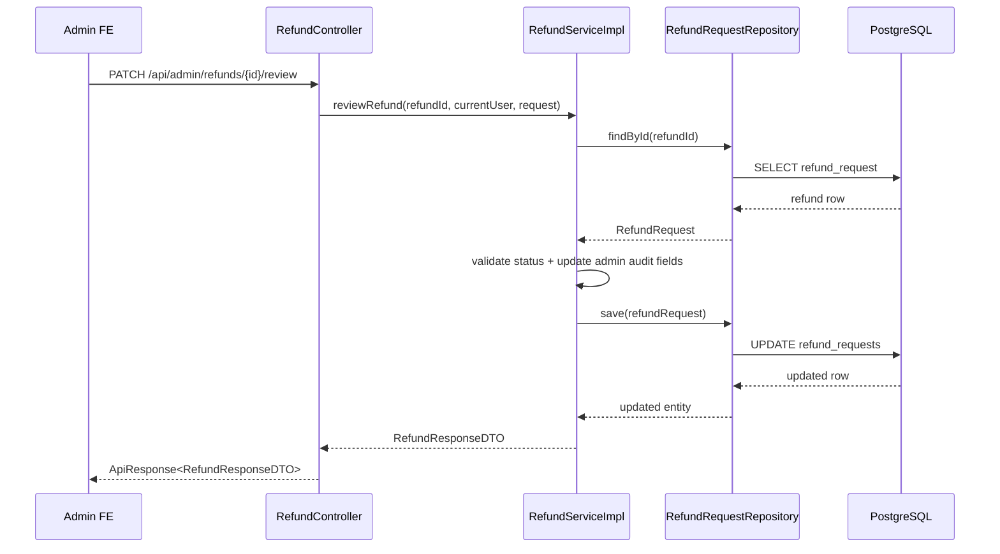

# Backend SRS Assessment Và Cách Đối Chiếu Theo Tầng - 2026-03-18

## Bối cảnh

Khi đánh giá backend đã “đủ SRS” hay chưa, rất nhiều người mới chỉ nhìn:

- có entity
- có repository
- có controller

rồi kết luận là feature đã xong.

Đó là cách nhìn rất dễ sai.

Backend chỉ nên được coi là “gần đủ” khi một feature đi được hết chuỗi:

`client -> controller -> service -> repository -> database -> response`

Nếu thiếu một mắt xích trong chuỗi này, feature thường chỉ nên được chấm `Partial`.

---

## SRS là gì?

`SRS` là tài liệu mô tả phần mềm phải làm gì.

Trong dự án này, SRS định nghĩa:

- feature lớn như `F-008 Deposit & Order`
- yêu cầu chi tiết như `FR-SELL-003 Hide/Show Listing`
- business rule như `BR08 Escrow`

Khi audit backend, ta không hỏi:

> “Có file chưa?”

Mà phải hỏi:

> “Luồng xử lý thật đã bám đúng SRS chưa?”

---

## Traceability là gì?

`Traceability` nghĩa là khả năng lần ngược.

Hiểu đơn giản:

- từ một yêu cầu trong SRS
- ta lần ra controller nào
- service nào
- repository nào
- test nào

Nếu không lần được như vậy, assessment rất dễ bị cảm tính.

---

## Vì sao controller không đủ để chứng minh feature đã xong?

Ví dụ có endpoint:

```java
@PatchMapping("/{orderId}/confirm-received")
```

Điều đó chỉ chứng minh:

- backend có một API tên như vậy

Nó chưa chứng minh:

- service có validate đúng người gọi không
- order status có đổi đúng business rule không
- payment/funding state có đồng bộ không
- product có đổi sang `sold` đúng lúc không
- test có chặn regression không

Nên trong backend, controller mới chỉ là “cửa vào”.

---

## Cách audit backend đúng hơn

Trong repo này, rule backend đang dùng chuẩn tối thiểu:

`controller -> service -> repository -> entity -> migration -> security -> test`

Nghĩa là khi audit một feature, ta lần qua các tầng sau:

### 1. Controller

Controller nhận request HTTP.

Ví dụ:

- [OrderController.java](/e:/Old_bicycle_system/BE_old_bicycle_project/old_bicycle_project/src/main/java/com/backend/old_bicycle_project/controller/OrderController.java)
- [RefundController.java](/e:/Old_bicycle_system/BE_old_bicycle_project/old_bicycle_project/src/main/java/com/backend/old_bicycle_project/controller/RefundController.java)

### 2. Service

Service là nơi đặt business logic.

Ví dụ:

- [OrderServiceImpl.java](/e:/Old_bicycle_system/BE_old_bicycle_project/old_bicycle_project/src/main/java/com/backend/old_bicycle_project/service/impl/OrderServiceImpl.java)
- [RefundServiceImpl.java](/e:/Old_bicycle_system/BE_old_bicycle_project/old_bicycle_project/src/main/java/com/backend/old_bicycle_project/service/impl/RefundServiceImpl.java)

### 3. Repository

Repository đọc và ghi dữ liệu xuống database.

Ví dụ:

- `OrderRepository`
- `RefundRequestRepository`

### 4. Entity

Entity mô tả dữ liệu trong Java tương ứng với bảng database.

Ví dụ:

- `Order`
- `RefundRequest`
- `Payment`

### 5. Security

Security quyết định ai được gọi API.

Ví dụ:

- buyer mới được gọi refund request
- admin mới được review refund

### 6. Test

Test là lớp chứng minh feature không chỉ “có code”, mà còn “đã được kiểm tra”.

Ví dụ:

- [RefundServiceImplTest.java](/e:/Old_bicycle_system/BE_old_bicycle_project/old_bicycle_project/src/test/java/com/backend/old_bicycle_project/service/impl/RefundServiceImplTest.java)
- [SecurityConfigIntegrationTest.java](/e:/Old_bicycle_system/BE_old_bicycle_project/old_bicycle_project/src/test/java/com/backend/old_bicycle_project/security/SecurityConfigIntegrationTest.java)

---

## Ví dụ: audit feature refund admin

Hãy nhìn feature admin review refund.

### Bước 1: kiểm tra controller

File:

- [RefundController.java](/e:/Old_bicycle_system/BE_old_bicycle_project/old_bicycle_project/src/main/java/com/backend/old_bicycle_project/controller/RefundController.java)

Ta thấy:

- `GET /api/admin/refunds`
- `PATCH /api/admin/refunds/{refundId}/review`

Điều này cho biết admin có API để:

- xem danh sách refund
- review refund

### Bước 2: kiểm tra service

File:

- [RefundServiceImpl.java](/e:/Old_bicycle_system/BE_old_bicycle_project/old_bicycle_project/src/main/java/com/backend/old_bicycle_project/service/impl/RefundServiceImpl.java)

Ở đây phải xem:

- có lọc được refund theo keyword/status không
- có map dữ liệu đủ cho FE admin disputes page không
- có validate status transition không

### Bước 3: kiểm tra repository

File:

- [RefundRequestRepository.java](/e:/Old_bicycle_system/BE_old_bicycle_project/old_bicycle_project/src/main/java/com/backend/old_bicycle_project/repository/RefundRequestRepository.java)

Nếu service cần filter nhiều điều kiện, repository phải đủ khả năng query.

### Bước 4: kiểm tra security

Trong controller có:

```java
@PreAuthorize("hasRole('ADMIN')")
```

Điều này rất quan trọng.

Nếu thiếu bước này, buyer hoặc seller có thể gọi nhầm API admin.

### Bước 5: kiểm tra test

Nếu có test cho:

- service
- security/integration

thì feature mới đáng tin hơn.

---

## Luồng đi thực tế của backend

Ví dụ với admin review refund:



### Giải thích lại bằng lời

1. FE admin gửi request review refund.
2. Controller nhận request và chuyển xuống service.
3. Service tìm refund trong database.
4. Service kiểm tra rule nghiệp vụ.
5. Nếu hợp lệ, service cập nhật trạng thái và thông tin admin xử lý.
6. Repository ghi xuống database.
7. Controller trả response về FE.

---

## Vì sao backend vẫn có thể là `Partial` dù endpoint chạy được?

Có nhiều lý do.

### 1. Chưa đủ business rule

Ví dụ:

- có API complete order
- nhưng chưa có `post-completion dispute`
- chưa có timeout auto release

Khi đó feature chỉ nên là `Partial`.

### 2. Chưa đủ breadth của SRS

Ví dụ:

- admin có CRUD cho brand/category/brake/frame material
- nhưng chưa có groupset/size chart

Vậy `FR-ADM-004` vẫn chưa trọn vẹn.

### 3. Chưa có test đủ mạnh

Nếu chỉ có code nhưng không có regression test, feature rất dễ vỡ ở lần sửa sau.

### 4. Chưa có flow end-to-end

Ví dụ:

- payment request có
- webhook có
- refund review có

nhưng chưa có transaction log, payout automation, hay remaining payment phase

thì payment feature vẫn là `Partial`.

---

## Một số ví dụ thực tế trong dự án này

### `F-001 User Authentication`

Backend gần `Done` vì:

- có register/login/refresh/logout
- có email verify
- có forgot/reset password
- có `/me`, update profile, change password
- có JWT + refresh token

### `F-008 Deposit & Order`

Backend vẫn `Partial` vì:

- order flow đã usable
- seller accept được
- buyer request payment được
- buyer confirm received được

Nhưng vẫn thiếu:

- transaction logging đúng nghĩa SRS
- auto release / timeout policy
- post-completion dispute

### `F-011 Admin Dashboard`

Backend mạnh hơn trước vì:

- có admin users
- có admin products moderation
- có admin reports
- có admin refunds
- có reference data CRUD

Nhưng vẫn thiếu:

- groupset / size chart management
- analytics depth rộng hơn

---

## Hiểu lầm thường gặp

### Hiểu lầm 1: “Có entity là xong”

Sai.

Entity chỉ là cấu trúc dữ liệu.

### Hiểu lầm 2: “Có controller là xong”

Sai.

Controller có thể chỉ là lớp mỏng, chưa đủ logic nghiệp vụ.

### Hiểu lầm 3: “API trả 200 là xong”

Sai.

Nó có thể vẫn:

- sai role
- sai state machine
- chưa ghi đủ audit field
- chưa bám SRS

### Hiểu lầm 4: “Có test là xong”

Sai.

Test có thể chỉ test happy path.

---

## Kết luận

Assessment backend đúng nghĩa không phải là đếm file.

Nó là việc trả lời 3 câu hỏi:

1. SRS yêu cầu gì?
2. Backend hiện có những tầng nào để thực hiện yêu cầu đó?
3. Những tầng đó đã nối với nhau đúng chưa?

Khi đọc một assessment backend, hãy chú ý:

- feature nào `Done`
- feature nào `Partial`
- blocker cụ thể là gì

Đó mới là thông tin giúp team quyết định phải làm tiếp phần nào.
