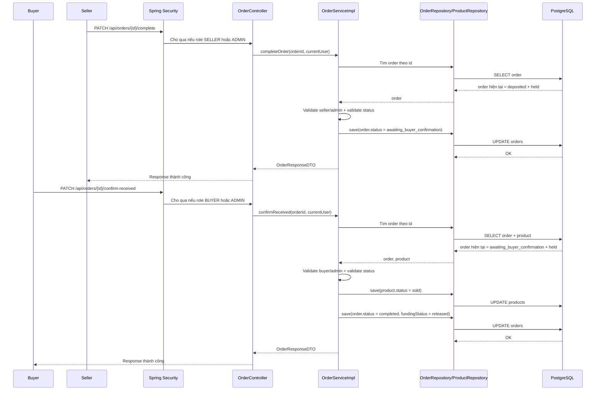

# Buyer Xác Nhận Đã Nhận Xe Trong Luồng Order

## Bối cảnh

Trước thay đổi này, backend đang có một điểm hơi nguy hiểm:

- seller gọi `PATCH /api/orders/{id}/complete`
- hệ thống lập tức:
  - đổi `order.status = completed`
  - giải ngân tiền cho seller
  - đổi `product.status = sold`

Điều đó có nghĩa là seller chỉ cần bấm nút hoàn tất là giao dịch kết thúc ngay, dù buyer chưa xác nhận đã nhận xe.

Sau thay đổi này, luồng được tách thành 2 bước:

1. seller báo đã giao xe
2. buyer xác nhận đã nhận xe

Chỉ sau bước 2 thì tiền mới được giải ngân.

## Khái niệm cần biết

### 1. Escrow là gì?

`Escrow` là cơ chế hệ thống giữ tiền ở giữa, chưa chuyển ngay cho seller.

Trong dự án này, ý tưởng gần giống như vậy:

- buyer đã thanh toán tiền cọc
- hệ thống giữ tiền ở trạng thái `held`
- chỉ khi giao dịch thật sự xong thì tiền mới chuyển sang `released`

### 2. State machine là gì?

`State machine` là cách mô tả một đối tượng được phép đi qua những trạng thái nào và đi theo thứ tự nào.

Ví dụ rất đơn giản:

- đèn giao thông có đỏ
- vàng
- xanh

Nó không nhảy lung tung. Nó đi theo thứ tự rõ ràng.

Order trong dự án cũng vậy. Sau thay đổi này, luồng chính là:

- `pending`
- `deposited`
- `awaiting_buyer_confirmation`
- `completed`

### 3. `awaiting_buyer_confirmation` là gì?

Đây là trạng thái mới được thêm vào enum `OrderStatus`.

Nó có nghĩa là:

- seller đã báo giao xe
- nhưng buyer chưa xác nhận đã nhận xe
- tiền vẫn đang bị giữ

## Vì sao cần trạng thái trung gian này?

Nếu không có trạng thái trung gian, hệ thống sẽ phải chọn một trong hai cách:

1. hoặc complete quá sớm
2. hoặc giữ mọi thứ ở `deposited`, làm FE và backend không biết seller đã báo giao xe hay chưa

Trạng thái `awaiting_buyer_confirmation` giúp backend và FE hiểu đúng tình huống hiện tại.

## Những file chính đã tham gia thay đổi

- [OrderStatus.java](/e:/Old_bicycle_system/BE_old_bicycle_project/old_bicycle_project/src/main/java/com/backend/old_bicycle_project/entity/enums/OrderStatus.java)
- [V9__order_buyer_confirmation_flow.sql](/e:/Old_bicycle_system/BE_old_bicycle_project/old_bicycle_project/src/main/resources/db/migration/V9__order_buyer_confirmation_flow.sql)
- [OrderController.java](/e:/Old_bicycle_system/BE_old_bicycle_project/old_bicycle_project/src/main/java/com/backend/old_bicycle_project/controller/OrderController.java)
- [OrderService.java](/e:/Old_bicycle_system/BE_old_bicycle_project/old_bicycle_project/src/main/java/com/backend/old_bicycle_project/service/OrderService.java)
- [OrderServiceImpl.java](/e:/Old_bicycle_system/BE_old_bicycle_project/old_bicycle_project/src/main/java/com/backend/old_bicycle_project/service/impl/OrderServiceImpl.java)
- [RefundServiceImpl.java](/e:/Old_bicycle_system/BE_old_bicycle_project/old_bicycle_project/src/main/java/com/backend/old_bicycle_project/service/impl/RefundServiceImpl.java)
- [ProductService.java](/e:/Old_bicycle_system/BE_old_bicycle_project/old_bicycle_project/src/main/java/com/backend/old_bicycle_project/service/ProductService.java)

## API mới và API cũ thay đổi ý nghĩa như thế nào?

### API cũ

- `PATCH /api/orders/{id}/complete`

Bây giờ API này không còn mang nghĩa “đóng giao dịch ngay” nữa.

Nó mang nghĩa:

- seller báo rằng đã giao xe
- backend chuyển order sang `awaiting_buyer_confirmation`

### API mới

- `PATCH /api/orders/{id}/confirm-received`

API này dành cho:

- buyer
- hoặc admin

Nó mang nghĩa:

- buyer xác nhận đã nhận xe
- backend mới complete giao dịch thật sự

## Luồng backend đầy đủ



## Giải thích từng lớp rất chậm và dễ hiểu

### 1. Client gửi gì?

Có 2 loại client:

- seller client
- buyer client

Seller gửi:

```http
PATCH /api/orders/{orderId}/complete
```

Buyer gửi:

```http
PATCH /api/orders/{orderId}/confirm-received
```

### 2. Controller nhận gì?

Controller nằm ở:

- [OrderController.java](/e:/Old_bicycle_system/BE_old_bicycle_project/old_bicycle_project/src/main/java/com/backend/old_bicycle_project/controller/OrderController.java)

Controller có nhiệm vụ:

- nhận request
- lấy `currentUser` từ security context
- gọi đúng service method

Controller không tự quyết định business rule lớn.

### 3. Service quyết định gì?

Service nằm ở:

- [OrderServiceImpl.java](/e:/Old_bicycle_system/BE_old_bicycle_project/old_bicycle_project/src/main/java/com/backend/old_bicycle_project/service/impl/OrderServiceImpl.java)

Service là nơi quyết định:

- ai được gọi API này
- order phải đang ở trạng thái nào
- khi đổi trạng thái thì đổi thêm gì nữa

Ví dụ:

- seller chỉ được báo giao xe khi order đang là `deposited`
- buyer chỉ được xác nhận nhận xe khi order đang là `awaiting_buyer_confirmation`
- khi buyer xác nhận xong thì:
  - order -> `completed`
  - funding -> `released`
  - product -> `sold`

### 4. Repository làm gì?

Repository là lớp nói chuyện với database.

Trong flow này, repository chính là:

- `OrderRepository`
- `ProductRepository`

Repository không tự nghĩ business rule. Nó chỉ:

- đọc order
- lưu order
- lưu product

### 5. Database thay đổi gì?

Sau bước seller báo giao xe:

```text
orders.status = awaiting_buyer_confirmation
orders.funding_status = held
products.status = active (chưa sold)
```

Sau bước buyer xác nhận nhận xe:

```text
orders.status = completed
orders.funding_status = released
orders.paid_amount = total_amount
orders.remaining_amount = 0
products.status = sold
```

## Refund thay đổi thế nào?

Một điểm quan trọng là buyer vẫn cần quyền mở refund nếu seller báo giao xe nhưng thực tế có vấn đề.

Vì vậy:

- [RefundServiceImpl.java](/e:/Old_bicycle_system/BE_old_bicycle_project/old_bicycle_project/src/main/java/com/backend/old_bicycle_project/service/impl/RefundServiceImpl.java)

đã được mở rộng để cho phép refund khi:

- `status = deposited`
  hoặc
- `status = awaiting_buyer_confirmation`

và đồng thời:

- `fundingStatus = held`

Nói đơn giản:

- miễn là tiền vẫn đang bị giữ
- buyer vẫn có thể yêu cầu hoàn tiền

## Product bị ảnh hưởng thế nào?

`ProductService` có danh sách các trạng thái order đang giao dịch dở.

Sau thay đổi này, danh sách đó phải tính thêm:

- `awaiting_buyer_confirmation`

Nếu quên bước này, seller có thể sửa hoặc ẩn sản phẩm trong lúc order đang chờ buyer xác nhận, dẫn đến logic bị lệch.

## Ví dụ nhỏ

### Trước thay đổi

1. Buyer đặt cọc.
2. Seller bấm hoàn tất.
3. Tiền được giải ngân ngay.

Nếu buyer chưa nhận xe thật, hệ thống vẫn đã chốt giao dịch.

### Sau thay đổi

1. Buyer đặt cọc.
2. Seller bấm “đã giao xe”.
3. Order chuyển sang `awaiting_buyer_confirmation`.
4. Buyer xác nhận đã nhận xe.
5. Hệ thống mới giải ngân.

Luồng này an toàn hơn.

## Những hiểu lầm dễ gặp

### Hiểu lầm 1: `complete` vẫn là complete thật

Không còn đúng nữa.

Trong version mới:

- `complete` ở phía seller chỉ là “báo đã giao xe”

### Hiểu lầm 2: buyer confirm received chỉ là đổi label ở FE

Không đúng.

Nó là thay đổi nghiệp vụ thật ở backend:

- release tiền
- đóng order
- đánh dấu product sold

### Hiểu lầm 3: đã có buyer confirm rồi thì refund không cần nữa

Không đúng.

Refund vẫn rất quan trọng ở giai đoạn:

- `awaiting_buyer_confirmation`

vì đây chính là lúc buyer có thể phát hiện vấn đề sau khi nhận xe.

## Kết luận

Thay đổi này làm cho order flow gần với tư duy escrow hơn:

- seller không thể tự chốt giao dịch một mình
- buyer có bước xác nhận cuối
- tiền chỉ được giải ngân khi có xác nhận hợp lệ
- refund vẫn mở trong lúc tiền còn đang bị giữ

Đây là thay đổi nhỏ về số lượng API, nhưng lại là thay đổi lớn về ý nghĩa nghiệp vụ và độ an toàn của marketplace.
