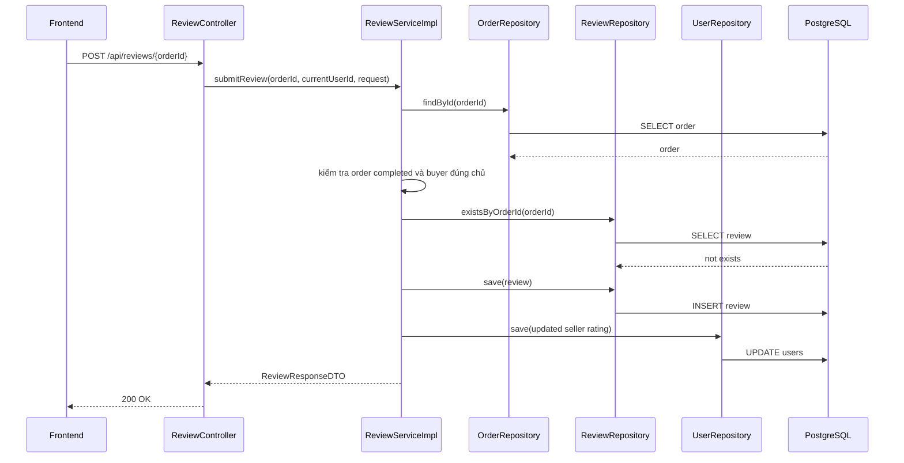
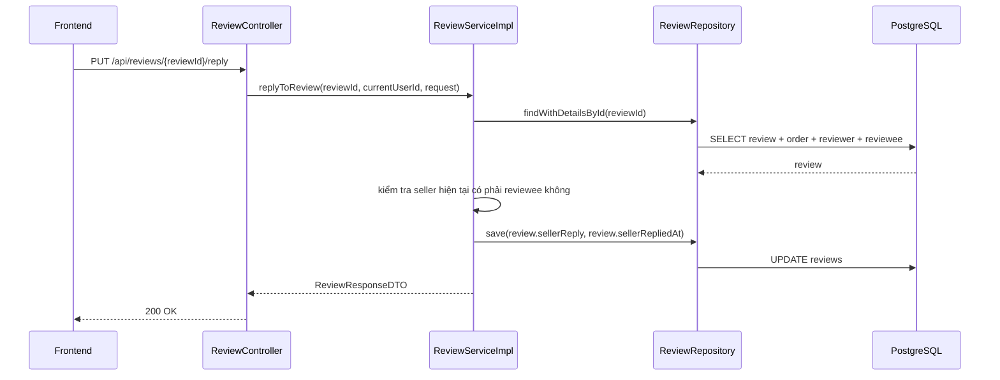

# Buyer review và seller reply review: giải thích cho người mới học

## 1. Bối cảnh của bài toán

Trong marketplace này, sau khi giao dịch hoàn tất thì buyer nên có quyền:

- chấm sao cho seller
- viết nhận xét về trải nghiệm mua bán

Sau đó seller cũng nên có quyền:

- phản hồi lại đánh giá đó

Điều này quan trọng vì review không chỉ để "trang trí". Nó là dữ liệu giúp:

- buyer khác biết seller có uy tín hay không
- seller giải thích thêm khi có hiểu lầm
- hệ thống giữ lại lịch sử giao dịch sau khi sản phẩm đã bán xong

## 2. Review trong bài này gắn với cái gì?

Nhiều người mới hay tưởng review gắn với:

- trang sản phẩm đang public

Nhưng trong dự án này, review thực chất gắn với:

- `order`
- `buyer`
- `seller`

Điều đó có nghĩa là:

- dù sản phẩm đã `sold`
- dù tin đăng không còn hiện ngoài marketplace

thì review vẫn hợp lệ, vì nó đang đánh giá **chất lượng giao dịch với seller**, không phải đánh giá việc "tin đăng còn public hay không".

## 3. Các API chính sau khi hoàn thiện

- `POST /api/reviews/{orderId}`
  - buyer gửi đánh giá cho order đã hoàn tất
- `PUT /api/reviews/{reviewId}/reply`
  - seller phản hồi lại review đó
- `GET /api/users/{sellerId}/reviews`
  - lấy danh sách review của seller để hiển thị ở FE

Các file chính:

- [ReviewController.java](/e:/Old_bicycle_system/BE_old_bicycle_project/old_bicycle_project/src/main/java/com/backend/old_bicycle_project/controller/ReviewController.java)
- [ReviewService.java](/e:/Old_bicycle_system/BE_old_bicycle_project/old_bicycle_project/src/main/java/com/backend/old_bicycle_project/service/ReviewService.java)
- [ReviewServiceImpl.java](/e:/Old_bicycle_system/BE_old_bicycle_project/old_bicycle_project/src/main/java/com/backend/old_bicycle_project/service/impl/ReviewServiceImpl.java)
- [ReviewRepository.java](/e:/Old_bicycle_system/BE_old_bicycle_project/old_bicycle_project/src/main/java/com/backend/old_bicycle_project/repository/ReviewRepository.java)
- [OrderServiceImpl.java](/e:/Old_bicycle_system/BE_old_bicycle_project/old_bicycle_project/src/main/java/com/backend/old_bicycle_project/service/impl/OrderServiceImpl.java)
- [V13__add_seller_reply_to_reviews.sql](/e:/Old_bicycle_system/BE_old_bicycle_project/old_bicycle_project/src/main/resources/db/migration/V13__add_seller_reply_to_reviews.sql)

## 4. Khái niệm `reply` trong review là gì?

`Reply` nghĩa là **phản hồi lại**.

Trong bài này:

- buyer viết review trước
- seller được phép viết một phản hồi bên dưới review đó

Thiết kế hiện tại dùng cách đơn giản:

- thêm thẳng 2 cột vào bảng `reviews`
  - `seller_reply`
  - `seller_replied_at`

Ưu điểm:

- đơn giản
- dễ đọc dữ liệu
- đủ dùng cho mô hình "mỗi review có tối đa một phản hồi của seller"

## 5. Luồng backend end-to-end

### 5.1. Buyer gửi review

Giải thích đơn giản:

1. FE gửi số sao và comment lên backend.
2. Controller nhận request rồi chuyển sang service.
3. Service tìm order.
4. Service kiểm tra:
   - order phải `completed`
   - người đang đăng nhập phải đúng là buyer của order
   - order đó chưa có review trước đó
5. Nếu hợp lệ, backend lưu review mới.
6. Backend cập nhật `averageRating` và `totalReviews` cho seller.
7. Backend trả review mới về FE.

### 5.2. Seller reply review

Giải thích đơn giản:

1. Seller bấm gửi phản hồi.
2. Controller chuyển việc cho service.
3. Service lấy review kèm dữ liệu liên quan.
4. Service kiểm tra người đang reply có đúng là seller được đánh giá hay không.
5. Nếu đúng, backend lưu `sellerReply` và thời gian reply.
6. FE nhận lại review đã cập nhật.

## 6. Vì sao `OrderResponseDTO` phải thêm `buyerReviewSubmitted`?

FE cần biết:

- order nào đã được buyer review rồi
- order nào chưa

Nếu không có cờ này, FE muốn biết phải gọi thêm nhiều request phụ hoặc đoán trạng thái, rất dễ sai.

Bản sửa này thêm:

- `buyerReviewSubmitted` trong [OrderResponseDTO.java](/e:/Old_bicycle_system/BE_old_bicycle_project/old_bicycle_project/src/main/java/com/backend/old_bicycle_project/dto/response/OrderResponseDTO.java)

và backend batch-load danh sách order đã review trong [OrderServiceImpl.java](/e:/Old_bicycle_system/BE_old_bicycle_project/old_bicycle_project/src/main/java/com/backend/old_bicycle_project/service/impl/OrderServiceImpl.java).

Điều này giúp FE chỉ cần đọc một response là biết có hiện nút "Viết đánh giá" hay không.

## 7. `Batch query` là gì và vì sao phải dùng ở đây?

`Batch query` là cách lấy dữ liệu theo **một nhóm ID cùng lúc**, thay vì lặp từng item một.

Ví dụ xấu:

- có 20 order
- mỗi order lại gọi `existsByOrderId(...)`
- tổng cộng 20 query phụ

Ví dụ tốt hơn:

- gom 20 `orderId`
- query một lần để lấy tập `reviewedOrderIds`

Trong bài này, [ReviewRepository.java](/e:/Old_bicycle_system/BE_old_bicycle_project/old_bicycle_project/src/main/java/com/backend/old_bicycle_project/repository/ReviewRepository.java) có:

- `findReviewedOrderIdsByOrderIds(...)`

Mục đích:

- giảm số lượng query
- tránh lỗi hiệu năng kiểu `N+1 query`

## 8. Những hiểu lầm dễ gặp

### Hiểu lầm 1: "Sản phẩm sold rồi thì không review được"

Sai.

Review đang gắn với:

- order
- seller

chứ không gắn với việc listing còn public hay không.

### Hiểu lầm 2: "Seller nào cũng reply review được"

Sai.

Chỉ seller đang là:

- `reviewee`

trong review đó mới được reply.

### Hiểu lầm 3: "Chỉ cần lưu review là đủ"

Chưa đủ.

FE còn cần biết:

- order đã review chưa

nên phải đồng bộ thêm `buyerReviewSubmitted`.

## 9. Test đã bảo vệ những gì?

Các test chính:

- [ReviewServiceImplTest.java](/e:/Old_bicycle_system/BE_old_bicycle_project/old_bicycle_project/src/test/java/com/backend/old_bicycle_project/service/impl/ReviewServiceImplTest.java)
- [ReviewControllerTest.java](/e:/Old_bicycle_system/BE_old_bicycle_project/old_bicycle_project/src/test/java/com/backend/old_bicycle_project/controller/ReviewControllerTest.java)

Những case đã được khóa:

- buyer review order completed
- seller reply review hợp lệ
- seller khác reply review không phải của mình thì bị chặn
- response review có đủ `sellerReply`

## 10. Chốt ngắn

Slice này hoàn thiện 2 việc:

- buyer review seller sau khi hoàn tất giao dịch
- seller reply lại review đó

Nó cũng làm dữ liệu rõ hơn cho FE bằng cách thêm:

- `buyerReviewSubmitted`

và tránh hiệu năng xấu bằng batch query thay vì kiểm tra từng order một.
