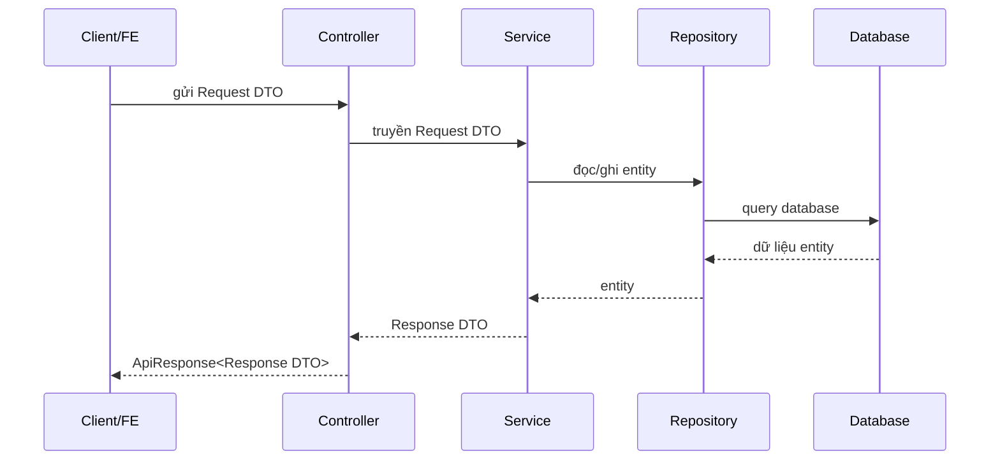
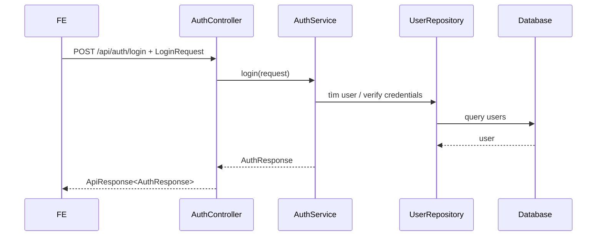
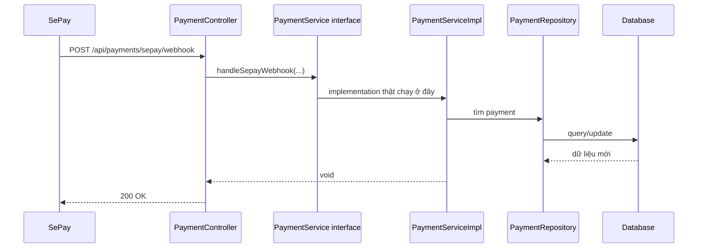

# DTO Và Service/Impl Cho Người Mới Học - 2026-03-17

## Bối cảnh

Khi nhìn vào backend Spring Boot của dự án này, người mới thường thấy khó hiểu ở hai chỗ:

- vì sao có rất nhiều file `DTO`
- vì sao có chỗ là `service` thường, có chỗ lại tách thành `service` và `service/impl`

Note này giải thích hai khái niệm đó bằng ví dụ ngay trong project.

## DTO là gì?

`DTO` là viết tắt của `Data Transfer Object`.

Hiểu rất đơn giản:

- đây là object dùng để **chuyển dữ liệu**
- nó không đại diện đầy đủ cho bảng database
- nó chỉ chứa phần dữ liệu cần thiết cho một mục đích cụ thể

Ví dụ:

- FE gửi JSON đăng ký tài khoản lên backend
- backend không cần nhận cả entity `User`
- backend chỉ cần vài field như `email`, `password`, `firstName`, `lastName`, `phone`, `role`

Lúc đó ta dùng `RegisterRequest`.

## Vì sao không dùng entity luôn?

Nếu dùng entity trực tiếp, sẽ có nhiều rủi ro:

1. FE có thể gửi thừa field không nên cho phép sửa
2. backend dễ vô tình lộ field nhạy cảm như `passwordHash`
3. response dễ bị lẫn quan hệ entity phức tạp
4. API khó kiểm soát, khó thay đổi

Vì vậy, DTO giúp tách rõ:

- dữ liệu FE được phép gửi
- dữ liệu backend muốn trả về
- dữ liệu lưu thật trong database

## Các loại DTO hay gặp trong project này

### 1. Request DTO

Đây là DTO dùng khi client gửi dữ liệu lên.

Ví dụ:

- [RegisterRequest.java](/e:/Old_bicycle_system/BE_old_bicycle_project/old_bicycle_project/src/main/java/com/backend/old_bicycle_project/dto/auth/RegisterRequest.java)
- [OrderCreateRequestDTO.java](/e:/Old_bicycle_system/BE_old_bicycle_project/old_bicycle_project/src/main/java/com/backend/old_bicycle_project/dto/request/OrderCreateRequestDTO.java)
- [ReportRequestDTO.java](/e:/Old_bicycle_system/BE_old_bicycle_project/old_bicycle_project/src/main/java/com/backend/old_bicycle_project/dto/request/ReportRequestDTO.java)

Các file này thường đi kèm annotation validation như:

- `@NotNull`
- `@NotBlank`
- `@Min`
- `@Max`

Mục đích là chặn dữ liệu sai ngay từ đầu.

### 2. Response DTO

Đây là DTO dùng khi backend trả dữ liệu về cho FE.

Ví dụ:

- [AuthResponse.java](/e:/Old_bicycle_system/BE_old_bicycle_project/old_bicycle_project/src/main/java/com/backend/old_bicycle_project/dto/auth/AuthResponse.java)
- [ProductResponse.java](/e:/Old_bicycle_system/BE_old_bicycle_project/old_bicycle_project/src/main/java/com/backend/old_bicycle_project/dto/product/ProductResponse.java)
- [OrderResponseDTO.java](/e:/Old_bicycle_system/BE_old_bicycle_project/old_bicycle_project/src/main/java/com/backend/old_bicycle_project/dto/response/OrderResponseDTO.java)

Response DTO thường:

- bỏ field nhạy cảm
- đổi cấu trúc cho FE dễ render hơn
- gộp thêm dữ liệu từ nhiều bảng

## Ví dụ nhỏ

### Entity `User`

Entity thật có thể có:

- `passwordHash`
- `refreshTokens`
- `emailVerifications`
- `status`
- `role`
- `isVerified`

Nhưng khi login, FE chỉ cần:

- `accessToken`
- `refreshToken`
- `tokenType`
- `expiresIn`
- thông tin user cơ bản

Nên backend trả [AuthResponse.java](/e:/Old_bicycle_system/BE_old_bicycle_project/old_bicycle_project/src/main/java/com/backend/old_bicycle_project/dto/auth/AuthResponse.java), không trả nguyên entity `User`.

## DTO đi qua hệ thống như thế nào?

## Áp dụng trong project này

Ví dụ với login:

1. FE gửi [LoginRequest.java](/e:/Old_bicycle_system/BE_old_bicycle_project/old_bicycle_project/src/main/java/com/backend/old_bicycle_project/dto/auth/LoginRequest.java)
2. [AuthController.java](/e:/Old_bicycle_system/BE_old_bicycle_project/old_bicycle_project/src/main/java/com/backend/old_bicycle_project/controller/AuthController.java) nhận request
3. [AuthService.java](/e:/Old_bicycle_system/BE_old_bicycle_project/old_bicycle_project/src/main/java/com/backend/old_bicycle_project/service/AuthService.java) xử lý đăng nhập
4. service sinh token và map sang `AuthResponse`
5. controller bọc lại bằng [ApiResponse.java](/e:/Old_bicycle_system/BE_old_bicycle_project/old_bicycle_project/src/main/java/com/backend/old_bicycle_project/dto/response/ApiResponse.java)
6. FE nhận response sạch, không thấy `passwordHash`

## Service là gì?

`Service` là lớp chứa **nghiệp vụ**.

Hiểu đơn giản:

- controller nhận request
- repository chỉ lo đọc/ghi database
- service là nơi quyết định “được làm hay không” và “phải làm theo rule nào”

Ví dụ:

- order có được accept không
- user chưa verify email có được login không
- payment webhook có hợp lệ không

Đó là việc của service.

## Vì sao có chỗ là service thường, có chỗ là service + impl?

Trong Java/Spring có hai kiểu phổ biến.

### Kiểu 1: Service là class thường

Ví dụ:

- [AuthService.java](/e:/Old_bicycle_system/BE_old_bicycle_project/old_bicycle_project/src/main/java/com/backend/old_bicycle_project/service/AuthService.java)
- [BrandService.java](/e:/Old_bicycle_system/BE_old_bicycle_project/old_bicycle_project/src/main/java/com/backend/old_bicycle_project/service/BrandService.java)

Ở kiểu này:

- file trong `service/` chính là implementation thật
- class thường có `@Service`
- không có interface tách riêng

Kiểu này phù hợp khi:

- module còn gọn
- chỉ có một cách triển khai
- team muốn ít file hơn

### Kiểu 2: Tách interface và implementation

Ví dụ:

- [PaymentService.java](/e:/Old_bicycle_system/BE_old_bicycle_project/old_bicycle_project/src/main/java/com/backend/old_bicycle_project/service/PaymentService.java)
- [PaymentServiceImpl.java](/e:/Old_bicycle_system/BE_old_bicycle_project/old_bicycle_project/src/main/java/com/backend/old_bicycle_project/service/impl/PaymentServiceImpl.java)

Ở kiểu này:

- file trong `service/` là **interface**
- file trong `service/impl/` là **class triển khai thật**

`PaymentService.java` chỉ nói:

- service này có các method nào

`PaymentServiceImpl.java` mới là nơi viết:

- logic tạo payment request
- logic parse webhook
- logic update order/payment

## Khác nhau ngắn gọn

| Kiểu | Trong `service/` | Trong `service/impl/` | Khi nào hay dùng |
| --- | --- | --- | --- |
| Service thường | class thật | không có | module đơn giản |
| Service + impl | interface | class thật | module phức tạp hoặc muốn tách contract |

## Vì sao tách interface + impl lại hữu ích?

### 1. Dễ hiểu “hợp đồng”

Interface giống như bản cam kết:

- service này có những chức năng gì

Ví dụ [PaymentService.java](/e:/Old_bicycle_system/BE_old_bicycle_project/old_bicycle_project/src/main/java/com/backend/old_bicycle_project/service/PaymentService.java) cho ta biết ngay:

- tạo payment request
- lấy payment history
- xử lý webhook

### 2. Dễ test và mock hơn

Khi test controller, ta có thể mock interface `PaymentService` dễ dàng.

### 3. Dễ đổi implementation sau này

Ví dụ sau này nếu payment gateway đổi lớn:

- vẫn giữ interface cũ
- thay implementation khác

## Nhưng vì sao không tách hết tất cả service?

Vì tách interface + impl cũng có giá của nó:

- thêm file
- thêm độ dài cấu trúc
- hơi nặng với module nhỏ

Nên trong project này đang tồn tại cả hai kiểu.

Đó không phải là sai. Nó chỉ cho thấy codebase đang dùng **mixed pattern**.

## Luồng thực tế của service trong project

### Ví dụ 1: AuthService là class thường

### Ví dụ 2: PaymentService + PaymentServiceImpl

## Hiểu đúng về thư mục `impl`

Thư mục `impl` không phải là “service xịn hơn”.

Nó chỉ có nghĩa là:

- đây là **implementation**
- tức là nơi chứa code thực thi interface

## Common mistakes

### 1. Nghĩ DTO = entity

Sai.

DTO chỉ là object để mang dữ liệu qua lại, không phải model database đầy đủ.

### 2. Nghĩ service trong `impl` mới là service thật, còn file trong `service/` là dư thừa

Không hẳn.

Nếu file trong `service/` là interface, nó vẫn rất quan trọng vì nó mô tả contract của module.

### 3. Nghĩ project phải chọn đúng một kiểu duy nhất

Không bắt buộc.

Project thực tế có thể dùng mixed pattern, miễn là team hiểu rõ vì sao module đó dùng kiểu nào.

## Kết luận

- `DTO` giúp chuyển dữ liệu an toàn và rõ ràng giữa FE, controller, service, và response.
- `service` là nơi chứa nghiệp vụ.
- File service thường là class triển khai trực tiếp.
- File trong `service/impl` là class triển khai cho interface nằm ở `service/`.
- Trong project này đang có cả hai kiểu, và điều đó là bình thường.
