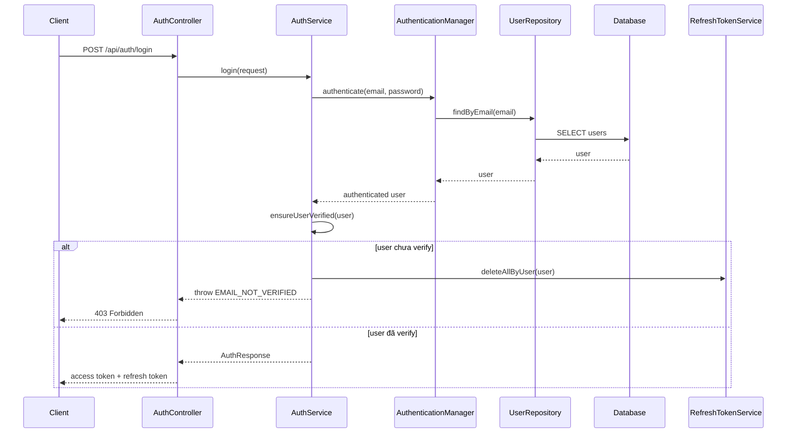

# Email Verification Và Login Guard: giải thích cho người mới học

## 1. Bối cảnh của vấn đề

Trong backend này, khi người dùng đăng ký tài khoản mới, hệ thống tạo user với:

- `isVerified = false`

Sau đó hệ thống gửi email chứa link xác thực. Người dùng phải bấm link đó thì tài khoản mới được xem là đã xác thực email.

Vấn đề trước khi sửa là:

- luồng gửi email xác thực đã có
- endpoint verify email đã có
- nhưng `login` vẫn cho đăng nhập dù `isVerified = false`

Nghĩa là tính năng xác thực email có tồn tại, nhưng luật nghiệp vụ “chưa xác thực thì chưa được đăng nhập” lại chưa được thực thi thật.

## 2. `Email verification guard` là gì?

`Guard` ở đây có thể hiểu đơn giản là một lớp chặn.

Nó trả lời câu hỏi:

> “Trước khi cho user đi tiếp, mình có cần kiểm tra thêm điều kiện nào không?”

Trong bài này, điều kiện đó là:

- user đã xác thực email chưa

Nếu chưa:

- không cho login thành công
- không cho dùng refresh token để xin access token mới

## 3. Vì sao phải chặn cả login và refresh token?

Nếu chỉ chặn `login` mà không chặn `refresh token`, sẽ có lỗ hổng như sau:

1. user từng có phiên đăng nhập cũ
2. sau đó hệ thống bắt đầu siết rule xác thực email
3. nhưng refresh token cũ vẫn còn sống
4. user vẫn xin access token mới được

Khi đó, luật mới bị vô hiệu hóa một phần.

Cho nên backend phải chặn cả:

- `login`
- `refresh token`

## 4. Luồng xử lý sau khi sửa

Các file chính:

- `src/main/java/com/backend/old_bicycle_project/service/AuthService.java`
- `src/main/java/com/backend/old_bicycle_project/service/EmailService.java`
- `src/main/java/com/backend/old_bicycle_project/controller/AuthController.java`
- `src/main/java/com/backend/old_bicycle_project/repository/UserRepository.java`

## 5. Giải thích từng bước đơn giản

### Bước 1: client gửi login request

Client gửi:

- email
- password

đến endpoint login.

### Bước 2: controller chuyển việc cho service

`AuthController` không tự quyết định business rule.

Nó chỉ nhận request rồi gọi:

- `AuthService.login(...)`

### Bước 3: service kiểm tra email/password

`AuthService` nhờ `AuthenticationManager` xác thực thông tin đăng nhập.

Nếu email hoặc password sai:

- Spring Security chặn từ sớm

Nếu đúng:

- service lấy được đối tượng `User`

### Bước 4: service kiểm tra `isVerified`

Đây là chỗ quan trọng nhất của bản sửa.

Sau khi đã xác thực đúng email/password, service gọi:

- `ensureUserVerified(user)`

Nếu `user.isVerified()` là `false`:

- backend xóa toàn bộ refresh token của user đó
- ném ra lỗi `EMAIL_NOT_VERIFIED`

### Bước 5: chỉ user đã verify mới nhận token

Nếu user đã xác thực email:

- backend mới tạo access token
- backend mới tạo hoặc trả refresh token

## 6. Vì sao việc xóa refresh token cũ lại hữu ích?

Giả sử trước đây user từng có refresh token từ một phiên cũ.

Nếu chỉ báo lỗi mà không xóa refresh token:

- token cũ có thể vẫn còn trong database
- về sau dễ tạo lỗ hổng hoặc gây khó hiểu khi debug

Khi xóa hết refresh token cũ:

- rule mới sạch hơn
- session cũ không còn được tiếp tục dùng
- backend dễ dự đoán hơn

## 7. Áp dụng cụ thể trong project này

Bản sửa lần này thêm:

- `EMAIL_NOT_VERIFIED` trong `ErrorCode`
- kiểm tra `ensureUserVerified(user)` trong:
  - `login(...)`
  - `refreshToken(...)`

Điều đó làm cho tính năng verify email từ chỗ “có gửi mail và có endpoint verify” trở thành một luật đăng nhập thật.

## 8. Những hiểu lầm dễ gặp

### Hiểu lầm 1: “Có gửi mail verify là đủ”

Không đúng.

Gửi mail chỉ là một phần của flow.

Nếu login không kiểm tra `isVerified`, thì verify email chỉ mang tính hình thức.

### Hiểu lầm 2: “Chặn login là đủ, refresh token không quan trọng”

Không đúng.

Refresh token cũng là một cổng để lấy access token mới, nên cũng phải chịu cùng luật.

### Hiểu lầm 3: “Kiểm tra ở controller là được”

Không nên.

Business rule kiểu này nên nằm ở service, vì:

- service là nơi quyết định nghiệp vụ
- controller chỉ nên nhận request và trả response

## 9. Chốt ngắn

Bản sửa này giúp backend chuyển từ:

- “có tính năng verify email”

sang:

- “verify email thật sự ảnh hưởng đến quyền đăng nhập”

Đây là một ví dụ điển hình cho việc:

- feature tồn tại trong code
- nhưng chỉ khi business rule được thực thi đúng chỗ thì feature đó mới thật sự hoàn chỉnh
