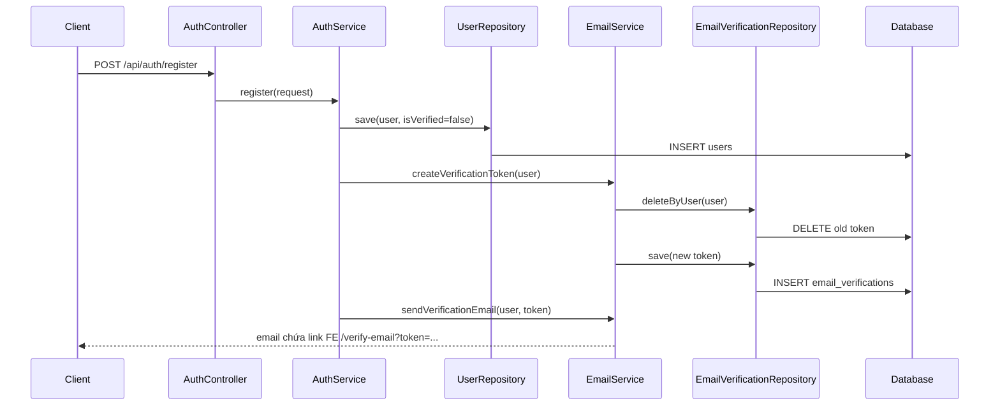
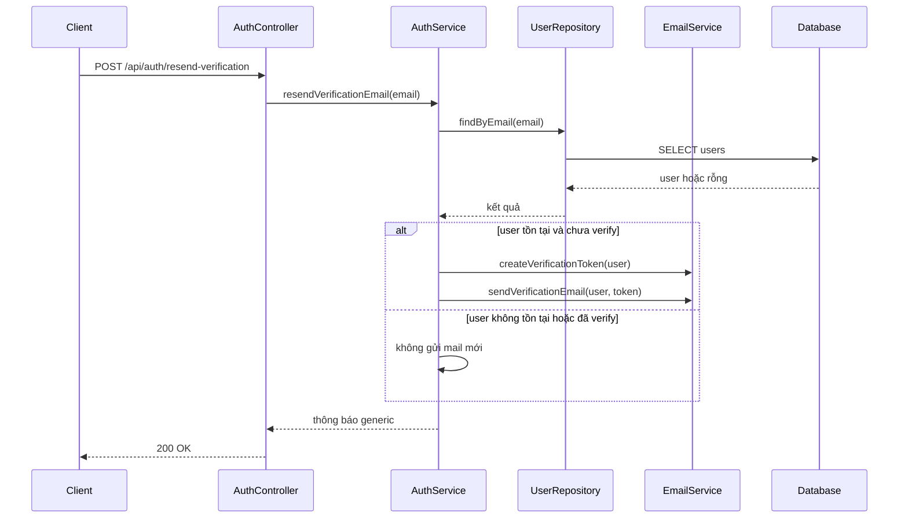

# Email verification resend và frontend link basics - 2026-03-25

## 1. Bối cảnh

Luồng xác thực email của dự án đã có từ trước:

- user đăng ký
- backend tạo token verify
- backend gửi email
- user bấm link
- backend xác thực token

Nhưng có 2 vấn đề thực tế:

1. Link trong email trước đây đi vào `/api/auth/verify-email?...`, nên khi deploy FE riêng và BE riêng, người dùng có thể rơi vào response JSON của backend thay vì màn hình FE.
2. Nếu user không nhận được email đầu tiên, hệ thống chưa có đường `resend verification` để gửi lại mail xác thực.

## 2. Khái niệm quan trọng

### Link FE thật là gì?

Đây là link mà trình duyệt mở ra để render giao diện frontend, ví dụ:

```text
/verify-email?token=abc123
```

Khác với API endpoint:

```text
/api/auth/verify-email?token=abc123
```

API endpoint dùng cho chương trình gọi dữ liệu. FE route dùng để mở màn hình cho người dùng.

### Resend verification là gì?

Đó là chức năng gửi lại email xác thực cho tài khoản chưa verify.

Chức năng này giúp user tự phục hồi khi:

- email bị chậm
- email rơi vào spam
- mail provider lỗi tạm thời ở lần gửi đầu

## 3. Luồng mới ở backend

### 3.1 Khi đăng ký



### 3.2 Khi gửi lại email xác thực



## 4. Giải thích theo từng lớp

### Client gửi gì?

- Khi đăng ký: email, password, họ tên, role
- Khi resend: chỉ cần email

### Controller làm gì?

- nhận request HTTP
- gọi sang service
- trả response dạng `ApiResponse`

### Service quyết định gì?

- chuẩn hóa email
- chỉ resend nếu user tồn tại và chưa verify
- luôn trả thông báo generic để không làm flow FE bị kẹt

### Repository đọc/ghi gì?

- bảng `users`
- bảng `email_verifications`

### Database thay đổi gì?

- khi register: thêm user mới và token verify
- khi resend: xóa token verify cũ rồi lưu token mới

### Response trả về là gì?

- với register: thông báo kiểm tra email
- với resend: thông báo generic rằng hệ thống đã xử lý yêu cầu gửi lại

## 5. File chính

- `src/main/java/com/backend/old_bicycle_project/service/AuthService.java`
- `src/main/java/com/backend/old_bicycle_project/service/EmailService.java`
- `src/main/java/com/backend/old_bicycle_project/controller/AuthController.java`
- `src/main/java/com/backend/old_bicycle_project/dto/auth/ResendVerificationRequest.java`

## 6. Sai lầm dễ gặp

- Dùng link API trong email thay vì link FE thật.
- Có nút resend ở FE nhưng backend chưa mở public endpoint.
- Gửi lại token mới nhưng không xóa token cũ.
- Chỉ nghĩ đến happy path mà quên trường hợp user không nhận được email đầu tiên.
