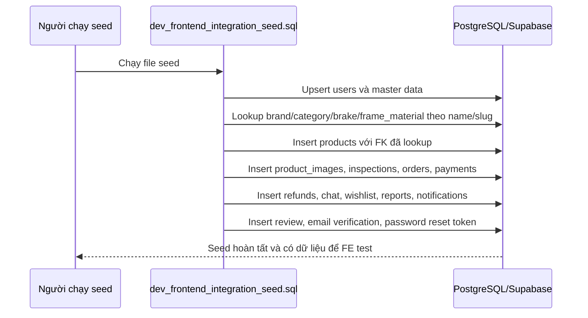

# Dev Seed SQL Cho FE Tích Hợp API

## Mục tiêu

File seed này dùng để nạp dữ liệu dev khi database gần như trống, để frontend có thể test các màn hình thật thay vì chỉ thấy empty state.

File chính:

- [dev_frontend_integration_seed.sql](/e:/Old_bicycle_system/BE_old_bicycle_project/old_bicycle_project/tools/sql/dev_frontend_integration_seed.sql)

## File seed này có gì?

Seed hiện tại đã chuẩn bị sẵn dữ liệu cho các nhóm chính:

- user theo nhiều role và status
- master data như brand, category, brake type, frame material
- product với nhiều `ProductStatus`
- inspection pass và fail
- order với các trạng thái `pending`, `deposited`, `completed`, `cancelled`
- payment với `success`, `failed`, `refunded`
- refund request với `pending`, `approved`, `rejected`, `completed`
- report
- notification
- chat conversation và message
- wishlist
- review
- token verify email và reset password mẫu

## Vì sao nên seed theo scenario?

Nếu chỉ insert vài dòng user và product ngẫu nhiên, FE sẽ khó test những màn hình phức tạp như:

- badge trạng thái
- bộ lọc admin
- order timeline
- refund workflow
- notification unread
- chat list có tin nhắn chưa đọc

Vì vậy file này seed theo `scenario`, tức là mỗi cụm dữ liệu phục vụ một use case rõ ràng.

## Vì sao file seed phải chịu được master data đã có sẵn?

Trong môi trường Supabase thật, database dev không phải lúc nào cũng trống hoàn toàn. Có thể:

- `frame_materials` đã có `Aluminum`
- `brands` đã có `Giant`
- `categories` đã có `bicycles`

Nếu file seed chỉ insert theo `id` cứng, nó có thể fail vì:

- database đang chặn trùng `name` hoặc `slug`
- nhưng row đang có lại dùng `id` khác với `id` trong file seed

Khi đó script sẽ dừng giữa chừng, dù dữ liệu nghiệp vụ phía sau như product hay order vẫn chưa được seed.

### Cách file seed hiện tại xử lý

File [dev_frontend_integration_seed.sql](/e:/Old_bicycle_system/BE_old_bicycle_project/old_bicycle_project/tools/sql/dev_frontend_integration_seed.sql) hiện xử lý theo 2 lớp:

1. **Master data upsert theo natural key**

- `brake_types` dùng `name`
- `frame_materials` dùng `name`
- `brands` dùng `name`
- `categories` dùng `slug`

Điều này giúp script không còn phụ thuộc tuyệt đối vào `id` cứng của master data.

2. **Product lookup khóa ngoại theo dữ liệu thật**

Khi insert `products`, script không nhét thẳng:

- `brand_id`
- `category_id`
- `brake_type_id`
- `frame_material_id`

Thay vào đó, script lookup lại theo:

- `brand.name`
- `category.slug`
- `brake_type.name`
- `frame_material.name`
- `seller.email`

Nhờ vậy, product vẫn insert đúng ngay cả khi master data đã có sẵn từ trước với UUID khác.

## Luồng dữ liệu của file seed



Giải thích đơn giản:

1. Người chạy seed đưa file SQL vào database.
2. File seed tạo hoặc cập nhật các bảng gốc như user, brand, category.
3. Khi tới `products`, script hỏi database: “brand Giant đang có id nào?”, “category road-bikes đang có id nào?”.
4. Database trả đúng id hiện có.
5. Script dùng các id đó để insert product.
6. Sau khi product có rồi, các bảng phía sau như order, payment, chat, notification mới dùng tiếp được.

## Cách chạy

### Cách 1: Supabase SQL Editor

1. Mở project Supabase của backend.
2. Vào SQL Editor.
3. Mở file [dev_frontend_integration_seed.sql](/e:/Old_bicycle_system/BE_old_bicycle_project/old_bicycle_project/tools/sql/dev_frontend_integration_seed.sql).
4. Copy nội dung và chạy.

### Cách 2: PostgreSQL client

Nếu máy có `psql`, có thể chạy:

```powershell
psql "<your_postgres_connection_string>" -f ".\tools\sql\dev_frontend_integration_seed.sql"
```

## Tài khoản dev đã seed

Tất cả account seed trong file hiện dùng cùng một mật khẩu:

```text
Password1
```

Một số account tiêu biểu:

- `admin@oldbicycle.dev`
- `inspector@oldbicycle.dev`
- `buyer.alpha@oldbicycle.dev`
- `buyer.beta@oldbicycle.dev`
- `buyer.unverified@oldbicycle.dev`
- `buyer.banned@oldbicycle.dev`
- `seller.road@oldbicycle.dev`
- `seller.mtb@oldbicycle.dev`
- `seller.city@oldbicycle.dev`

## Token dev đã seed

- email verification:
  - `verify-buyer-unverified-token`
- password reset:
  - `reset-buyer-beta-token`

## Lưu ý

- Đây là seed dev, không phải Flyway migration.
- Không nên nhét dữ liệu mẫu này vào `db/migration/`.
- File có block `TRUNCATE` ở đầu nhưng đang comment lại. Chỉ bỏ comment khi bạn thật sự muốn reset sạch dữ liệu dev.
- Seed hiện được viết cho PostgreSQL và Supabase, không nhắm tới H2 test database.
- File seed hiện đã được viết theo hướng **idempotent tương đối** cho master data phổ biến, tức là chạy lại nhiều lần sẽ ít bị fail hơn khi database đã có sẵn `brand`, `category`, `frame_material`, `brake_type`.

## Kết quả verify gần nhất

Trong lần apply gần nhất lên Supabase `kfkzxghznwgbbarfsqre`, script đã nạp thành công:

- `9` users
- `12` products
- `14` product images
- `2` inspections
- `8` orders
- `6` payments
- `4` refund requests
- `3` conversations
- `8` messages
- `3` reports
- `8` notifications
- `2` reviews
- `6` wishlist rows
- `1` email verification token mẫu
- `1` password reset token mẫu

## Kết luận

Khi FE bắt đầu tích hợp, điều quan trọng không phải là “có dữ liệu”, mà là “có đúng các trạng thái dữ liệu cần test”. File seed này được viết theo đúng hướng đó để FE có thể test cả:

- happy path
- empty state
- badge trạng thái
- filter
- admin flow
- payment và refund flow
