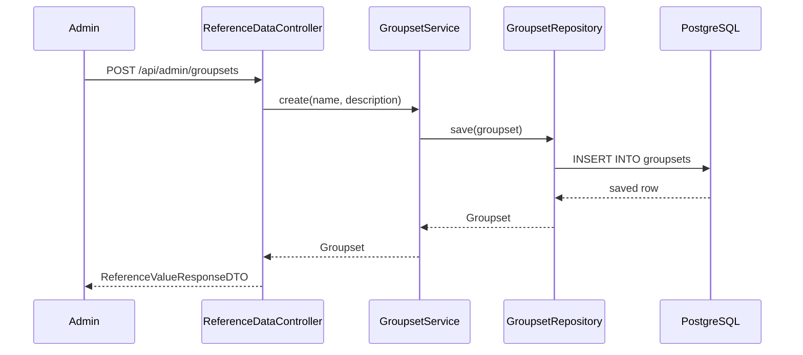
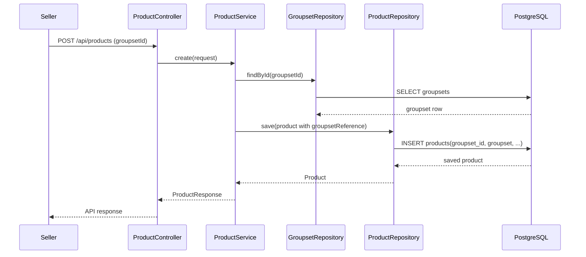

# Groupset Master Data Và Cách Product Gắn Với Groupset: giải thích cho người mới học

## 1. Bối cảnh

Trước đây product đang có field:

- `groupset`

Field này là `String`, nghĩa là seller hoặc hệ thống có thể lưu các giá trị như:

- `Shimano 105`
- `105 Shimano`
- `shimano105`

Vấn đề là:

- dữ liệu bị loạn
- buyer lọc theo groupset không chính xác
- admin không có chỗ quản lý danh mục groupset chuẩn

Cho nên lần này backend thêm:

- bảng `groupsets`
- cột `products.groupset_id`

## 2. `Master data` là gì?

`Master data` có thể hiểu đơn giản là dữ liệu chuẩn, dùng lại nhiều lần trong hệ thống.

Ví dụ trong project này:

- `brands`
- `categories`
- `brake_types`
- `frame_materials`
- và bây giờ có thêm `groupsets`

Ý tưởng là:

- admin tạo danh sách groupset chuẩn trước
- seller chỉ chọn từ danh sách đó
- product sẽ tham chiếu tới groupset chuẩn bằng `id`

## 3. Bảng mới hoạt động ra sao?

### Bảng `groupsets`

Bảng này giữ danh sách groupset chuẩn:

- `id`
- `name`
- `description`
- `created_at`

Ví dụ:

- `Shimano 105`
- `SRAM Rival`
- `Shimano GRX`

### Cột `products.groupset_id`

Đây là khóa ngoại từ `products` sang `groupsets`.

Nó trả lời câu hỏi:

> “Chiếc xe này đang dùng groupset chuẩn nào trong hệ thống?”

## 4. Vì sao vẫn giữ cột `products.groupset` dạng text?

Vì hệ thống đã có dữ liệu cũ.

Nếu xóa ngay cột text:

- migration sẽ rủi ro hơn
- các record cũ dễ bị mất thông tin hiển thị

Cho nên backend dùng hướng an toàn hơn:

- thêm `groupset_id` mới
- vẫn giữ `groupset` text cũ
- migration backfill dữ liệu cũ sang bảng `groupsets`

Nói ngắn gọn:

- `groupset_id` là dữ liệu chuẩn mới
- `groupset` text là lớp tương thích dữ liệu cũ

## 5. Luồng backend sau khi sửa

Các file chính:

- `src/main/java/com/backend/old_bicycle_project/controller/ReferenceDataController.java`
- `src/main/java/com/backend/old_bicycle_project/service/GroupsetService.java`
- `src/main/java/com/backend/old_bicycle_project/service/ProductService.java`
- `src/main/java/com/backend/old_bicycle_project/specification/ProductSpecification.java`
- `src/main/resources/db/migration/V15__groupset_master_data.sql`

Khi seller tạo product:

## 6. Lọc product theo groupset hoạt động thế nào?

Buyer hoặc FE gửi:

- `groupsetId`

đến API search product.

`ProductSpecification` sẽ ưu tiên:

- lọc theo `groupsetReference.id`

Nếu không có `groupsetId` mà chỉ có text cũ:

- backend vẫn còn fallback sang `groupset like ...`

Điều này giúp hệ thống:

- hỗ trợ dữ liệu mới chuẩn hơn
- nhưng chưa làm vỡ dữ liệu cũ ngay lập tức

## 7. Migration lần này làm gì?

File:

- `V15__groupset_master_data.sql`

Nó làm 4 việc chính:

1. tạo bảng `groupsets`
2. thêm cột `products.groupset_id`
3. lấy các giá trị `groupset` text cũ trong `products` để insert vào `groupsets`
4. update các product cũ để map `groupset_id`

Đây là kiểu migration rất hay gặp:

- tạo bảng mới
- backfill dữ liệu cũ
- rồi cho code mới dùng dữ liệu chuẩn

## 8. Những hiểu lầm dễ gặp

### Hiểu lầm 1: “Có bảng `groupsets` rồi thì cột `products.groupset` là dư”

Không hẳn.

Trong giai đoạn chuyển tiếp, cột text cũ giúp:

- giữ tương thích dữ liệu cũ
- giảm rủi ro khi rollout

### Hiểu lầm 2: “Filter theo groupset chỉ cần so sánh text là đủ”

Không đúng.

So sánh text dễ bị:

- sai chính tả
- khác format
- trùng nghĩa nhưng khác cách viết

Khóa ngoại `groupset_id` ổn định hơn nhiều.

### Hiểu lầm 3: “Master data chỉ là danh sách để hiển thị”

Không đúng.

Master data còn ảnh hưởng tới:

- validation
- filter
- reporting
- dữ liệu sạch trong database

## 9. Chốt ngắn

Lần sửa này biến `groupset` từ chỗ:

- text rời rạc

thành:

- master data có quản lý
- product liên kết bằng khóa ngoại
- vẫn giữ tương thích với dữ liệu cũ

Đây là một bước rất điển hình của việc:

- nâng chất lượng dữ liệu
- nhưng không phá hệ thống đang chạy.
