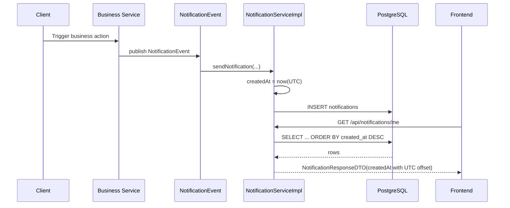

# Inspection Context, Notification Coverage, Và UTC Timestamp Basics

## Bối cảnh

Backend notification của dự án từng có 2 bước cải thiện:

1. DTO trả `createdAt` dưới dạng `OffsetDateTime` để frontend biết rõ múi giờ.
2. Bổ sung thêm notification cho các luồng moderation, inspection, refund, report, và payout.

Tuy nhiên vẫn còn một bug thật ngoài môi trường chạy:

- một số bản ghi `notifications.created_at` bị lưu lệch sang tương lai
- backend sort theo `created_at desc`
- frontend nhận các bản ghi đó ở đầu danh sách
- relative time hiển thị sai thành `Vừa xong`

## Root cause

### Định nghĩa ngắn

`LocalDateTime` là kiểu ngày giờ **không gắn múi giờ**.

Nó chỉ nói “11:54” nhưng không nói:

- 11:54 ở UTC
- hay 11:54 ở UTC+6
- hay 11:54 ở UTC+7

Khi dữ liệu được lưu vào cột PostgreSQL kiểu `timestamp` không có timezone, nếu các instance backend chạy với múi giờ khác nhau thì cùng một thời điểm thật có thể bị ghi thành các “giờ tường” khác nhau.

### Điều gì đã xảy ra

Một nhóm notification được ghi bằng giờ tường của instance chạy lệch múi giờ, nên `created_at` trong DB lớn hơn `now()` của Postgres nhiều giờ.

Khi backend hiện tại đọc lại các dòng đó và map về DTO, chúng trở thành timestamp “ở tương lai”.

Hệ quả:

1. `findByUserIdOrderByCreatedAtDesc(...)` đẩy chúng lên đầu danh sách.
2. Frontend thấy thời gian âm và từng hiển thị `Vừa xong`.

## Ví dụ rất ngắn

### Thời điểm thật

- Sự kiện xảy ra lúc `05:54 UTC`

### Dữ liệu lỗi

- DB lại lưu `11:54` trong cột `timestamp`

Nếu backend hiện tại hiểu số `11:54` đó là UTC, notification sẽ trông như đang ở tương lai gần 6 giờ.

## Cách sửa trong backend

### 1. Chuẩn hóa notification timestamp về UTC khi ghi

Entity `Notification` không còn dựa vào `@CreationTimestamp` theo giờ local của JVM cho field `createdAt`.

Thay vào đó:

- `createdAt` mặc định được gán bằng `LocalDateTime.now(ZoneOffset.UTC)`
- `@PrePersist` cũng ép fallback về UTC nếu field còn `null`
- `NotificationServiceImpl.sendNotification(...)` set `createdAt` theo UTC một cách tường minh

Điểm quan trọng là: từ đây notification mới sẽ luôn được lưu bằng một quy ước duy nhất.

### 2. Map DTO bằng đúng quy ước lưu trữ

`NotificationServiceImpl.mapToDTO(...)` bây giờ gắn offset UTC cho `createdAt`.

Điều này làm cho frontend nhận được timestamp có nghĩa rõ ràng:

- không còn phụ thuộc `ZoneId.systemDefault()`
- không còn bị đổi kết quả chỉ vì server deploy ở môi trường khác

### 3. Sửa dữ liệu cũ đã bị lệch

Migration `V18__normalize_notification_timestamps_to_utc.sql` thực hiện:

```sql
UPDATE notifications
SET created_at = created_at - interval '6 hours'
WHERE created_at > now() + interval '5 minutes';
```

Ý nghĩa:

- notification nào đang nằm tương lai quá 5 phút là dữ liệu sai
- hệ thống hiện không có “scheduled notification”, nên trường hợp này không hợp lệ
- trừ `6 giờ` đưa các bản ghi lệch quay về thời điểm thật

## Luồng backend sau khi sửa

`client action -> business service -> NotificationEvent -> NotificationServiceImpl -> notifications table -> NotificationResponseDTO -> frontend`

### Giải thích từng bước

1. Người dùng hoặc admin thực hiện một hành động như duyệt tin, chuyển inspection, hoàn tiền.
2. Service nghiệp vụ publish `NotificationEvent`.
3. `NotificationServiceImpl.sendNotification(...)` tạo entity `Notification`.
4. `createdAt` được gán theo UTC trước khi lưu.
5. Repository ghi xuống bảng `notifications`.
6. Khi client gọi `GET /api/notifications/me`, backend đọc dữ liệu và map `createdAt` sang `OffsetDateTime` với offset UTC.
7. Frontend nhận timestamp rõ múi giờ và format lại.

## Mermaid sequence diagram



## Vì sao fix này quan trọng

### Nếu chỉ sửa frontend

Frontend có thể ngừng hiện `Vừa xong`, nhưng thứ tự notification vẫn sai vì backend vẫn sort trên dữ liệu sai.

### Nếu chỉ sửa dữ liệu cũ

Các notification mới vẫn có thể sai lại trong lần deploy khác nếu logic ghi tiếp tục phụ thuộc timezone local của JVM.

Vì vậy cần đủ cả 2 phần:

1. sửa cách ghi mới
2. sửa dữ liệu cũ

## Test regression

`NotificationServiceImplTest` bây giờ kiểm tra rằng:

- notification được persist với `createdAt` khác `null`
- response push qua WebSocket dùng đúng `UTC offset`

Test này giúp ngăn bug quay lại khi ai đó vô tình đổi lại logic timestamp trong tương lai.
