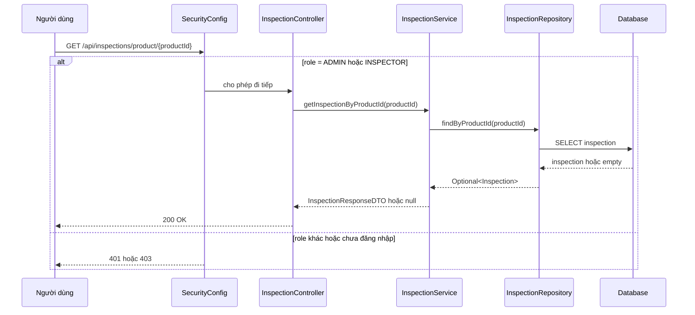

# Hardening quyền truy cập inspection detail

## 1. Bối cảnh

Trong backend này có endpoint:

- `GET /api/inspections/product/{productId}`

Ban đầu endpoint đó để public. Cách này tiện cho frontend vì chỉ cần gọi một API là lấy được dữ liệu inspection.

Nhưng có một rủi ro:

- endpoint raw inspection detail trả cả dữ liệu nội bộ như `inspectorId`
- về lâu dài còn có thể lộ thêm ghi chú kỹ thuật hoặc metadata mà người mua bình thường không cần thấy

Vì vậy cần tách rõ:

- dữ liệu công khai cho người dùng thường
- dữ liệu nội bộ cho admin hoặc inspector

## 2. Khái niệm cần hiểu

### 2.1. Public summary là gì?

`Public summary` là phần thông tin ngắn gọn, an toàn để hiển thị cho người dùng bình thường.

Ví dụ:

- xe đã pass inspection hay chưa
- điểm tổng quan
- còn hạn kiểm định đến khi nào

Đây là dữ liệu phục vụ quyết định mua bán.

### 2.2. Raw detail là gì?

`Raw detail` là dữ liệu chi tiết hơn của bản ghi inspection trong hệ thống.

Ví dụ:

- ai là inspector
- ghi chú kỹ thuật nội bộ
- các trường phục vụ tooling quản trị

Dữ liệu này thường chỉ nên cho vai trò nội bộ xem.

## 3. Vấn đề của thiết kế cũ

Nếu để endpoint raw detail là public:

1. người ngoài có thể dò `productId` rồi đọc dữ liệu inspection không cần thiết
2. sau này chỉ cần thêm một field nhạy cảm vào DTO là tự động lộ ra ngoài
3. contract API trở nên khó hiểu vì public API lại mang trách nhiệm của internal tooling

Đây là kiểu lỗi hay gặp khi dự án lớn dần lên:

- lúc đầu API chỉ có vài field nên thấy “không sao”
- sau vài vòng phát triển, endpoint cũ bỗng dưng lộ quá nhiều dữ liệu

## 4. Cách sửa trong project này

Lần sửa này làm 2 việc:

1. `SecurityConfig` không còn cho phép public toàn bộ `GET /api/inspections/**`
2. `InspectionController.getInspectionByProductId(...)` được gắn `@PreAuthorize("hasAnyRole('INSPECTOR', 'ADMIN')")`

Điều đó có nghĩa là:

- admin và inspector vẫn xem được inspection raw detail
- buyer/seller/anonymous không gọi được endpoint này nữa
- dữ liệu inspection công khai tiếp tục đi qua product detail

## 5. Luồng sau khi sửa

## 6. Vì sao product detail vẫn là nơi phù hợp cho dữ liệu public?

Luồng public nên là:

- người mua mở product detail
- backend trả `ProductResponse`
- bên trong có `inspection` summary đủ để đọc

Ưu điểm:

- public API gọn hơn
- frontend buyer không đụng vào endpoint nội bộ
- backend dễ kiểm soát trường nào thật sự public

## 7. Ví dụ dễ hiểu

Hãy tưởng tượng inspection giống như một phiếu kiểm tra trong gara.

- khách mua xe chỉ cần biết: xe đã đạt chưa, điểm bao nhiêu, còn hiệu lực không
- kỹ thuật viên và quản lý gara mới cần xem chi tiết ai kiểm, ghi chú gì, file báo cáo nào

Nếu đưa cả “phiếu nội bộ” cho khách, hệ thống sẽ dư thông tin và khó an toàn.

## 8. File chính đã sửa

- `src/main/java/com/backend/old_bicycle_project/security/SecurityConfig.java`
- `src/main/java/com/backend/old_bicycle_project/controller/InspectionController.java`
- `src/main/java/com/backend/old_bicycle_project/service/InspectionService.java`
- `src/test/java/com/backend/old_bicycle_project/security/SecurityConfigIntegrationTest.java`

## 9. Kết luận

Bản sửa này không thêm tính năng mới cho người dùng cuối, nhưng lại rất quan trọng cho chất lượng hệ thống.

Nó giúp backend:

- tách rõ public API và internal API
- giảm nguy cơ lộ dữ liệu inspection nội bộ
- giữ cho contract frontend dễ hiểu hơn khi dự án tiếp tục phát triển
