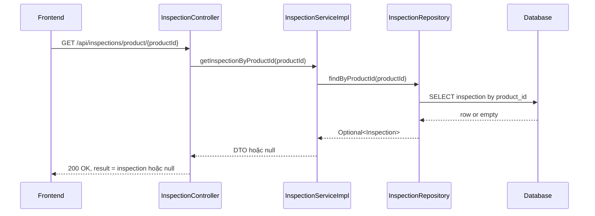
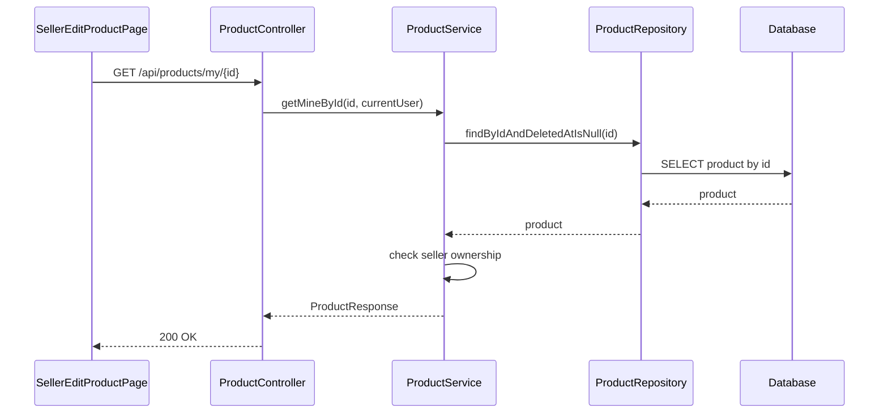

# Inspection null và seller edit ở backend

## Bối cảnh

Trong lượt sửa này có 2 lỗi backend liên quan trực tiếp đến frontend:

1. `GET /api/inspections/product/{productId}` trả `404` khi xe chưa có bản ghi kiểm định.
2. Trang seller edit dùng `GET /api/products/{id}` nên không mở được tin đang `pending` hoặc `hidden`.

Hai lỗi này đều không phải lỗi database hỏng. Chúng là lỗi **thiết kế contract API**.

## Khái niệm cần hiểu

### Contract API là gì?

`Contract API` là thỏa thuận giữa frontend và backend.

Ví dụ:

- frontend nghĩ rằng: "xe chưa kiểm định" là trạng thái bình thường
- backend lại trả `404 Not Found`

Khi đó 2 bên hiểu khác nhau, nên giao diện sẽ hiện lỗi đỏ dù thực tế không có bug nghiệp vụ.

### Seller-scoped endpoint là gì?

Đây là endpoint chỉ dành cho chính người bán lấy dữ liệu của tin đăng mình sở hữu.

Nó khác endpoint public ở chỗ:

- endpoint public chỉ nên trả tin đang hiển thị cho người mua
- endpoint seller có thể trả cả tin `pending`, `hidden`, hoặc tin chưa public

## Vì sao lỗi inspection 404 xảy ra?

Trước khi sửa:

- controller gọi service `getInspectionByProductId(productId)`
- service tìm inspection theo `productId`
- nếu không có bản ghi thì ném `RECORD_NOT_EXISTS`
- frontend nhận 404 và console đỏ liên tục

Nhưng "chưa có inspection" là trạng thái hợp lệ của nhiều xe. Vì vậy trả lỗi là quá gắt.

## Cách sửa

Tôi đổi service để:

- nếu có inspection -> map sang `InspectionResponseDTO`
- nếu chưa có inspection -> trả `null`

Controller vẫn trả `200 OK`, nhưng `result = null`.

### Luồng sau khi sửa

### Giải thích theo từng lớp

1. Frontend gửi `productId`.
2. Controller chỉ nhận request và gọi service.
3. Service quyết định:
   - có dữ liệu thì map ra DTO
   - không có dữ liệu thì trả `null`
4. Repository đọc database.
5. Database có thể trả rỗng.
6. Response vẫn là `200`, vì đây không phải lỗi hệ thống.

## Vì sao seller không edit được tin đang chờ duyệt?

Trước khi sửa, trang edit gọi:

- `GET /api/products/{id}`

Nhưng endpoint này là endpoint public. Trong `ProductService.getById(...)`, backend chỉ cho phép các status public như:

- `active`
- `pending_inspection`
- `inspected_passed`
- `inspected_failed`

Tin `pending` hoặc `hidden` sẽ bị chặn để người mua không thấy.

Điều này đúng với public API, nhưng sai với seller edit screen.

## Cách sửa seller edit

Tôi thêm endpoint mới:

- `GET /api/products/my/{id}`

Endpoint này:

- yêu cầu role `SELLER`
- lấy product theo `id`
- kiểm tra product đó có thuộc chính seller hiện tại không
- nếu đúng thì trả dữ liệu, kể cả khi status là `pending` hoặc `hidden`

## Luồng mới của seller edit

## Vì sao cách này quan trọng?

Nếu không tách public endpoint và seller endpoint, ta sẽ bị 2 lỗi:

1. Người bán không sửa được tin của chính mình.
2. Hoặc tệ hơn, nếu nới public endpoint quá tay thì người mua lại nhìn thấy tin chưa duyệt.

Tách endpoint giúp mỗi luồng có quy tắc riêng, dễ hiểu và an toàn hơn.

## Ví dụ dễ hiểu

Hãy tưởng tượng có 2 cửa:

- cửa ngoài cho khách: chỉ thấy món đã trưng bày
- cửa trong cho chủ cửa hàng: thấy cả món đang chuẩn bị, đang chỉnh sửa, hoặc đang ẩn

`GET /api/products/{id}` là cửa ngoài.
`GET /api/products/my/{id}` là cửa trong của người bán.

## Những file chính đã tham gia lần sửa này

- [InspectionController.java](/e:/Old_bicycle_system/BE_old_bicycle_project/old_bicycle_project/src/main/java/com/backend/old_bicycle_project/controller/InspectionController.java)
- [InspectionService.java](/e:/Old_bicycle_system/BE_old_bicycle_project/old_bicycle_project/src/main/java/com/backend/old_bicycle_project/service/InspectionService.java)
- [InspectionServiceImpl.java](/e:/Old_bicycle_system/BE_old_bicycle_project/old_bicycle_project/src/main/java/com/backend/old_bicycle_project/service/impl/InspectionServiceImpl.java)
- [ProductController.java](/e:/Old_bicycle_system/BE_old_bicycle_project/old_bicycle_project/src/main/java/com/backend/old_bicycle_project/controller/ProductController.java)
- [ProductService.java](/e:/Old_bicycle_system/BE_old_bicycle_project/old_bicycle_project/src/main/java/com/backend/old_bicycle_project/service/ProductService.java)
- [ProductServiceTest.java](/e:/Old_bicycle_system/BE_old_bicycle_project/old_bicycle_project/src/test/java/com/backend/old_bicycle_project/service/ProductServiceTest.java)
- [InspectionServiceImplTest.java](/e:/Old_bicycle_system/BE_old_bicycle_project/old_bicycle_project/src/test/java/com/backend/old_bicycle_project/service/impl/InspectionServiceImplTest.java)

## Hiểu lầm dễ gặp

### Hiểu lầm 1: Không có inspection thì phải là 404

Không đúng.

Chỉ nên trả `404` khi bản thân tài nguyên bị hỏi là sai hoặc không tồn tại theo nghĩa nghiệp vụ.

Ở đây:

- product có thật
- chỉ là chưa có inspection

Nên `200 + result = null` hợp lý hơn.

### Hiểu lầm 2: Seller edit thì cứ dùng lại endpoint public

Không nên.

Endpoint public và endpoint owner có mục tiêu khác nhau.

Nếu dùng chung, sớm muộn cũng lệch quyền hoặc lệch trạng thái hiển thị.

## Kết luận

Lượt sửa này làm 2 việc quan trọng:

1. Biến "chưa có inspection" thành trạng thái dữ liệu bình thường thay vì lỗi 404.
2. Tách endpoint dành riêng cho seller để mở tin của chính mình khi edit.

Nhờ đó:

- frontend bớt console đỏ không cần thiết
- seller edit hoạt động đúng với tin `pending/hidden`
- public product API vẫn giữ đúng vai trò cho người mua
