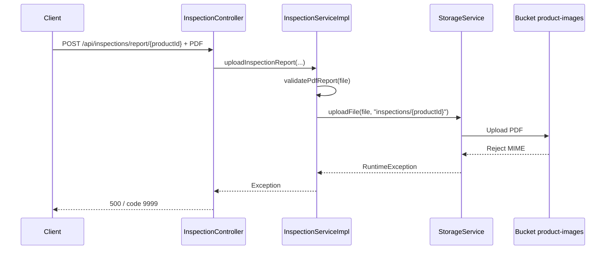
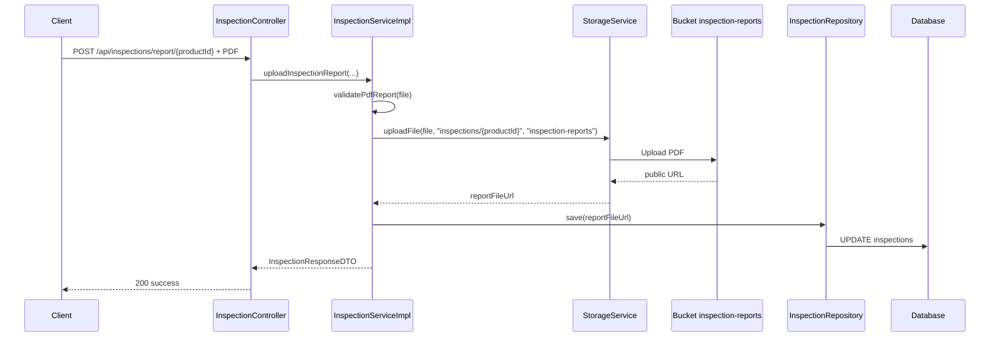

# Sửa lỗi upload báo cáo kiểm định PDF bằng bucket riêng

## 1. Bối cảnh

Trong quá trình smoke test runtime, endpoint:

- `POST /api/inspections/report/{productId}`

đã trả về:

- `500`
- `code = 9999`

Nhìn từ frontend thì đây giống một lỗi backend chung chung. Nhưng khi đi sâu vào log và storage thật, nguyên nhân không nằm ở controller hay validation JSON, mà nằm ở policy của Supabase Storage.

## 2. Khái niệm cần biết

### 2.1. Bucket là gì?

`Bucket` là một vùng chứa file trong dịch vụ lưu trữ.

Có thể hiểu đơn giản:

- database lưu dữ liệu dạng bảng
- storage lưu dữ liệu dạng file
- bucket là một thư mục lớn có rule riêng

Ví dụ:

- bucket A chỉ cho ảnh
- bucket B chỉ cho PDF

### 2.2. MIME type là gì?

`MIME type` là loại nội dung của file.

Ví dụ:

- `image/png`
- `image/jpeg`
- `application/pdf`

Nếu bucket chỉ cho phép `image/png` mà ta cố upload `application/pdf`, storage sẽ từ chối.

## 3. Root cause thật

Bucket cũ `product-images` đang có policy:

- `image/png`
- `image/jpeg`
- `image/webp`

Nhưng luồng upload báo cáo kiểm định lại gửi file:

- `application/pdf`

Nghĩa là backend validate đúng PDF, nhưng lại upload PDF vào bucket dành cho ảnh.

Kết quả là:

1. `InspectionServiceImpl` nhận file PDF
2. `MultipartFileValidationUtils.validatePdfReport(...)` cho qua
3. `StorageService.uploadFile(...)` đẩy file vào `product-images`
4. Supabase Storage từ chối vì MIME không hợp lệ
5. `StorageService` ném `RuntimeException`
6. `GlobalExceptionHandler` bắt `Exception.class`
7. client chỉ thấy `9999`

## 4. Luồng cũ

## 5. Cách sửa

### 5.1. Tách bucket theo đúng nghiệp vụ

- ảnh tiếp tục đi vào `product-images`
- báo cáo kiểm định PDF đi vào `inspection-reports`

### 5.2. Nâng cấp `StorageService`

Trước đây `StorageService` chỉ biết một bucket mặc định.

Sau khi sửa:

- `uploadFile(file, folder)` vẫn giữ cho các luồng cũ
- thêm `uploadFile(file, folder, bucketName)` để caller chỉ định bucket riêng

Điều này giúp:

- không phá các luồng upload ảnh cũ
- chỉ tách riêng luồng PDF cần bucket khác

### 5.3. Sửa `deleteFile(...)`

Trước đây `deleteFile(...)` giả định mọi public URL đều thuộc bucket mặc định.

Điều đó sai khi báo cáo kiểm định nằm ở bucket mới.

Sau khi sửa:

- `deleteFile(...)` đọc bucket trực tiếp từ public URL
- xóa đúng bucket và đúng path

Nhờ vậy upload lần hai vẫn xóa được file PDF cũ.

## 6. Các file đã sửa

- [StorageService.java](/e:/Old_bicycle_system/BE_old_bicycle_project/old_bicycle_project/src/main/java/com/backend/old_bicycle_project/service/StorageService.java)
- [InspectionServiceImpl.java](/e:/Old_bicycle_system/BE_old_bicycle_project/old_bicycle_project/src/main/java/com/backend/old_bicycle_project/service/impl/InspectionServiceImpl.java)
- [application.properties](/e:/Old_bicycle_system/BE_old_bicycle_project/old_bicycle_project/src/main/resources/application.properties)
- [StorageServiceTest.java](/e:/Old_bicycle_system/BE_old_bicycle_project/old_bicycle_project/src/test/java/com/backend/old_bicycle_project/service/StorageServiceTest.java)
- [InspectionServiceImplTest.java](/e:/Old_bicycle_system/BE_old_bicycle_project/old_bicycle_project/src/test/java/com/backend/old_bicycle_project/service/impl/InspectionServiceImplTest.java)

## 7. Luồng mới

## 8. Verify thực tế

### 8.1. Unit test

Đã pass:

- `InspectionServiceImplTest`
- `StorageServiceTest`

### 8.2. Storage thật

Đã tạo bucket thật:

- `inspection-reports`

Bucket này:

- public
- giới hạn `application/pdf`

### 8.3. Runtime thật

Đã gọi thật endpoint:

- `POST /api/inspections/report/97d8b5e1-fc15-4d57-8a58-765b29898bc8`

Kết quả:

- response `200`
- `reportFileUrl` nằm trong bucket `inspection-reports`

Đã upload lần hai để verify nhánh xóa file cũ:

- response vẫn `200`
- URL cũ không còn dùng được nữa

## 9. Bài học cho người mới học

Một tính năng upload file không chỉ có một lớp kiểm tra.

Phải kiểm tra đủ:

1. frontend gửi đúng file chưa
2. backend validate đúng chưa
3. storage thật có cho phép loại file đó không

Nếu chỉ nhìn unit test hoặc chỉ nhìn controller, ta rất dễ bỏ sót lớp policy của storage.

Đây là lý do bug này chỉ lộ ra khi chạy runtime thật với Supabase Storage.
