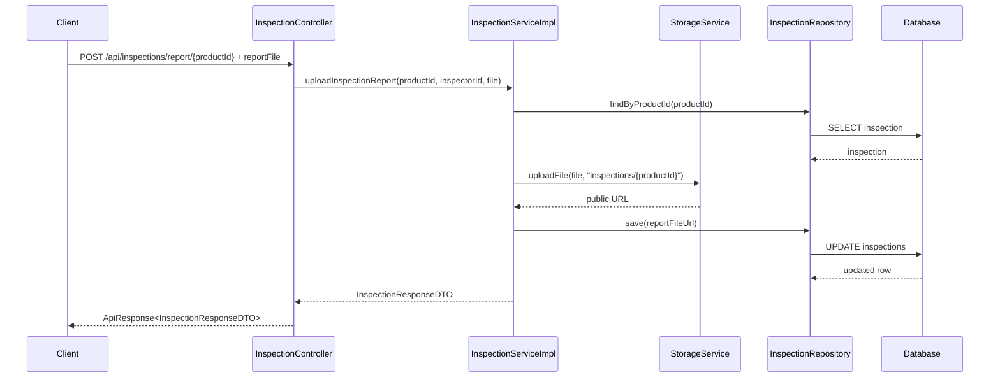
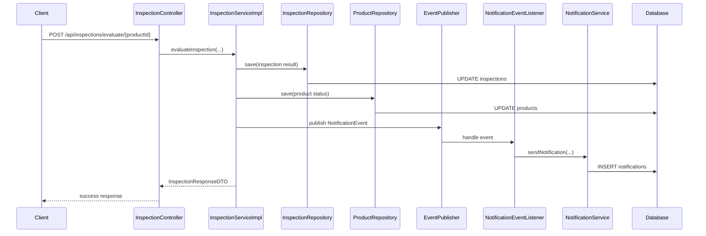

# Upload báo cáo kiểm định và notification cho seller

## 1. Bối cảnh

Ở cụm inspector, trước đây hệ thống đã có:

- seller gửi yêu cầu kiểm định
- inspector chấm điểm và kết luận đạt hoặc không đạt

Nhưng còn thiếu 2 phần thực tế:

1. inspector chưa thể tải lên file báo cáo kiểm định thật
2. seller chưa được báo ngay khi inspector hoàn tất kết quả

Điều này làm flow kiểm định chưa đủ “thật”, vì:

- có điểm số nhưng không có file báo cáo đính kèm
- có kết quả nhưng seller phải tự đi kiểm tra thủ công

## 2. Khái niệm cần hiểu

### 2.1. `Report file` là gì?

`Report file` là file báo cáo kiểm định.

Ví dụ:

- file PDF ghi kết quả kiểm tra xe
- ảnh scan biên bản
- file tài liệu inspector muốn đính kèm

Trong project này, file đó được lưu bằng `reportFileUrl`.

### 2.2. `Notification` là gì?

`Notification` là thông báo hệ thống gửi cho người dùng.

Mục tiêu là:

- khi có sự kiện quan trọng
- người dùng không cần tự đoán hoặc tự refresh nhiều lần

Ở đây, sự kiện quan trọng là:

- xe đã được kiểm định xong

## 3. Bản sửa lần này làm gì?

### 3.1. Backend thêm API upload báo cáo

File chính:

- [InspectionController.java](/e:/Old_bicycle_system/BE_old_bicycle_project/old_bicycle_project/src/main/java/com/backend/old_bicycle_project/controller/InspectionController.java)
- [InspectionService.java](/e:/Old_bicycle_system/BE_old_bicycle_project/old_bicycle_project/src/main/java/com/backend/old_bicycle_project/service/InspectionService.java)
- [InspectionServiceImpl.java](/e:/Old_bicycle_system/BE_old_bicycle_project/old_bicycle_project/src/main/java/com/backend/old_bicycle_project/service/impl/InspectionServiceImpl.java)

API mới:

- `POST /api/inspections/report/{productId}`

API này nhận:

- `reportFile` từ multipart form-data

Rồi backend:

1. tìm product
2. tìm inspection row của product đó
3. upload file lên storage
4. lưu `reportFileUrl` vào inspection
5. trả inspection mới nhất về client

### 3.2. Backend gửi notification cho seller sau khi chấm xong

Trong [InspectionServiceImpl.java](/e:/Old_bicycle_system/BE_old_bicycle_project/old_bicycle_project/src/main/java/com/backend/old_bicycle_project/service/impl/InspectionServiceImpl.java):

- sau khi inspector evaluate xong
- backend publish `NotificationEvent`
- user nhận thông báo là seller của product đó

Notification sẽ nói:

- xe đạt hay không đạt kiểm định
- seller nên xem kết quả và báo cáo

## 4. Luồng đi của backend sau khi sửa

### 4.1. Luồng upload báo cáo

### 4.2. Luồng evaluate và gửi notification

## 5. Giải thích đơn giản cho người mới học

### 5.1. Vì sao tách upload báo cáo ra một API riêng?

Vì file upload thường dùng `multipart/form-data`, còn dữ liệu chấm điểm trước đó đang là JSON.

Nếu nhét cả hai thứ vào một endpoint ngay từ đầu, contract sẽ phức tạp hơn.

Tách ra giúp:

- code dễ đọc hơn
- frontend dễ gọi hơn
- sửa ít chỗ hơn

### 5.2. Vì sao notification được gửi sau khi evaluate?

Vì evaluate mới là bước kết luận chính thức.

Trước đó:

- có thể inspector mới chỉ tải file lên
- chưa chắc xe đã đạt hay không đạt

Nên notification nên bắn ở bước “đã chốt kết quả”.

## 6. Áp dụng ở frontend

Frontend inspector form giờ:

1. chọn file báo cáo nếu có
2. upload file trước
3. gửi kết quả đánh giá
4. sau khi backend chốt xong, seller nhận notification

## 7. Hiểu lầm dễ gặp

### Hiểu lầm 1: “Có file báo cáo là đủ, không cần notification”

Sai.

Nếu seller không biết có kết quả mới thì file tồn tại cũng chưa có nhiều ý nghĩa.

### Hiểu lầm 2: “Notification nên gửi ngay khi upload file”

Không hẳn đúng.

Upload file chưa phải lúc nào cũng đồng nghĩa với có kết quả cuối cùng.

### Hiểu lầm 3: “Upload file xong thì product tự public luôn”

Sai.

Upload báo cáo chỉ là dữ liệu phụ của inspection.

Việc product public hay không vẫn phụ thuộc business rule về status.

## 8. Chốt ngắn

Bản sửa này làm cụm inspector thực tế hơn bằng cách:

- cho phép inspector tải file báo cáo kiểm định thật
- tự động báo cho seller khi kiểm định hoàn tất

Nó không đổi API chính của seller đăng tin hay buyer mua hàng, nhưng làm cho flow kiểm định gần hơn với cách vận hành ngoài đời.
