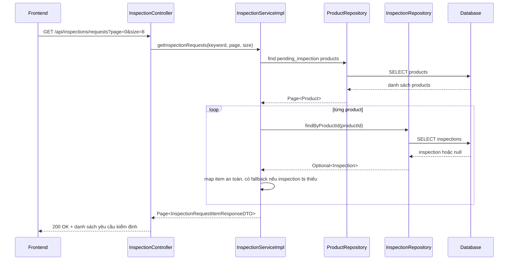

# Inspection Request 404 Vì Thiếu Bản Ghi Inspection: giải thích cho người mới học

## 1. Bối cảnh của lỗi

Trang inspector có API:

- `GET /api/inspections/requests`

Mục tiêu của API này là trả về danh sách các xe đang chờ kiểm định.

Trong lần lỗi này, frontend gọi đúng API nhưng backend lại trả:

- `404 Record does not exist`

Điều đó làm cho FE hiện banner lỗi dù thực tế vẫn có xe đang chờ kiểm định.

## 2. Gốc của vấn đề là gì?

Trong database có một xe có:

- `product.status = pending_inspection`

nhưng lại **không có** dòng tương ứng trong bảng:

- `inspections`

Nói đơn giản:

- trạng thái của sản phẩm nói rằng xe đang chờ kiểm định
- nhưng dữ liệu kiểm định đi kèm lại bị thiếu

Đây là một kiểu lỗi gọi là **data inconsistency**.

`Data inconsistency` có thể hiểu đơn giản là:

- dữ liệu ở hai nơi liên quan đến nhau
- nhưng chúng không còn khớp nhau nữa

## 3. Vì sao backend lại trả 404?

Trước khi sửa, luồng trong service là:

1. lấy danh sách product có trạng thái `pending_inspection`
2. với từng product, tìm inspection theo `productId`
3. nếu không tìm thấy inspection thì ném lỗi `RECORD_NOT_EXISTS`

Vấn đề là:

- chỉ cần **một** xe bị thiếu dòng trong bảng `inspections`
- là cả API danh sách bị fail

Điều này không hợp lý, vì đây là API list.

Một item dữ liệu xấu không nên làm hỏng toàn bộ danh sách.

## 4. Luồng xử lý sau khi sửa

Các file chính:

- `src/main/java/com/backend/old_bicycle_project/controller/InspectionController.java`
- `src/main/java/com/backend/old_bicycle_project/service/impl/InspectionServiceImpl.java`
- `src/main/java/com/backend/old_bicycle_project/repository/InspectionRepository.java`
- `tools/sql/dev_frontend_integration_seed.sql`

## 5. Sửa cụ thể như thế nào?

### Phần 1: Làm service an toàn hơn

Trong `mapRequestItem(...)`, backend không còn:

- ném lỗi ngay khi không có inspection

Thay vào đó, backend sẽ:

- cho phép `inspection = null`
- dùng dữ liệu từ `product` để dựng item fallback

Ví dụ:

- `inspectionId` fallback về `productId`
- `requestedAt` fallback về `product.updatedAt` hoặc `product.createdAt`

Điều này giúp API danh sách vẫn chạy được.

### Phần 2: Cho phép evaluate tạo inspection nếu dòng bị thiếu

Trong `evaluateInspection(...)`, nếu backend không tìm thấy inspection row cũ, nó sẽ:

- tự tạo một `Inspection` mới
- gắn lại với product đang chờ kiểm định

Nghĩa là hệ thống không chỉ “chịu đựng lỗi dữ liệu”, mà còn có thể tự phục hồi ở bước đánh giá.

### Phần 3: Vá dữ liệu seed và DB dev thật

Bug này không chỉ nằm ở code.

Nó còn nằm trong dữ liệu seed:

- product `00000000-0000-0000-0000-000000002006`
- có trạng thái `pending_inspection`
- nhưng ban đầu thiếu row trong `inspections`

Cho nên bản sửa cũng thêm dòng inspection seed còn thiếu để tránh lỗi lặp lại sau khi reseed.

## 6. Ví dụ dễ hiểu

Hãy tưởng tượng bạn có danh sách công việc:

- “Sửa xe A”
- “Sửa xe B”

Nhưng hồ sơ chi tiết của xe B bị mất.

Nếu hệ thống nói:

- “Thiếu hồ sơ xe B, vậy tôi hủy luôn cả danh sách”

thì đó là cách xử lý kém bền.

Cách hợp lý hơn là:

- vẫn hiển thị xe B trong hàng chờ
- ghi nhận rằng dữ liệu chi tiết đang thiếu
- cho phép người xử lý hoặc hệ thống tạo lại hồ sơ khi cần

Đó chính là điều bản sửa này đang làm.

## 7. Áp dụng trong project này

Sau khi sửa:

- `GET /api/inspections/requests` không còn nổ chỉ vì một product thiếu inspection row
- `evaluateInspection(...)` có thể tự tạo inspection row còn thiếu
- seed SQL đã được vá để dữ liệu dev không tự sinh lại bug cũ

Ở môi trường dev hiện tại, product:

- `00000000-0000-0000-0000-000000002006`

đã có inspection row tương ứng, nên runtime local đã trả `200 OK` lại bình thường.

## 8. Những hiểu lầm dễ gặp

### Hiểu lầm 1: “FE gọi sai endpoint”

Không đúng.

FE gọi đúng:

- `/api/inspections/requests`

Lỗi nằm ở backend logic và dữ liệu.

### Hiểu lầm 2: “404 nghĩa là không có dữ liệu nên hợp lý”

Không đúng trong trường hợp này.

Nếu hàng chờ trống thật, API nên trả:

- `200 OK`
- danh sách rỗng

Chứ không nên trả `404`.

### Hiểu lầm 3: “Chỉ cần vá dữ liệu là đủ”

Không đủ.

Nếu chỉ vá dữ liệu hiện tại mà không sửa service:

- bug sẽ quay lại khi có dữ liệu lệch mới

Cho nên phải sửa cả:

- dữ liệu hiện tại
- logic backend

## 9. Chốt ngắn

Bug này là ví dụ điển hình của việc:

- code đúng một phần
- nhưng dữ liệu thực tế bị lệch

Nếu service viết quá “mong manh”, chỉ một dòng dữ liệu xấu cũng có thể làm hỏng cả màn hình.

Bản sửa lần này làm 3 việc cùng lúc:

1. vá dữ liệu dev đang lỗi
2. làm service bền hơn
3. vá seed để lỗi không tái tạo sau này
