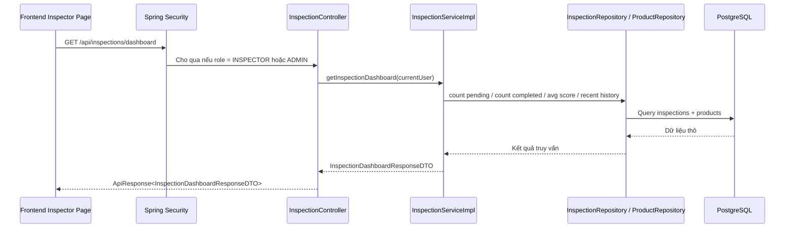

# Inspector Dashboard, History và Form Kiểm Định - 2026-03-18

## Bối cảnh

Trước thay đổi này, backend đã có luồng kiểm định cơ bản:

- seller gửi yêu cầu kiểm định
- inspector đánh giá xe
- buyer xem kết quả kiểm định của một xe

Nhưng backend chưa có đủ API để làm trọn bộ màn hình dành riêng cho `inspector`, ví dụ:

- trang tổng quan của inspector
- danh sách yêu cầu đang chờ kiểm định
- lịch sử các xe đã kiểm định

Slice này bổ sung đủ phần đó để frontend có thể làm trọn vẹn khu vực `inspector`.

## Một số khái niệm cần hiểu trước

### Inspector là gì?

`Inspector` là người có quyền kiểm tra chất lượng xe trong hệ thống. Người này không phải buyer và cũng không phải seller.

Vai trò của inspector là:

- xem xe nào đang chờ kiểm định
- chấm điểm từng hạng mục của xe
- xác nhận xe đạt hay không đạt
- xem lại lịch sử các lần đã kiểm định

### Dashboard là gì?

`Dashboard` là màn hình tổng quan. Thay vì đọc từng bản ghi một, dashboard gom một số con số chính lại để người dùng nhìn nhanh tình hình hiện tại.

Ví dụ trong slice này, dashboard hiển thị:

- có bao nhiêu yêu cầu đang chờ
- tuần này đã kiểm định bao nhiêu xe
- tỉ lệ đạt chuẩn
- điểm trung bình

### History là gì?

`History` là lịch sử. Đây là danh sách các việc đã xảy ra trước đó.

Trong inspector flow, history là các xe đã được đánh giá xong và lưu lại kết quả như:

- điểm tổng thể
- đạt hay không đạt
- lúc nào đánh giá
- còn hiệu lực đến khi nào

### Pagination là gì?

`Pagination` là chia dữ liệu thành nhiều trang nhỏ.

Ví dụ:

- trang 1 có 8 xe
- trang 2 có 8 xe tiếp theo

Làm vậy để:

- phản hồi nhanh hơn
- không tải quá nhiều dữ liệu một lúc
- frontend dễ hiển thị hơn

## Vấn đề kỹ thuật được xử lý trong slice này

### 1. Bổ sung `updated_at` cho bảng `inspections`

Để làm lịch sử và dashboard tốt hơn, backend cần biết thời điểm một lượt kiểm định được cập nhật hoặc hoàn thành.

Vì vậy slice này thêm:

- cột `updated_at`
- index cho `inspector_id`
- index cho `updated_at`

Điều này giúp:

- sắp xếp lịch sử theo lần đánh giá mới nhất
- đếm số lượt hoàn thành gần đây
- lọc theo inspector nhanh hơn

### 2. Tách response riêng cho từng màn hình

Không phải màn nào cũng cần cùng một kiểu dữ liệu.

Ví dụ:

- trang yêu cầu kiểm định chỉ cần tên xe, người bán, ảnh, thời điểm gửi
- trang lịch sử lại cần thêm điểm số, kết quả đạt hay không đạt, thời điểm đánh giá
- dashboard cần các con số tổng hợp

Vì vậy slice này tạo thêm các DTO riêng:

- `InspectionRequestItemResponseDTO`
- `InspectionHistoryItemResponseDTO`
- `InspectionDashboardResponseDTO`

Đây là cách làm đúng vì mỗi API có một hợp đồng dữ liệu rõ ràng.

## Luồng đi backend của inspector

### Sơ đồ tổng quát



## Giải thích luồng theo kiểu từng bước

### 1. Frontend gửi request

Ví dụ frontend mở trang dashboard của inspector và gọi:

```http
GET /api/inspections/dashboard
```

### 2. Security kiểm tra quyền

Spring Security sẽ kiểm tra user hiện tại có role phù hợp hay không.

Trong slice này:

- `INSPECTOR` được vào
- `ADMIN` cũng được vào
- role khác sẽ bị chặn

Điều này quan trọng vì đây là dữ liệu nội bộ, không phải dữ liệu public.

### 3. Controller nhận request

`InspectionController` nhận request và gọi sang service.

Controller nên mỏng, nghĩa là:

- không tự tính business rule phức tạp
- chỉ nhận input
- gọi service
- trả response

### 4. Service quyết định logic

`InspectionServiceImpl` là nơi xử lý chính.

Ví dụ với dashboard:

- nếu user là `admin` thì xem toàn bộ dữ liệu
- nếu user là `inspector` thì chỉ xem dữ liệu của chính họ
- service tính:
  - số lượng yêu cầu đang chờ
  - số lượt hoàn thành trong tuần
  - tỉ lệ đạt chuẩn
  - điểm trung bình
  - danh sách kiểm định gần đây

### 5. Repository truy vấn database

Repository là lớp giao tiếp với database.

Trong slice này, repository được dùng để:

- đếm số dòng theo điều kiện
- lấy trang dữ liệu có phân trang
- lọc theo inspector hoặc keyword
- tính điểm trung bình

### 6. Database trả dữ liệu

PostgreSQL trả dữ liệu về cho repository.

Repository trả tiếp cho service, service map sang DTO, rồi controller trả về cho client.

### 7. Frontend nhận response

Frontend nhận về `ApiResponse<T>` và chỉ cần lấy phần `result`.

Ví dụ dashboard trả về dữ liệu kiểu:

- `pendingRequests`
- `completedThisWeek`
- `passRate`
- `averageScore`
- `recentInspections`

## 3 API mới của inspector trong slice này

### 1. `GET /api/inspections/requests`

API này trả về danh sách xe đang chờ kiểm định.

Dùng cho màn:

- inspector requests page

Frontend có thể gửi:

- `keyword`
- `page`
- `size`

### 2. `GET /api/inspections/history`

API này trả về lịch sử kiểm định.

Điểm quan trọng:

- inspector thường chỉ thấy lịch sử của chính mình
- admin có thể thấy dữ liệu rộng hơn

### 3. `GET /api/inspections/dashboard`

API này trả về dữ liệu tổng hợp để dựng dashboard.

## Ví dụ nhỏ để dễ hình dung

Giả sử có 3 xe đang chờ kiểm định.

Inspector mở trang dashboard:

1. frontend gọi `/api/inspections/dashboard`
2. backend kiểm tra role
3. service đếm số xe chờ = `3`
4. service tính thêm các chỉ số khác
5. frontend nhận dữ liệu và hiện lên thẻ thống kê

Luồng này không cần frontend tự cộng trừ dữ liệu. Backend làm sẵn để frontend đơn giản hơn.

## Những file chính tham gia trong project này

- `InspectionController`: nhận request HTTP
- `InspectionServiceImpl`: xử lý logic dashboard, history, requests
- `InspectionRepository`: truy vấn dữ liệu kiểm định
- `ProductRepository`: lấy sản phẩm đang chờ kiểm định
- `InspectionSpecification`: tạo điều kiện lọc lịch sử
- `ProductSpecification`: tạo điều kiện lọc yêu cầu kiểm định
- `V10__inspection_dashboard_and_history.sql`: cập nhật schema database

## Những hiểu lầm dễ gặp

### Hiểu lầm 1: "Dashboard chỉ là frontend cộng số"

Không đúng.

Nếu để frontend tự cộng từ danh sách dài:

- frontend phải tải rất nhiều dữ liệu
- chậm hơn
- khó đảm bảo đúng

Dashboard nên do backend tính.

### Hiểu lầm 2: "DTO nào cũng dùng chung được"

Không nên.

Nếu dùng một DTO chung cho mọi màn:

- response sẽ thừa dữ liệu
- khó hiểu
- frontend khó bảo trì

Tách DTO theo màn hình là hợp lý hơn.

### Hiểu lầm 3: "updated_at không quan trọng"

Thực ra rất quan trọng khi cần:

- sắp xếp mới nhất trước
- thống kê theo tuần
- biết lúc nào kết quả vừa được đánh giá

## Kết luận

Slice này làm cho inspector area của backend đi từ mức "có evaluate cơ bản" lên mức "đủ để dựng dashboard, request queue, history".

Nói ngắn gọn:

- controller mở thêm API
- service tính logic theo role
- repository hỗ trợ truy vấn và thống kê
- database có thêm cột và index để phục vụ truy vấn mới
- frontend có thể gọi API thật thay vì dùng mock
