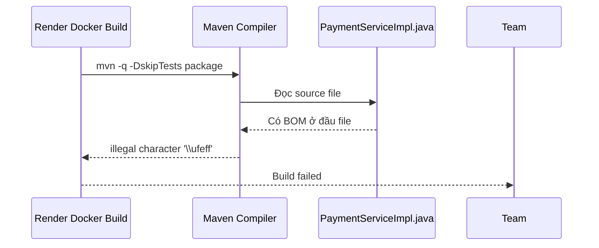
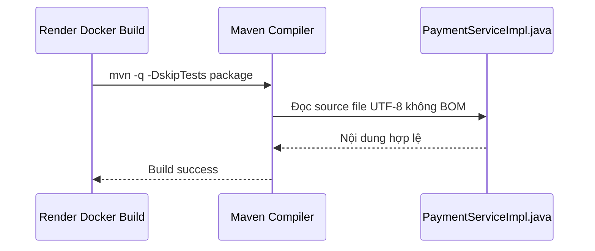

# Lỗi BOM ở file Java làm Render build fail là gì?

## Vấn đề

Khi deploy backend lên Render, bước Docker build chạy lệnh:

```powershell
mvn -q -DskipTests package
```

nhưng Maven báo lỗi kiểu:

- `illegal character: '\ufeff'`
- `class, interface, enum, or record expected`

## BOM là gì?

`BOM` là viết tắt của `Byte Order Mark`.

Đây là một vài byte đặc biệt có thể nằm ở đầu file text để báo encoding. Với UTF-8, BOM thường là 3 byte:

```text
EF BB BF
```

Nhiều tool vẫn đọc được UTF-8 có BOM. Nhưng với một số file source code, đặc biệt là Java, BOM ở đầu file có thể bị compiler hiểu nhầm là ký tự lạ.

## Vì sao local có lúc nhìn như vẫn bình thường?

Editor như VS Code thường vẫn hiển thị file gần như bình thường, nên người viết code rất dễ không nhận ra file đang có BOM.

Trong task này:

- file `PaymentServiceImpl.java`
- file `PaymentServiceImplTest.java`

đều bị BOM ở đầu file.

Vì vậy:

1. local build kiểu không `clean` có thể chưa lộ lỗi ngay
2. nhưng Render build từ đầu trong container mới
3. Maven phải compile sạch lại
4. compiler gặp BOM và fail

## Cách nhận biết

Triệu chứng điển hình là lỗi ở ngay dòng đầu tiên của file:

- `[1,1] illegal character: '\ufeff'`

Nếu thấy lỗi này, hãy nghĩ ngay đến BOM hoặc encoding đầu file.

## Cách sửa

Ý tưởng sửa rất đơn giản:

1. đọc nội dung file
2. ghi lại dưới dạng `UTF-8 without BOM`

Trong task này, chúng ta đã rewrite lại file với `UTF-8 no BOM`, nên:

- Maven compile lại thành công
- Render có thể build lại image bình thường

## Bài học rút ra

- Lỗi deploy không phải lúc nào cũng do logic business.
- Có những lỗi chỉ là encoding file source.
- Nếu log Maven báo `\ufeff` ở dòng đầu, hãy kiểm tra BOM trước khi debug sâu hơn.

## Áp dụng trong dự án này

Flow lỗi đã xảy ra:



Sau khi bỏ BOM:



## File liên quan

- `src/main/java/com/backend/old_bicycle_project/service/impl/PaymentServiceImpl.java`
- `src/test/java/com/backend/old_bicycle_project/service/impl/PaymentServiceImplTest.java`

