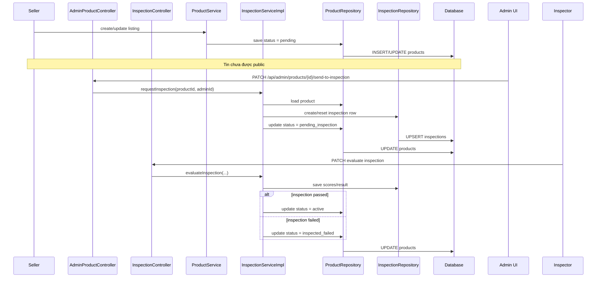

# Bắt buộc kiểm định trước khi public: giải thích cho người mới học

## 1. Bối cảnh của bài toán

Trước slice này, hệ thống có thể đi theo hướng:

- seller tạo tin
- admin duyệt
- tin có thể lên public
- inspection chỉ là một nhánh bổ sung

Nhưng nhóm đã chốt lại nghiệp vụ như sau:

- mọi tin đăng đều phải qua admin trước
- admin không đưa thẳng tin lên public
- admin phải chuyển tin qua inspection
- chỉ khi inspection đạt thì tin mới được hiển thị công khai

Điều này làm cho niềm tin của người mua cao hơn, vì mọi tin public đều đã đi qua ít nhất 2 lớp:

- kiểm duyệt nội dung bởi admin
- kiểm định kỹ thuật bởi inspector

## 2. `Mandatory inspection before public` là gì?

`Mandatory` có thể hiểu đơn giản là **bắt buộc**.

`Inspection before public` có nghĩa là:

- trước khi tin đăng xuất hiện cho buyer thấy ngoài marketplace
- nó phải đi qua bước kiểm định

Nói ngắn gọn:

> “Không có kiểm định đạt thì không được public.”

## 3. Trạng thái nào đang được dùng?

Trong project này, ta tận dụng các `status` sẵn có thay vì tạo quá nhiều trạng thái mới:

- `pending`: seller vừa tạo hoặc vừa sửa tin, đang chờ admin xem
- `pending_inspection`: admin đã chuyển tin sang hàng chờ inspector
- `active`: tin đã kiểm định đạt và đang public
- `inspected_failed`: kiểm định không đạt

Trạng thái `inspected_passed` vẫn còn trong enum để tương thích dữ liệu cũ, nhưng flow mới coi:

- `active` mới là trạng thái public chuẩn

## 4. Luồng backend sau khi sửa

Các file chính:

- `src/main/java/com/backend/old_bicycle_project/controller/AdminProductController.java`
- `src/main/java/com/backend/old_bicycle_project/controller/InspectionController.java`
- `src/main/java/com/backend/old_bicycle_project/service/ProductService.java`
- `src/main/java/com/backend/old_bicycle_project/service/impl/InspectionServiceImpl.java`
- `src/main/java/com/backend/old_bicycle_project/specification/ProductSpecification.java`

## 5. Giải thích từng lớp trong flow

### Bước 1: seller tạo hoặc sửa tin

Client gửi request tạo hoặc cập nhật product.

`ProductService` sẽ:

- validate dữ liệu cơ bản
- lưu product với `status = pending`

Điều này có nghĩa là:

- tin chưa thể public ngay

### Bước 2: admin chuyển tin sang inspection

Admin gọi:

- `PATCH /api/admin/products/{id}/send-to-inspection`

`AdminProductController` không tự xử lý business logic.

Nó chỉ chuyển việc cho:

- `InspectionServiceImpl.requestInspection(...)`

Service này sẽ:

- kiểm tra đúng role admin
- lấy product
- tạo hoặc reset dòng `inspection`
- đổi trạng thái product sang `pending_inspection`

### Bước 3: inspector đánh giá

Inspector chấm điểm các hạng mục như:

- frame
- fork
- brakes
- drivetrain
- wheels

Nếu đạt:

- product chuyển sang `active`

Nếu không đạt:

- product chuyển sang `inspected_failed`

## 6. Vì sao `ProductSpecification` cũng phải sửa?

Nhiều bạn mới học thường nghĩ:

> “Chỉ cần đổi service là đủ.”

Không đúng.

Ngoài service, phần `search` và `public list` cũng phải đổi.

Nếu không sửa `ProductSpecification`, hệ thống có thể vẫn lọc sai và để buyer nhìn thấy các tin:

- chưa kiểm định
- hoặc kiểm định hết hạn

Trong slice này, `ProductSpecification` đã được siết để public search chỉ lấy:

- tin có trạng thái public hợp lệ
- và có inspection đạt còn hạn

## 7. Vì sao `show()` phải làm tin quay về `pending`?

Khi seller ẩn tin rồi hiện lại, ta không muốn dùng lại kết quả inspection cũ một cách mù quáng.

Lý do:

- seller có thể đã sửa nội dung
- seller có thể đã thay ảnh hoặc thông số
- tình trạng xe có thể không còn giống lúc kiểm định trước

Vì vậy `ProductService.show(...)` bây giờ:

- đưa tin về `pending`
- gia hạn thời gian hiển thị
- làm inspection cũ mất hiệu lực

Nghĩa là:

> hiện lại không phải là public lại ngay, mà là đi qua moderation + inspection lại

## 8. Những chỗ dễ hiểu nhầm

### Hiểu nhầm 1: `active` chỉ là admin duyệt

Không còn đúng trong flow mới.

Giờ `active` nên được hiểu là:

- đã qua inspection đạt
- đang public

### Hiểu nhầm 2: seller tự yêu cầu inspection

Không đúng nữa.

Flow mới đã siết lại:

- seller không tự route sang inspection
- admin mới là người quyết định chuyển tin qua hàng chờ inspector

### Hiểu nhầm 3: `inspected_passed` là trạng thái public chuẩn

Không nên hiểu như vậy.

Trong flow mới:

- `inspected_passed` chủ yếu là dữ liệu cũ để tương thích
- `active` mới là đích public chính

## 9. Chốt ngắn

Slice này biến inspection từ một tính năng “có cũng được” thành một phần bắt buộc của state machine sản phẩm.

Tức là từ:

- tạo tin -> admin duyệt -> có thể public

đổi thành:

- tạo tin -> admin chuyển inspection -> inspector đánh giá -> đạt thì mới public

Đây là thay đổi quan trọng vì nó ảnh hưởng cùng lúc tới:

- controller
- service
- rule hiển thị public
- seller flow
- admin flow
- inspector flow
