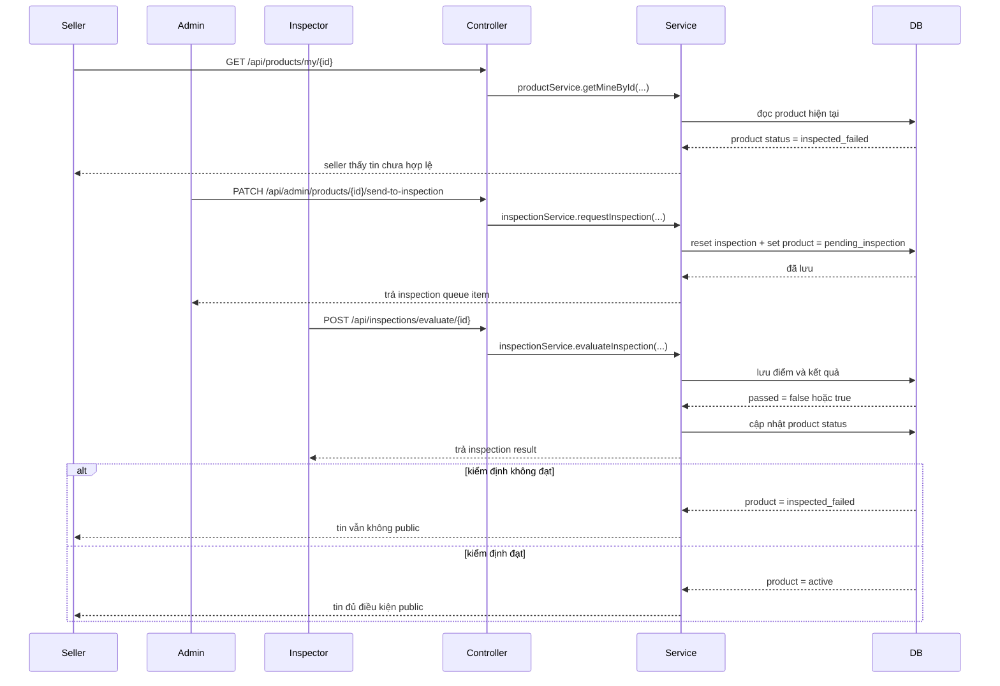

# Mandatory Inspection Live Smoke: giải thích cho người mới học

## 1. Bối cảnh

Sau khi đổi nghiệp vụ sang hướng:

- tin đăng mới không được public ngay
- admin phải chuyển tin sang kiểm định
- chỉ khi kiểm định đạt thì tin mới lên public

thì test unit là chưa đủ. Cần có một lượt **live smoke test**.

`Live smoke test` có thể hiểu đơn giản là:

- gọi API thật trên server đang chạy
- đi qua đúng user thật, token thật, dữ liệu thật
- xem trạng thái trong hệ thống có đổi đúng như mong đợi không

## 2. Luồng đã kiểm tra lần này

Product dùng để kiểm tra:

- `00000000-0000-0000-0000-000000002004`
- tiêu đề gốc: `Specialized Rockhopper 2020`

Các role dùng để test:

- `admin@oldbicycle.dev`
- `inspector@oldbicycle.dev`
- `seller.mtb@oldbicycle.dev`

Mật khẩu seed:

```text
Password1
```

## 3. Sơ đồ luồng runtime



## 4. Kết quả live smoke thật

### Nhánh 1: admin đưa sang kiểm định

Gọi:

- `PATCH /api/admin/products/{id}/send-to-inspection`

Kết quả thật:

- trả `200`
- inspection record được reset
- product chuyển sang `pending_inspection`
- inspector queue thấy đúng item này

### Nhánh 2: inspector đánh fail

Gọi:

- `POST /api/inspections/evaluate/{id}`

với:

- `passed = false`

Kết quả thật:

- trả `200`
- `overallScore = 2.0`
- product chuyển sang `inspected_failed`
- `GET /api/products/{id}` từ public trả `404`

Điều này cho thấy:

- tin fail kiểm định không bị lọt ra public

### Nhánh 3: seller sửa lại tin

Gọi:

- `PUT /api/products/{id}` dạng `multipart/form-data`

Kết quả thật:

- trả `200`
- product chuyển về `pending`
- inspection cũ bị làm mất hiệu lực

Đây là bước rất quan trọng vì nó chứng minh:

- seller sửa tin sau khi fail thì phải quay lại hàng chờ kiểm duyệt/kiểm định, không được tự public lại

### Nhánh 4: inspector đánh pass

Sau khi admin đưa lại sang kiểm định, inspector gọi:

- `POST /api/inspections/evaluate/{id}`

với:

- `passed = true`

Kết quả thật:

- trả `200`
- `overallScore = 4.0`
- product chuyển sang `active`
- `GET /api/products/{id}` từ public trả `200`
- public search theo tiêu đề gốc cũng tìm thấy item này

Điều này chứng minh:

- chỉ tin đạt kiểm định mới lên public

## 5. Vì sao lượt test này có giá trị hơn test unit?

Vì nó chạm đủ các lớp thật:

1. client login lấy token
2. controller nhận request theo role
3. service đổi trạng thái nghiệp vụ
4. repository ghi xuống database thật
5. public API đọc lại trạng thái mới

Nói cách khác, đây là test của cả chuỗi:

`client -> controller -> service -> repository -> database -> response`

## 6. Một lưu ý kỹ thuật nhỏ trên Windows

Endpoint update product dùng:

- `multipart/form-data`

Trên máy đang test, PowerShell hiện tại không hỗ trợ tốt `Invoke-RestMethod -Form`.

Vì vậy để smoke endpoint này, cách ổn định hơn là dùng:

```powershell
curl.exe -X PUT "http://localhost:8080/api/products/{id}" ^
  -H "Authorization: Bearer <token>" ^
  -F "title=..." ^
  -F "description=..."
```

Đây không phải bug của backend. Đây là giới hạn của tooling gọi HTTP trên môi trường Windows đang dùng.

## 7. Chốt ngắn

Lượt live smoke này xác nhận được 4 ý quan trọng:

- admin có thể đưa tin sang kiểm định
- tin fail kiểm định sẽ không public
- seller sửa tin sẽ quay về `pending`
- chỉ khi inspector đánh pass thì tin mới public lại

Đó chính là bằng chứng runtime rằng flow `mandatory inspection before public` đang hoạt động đúng trên server thật, không chỉ đúng trong test unit.
