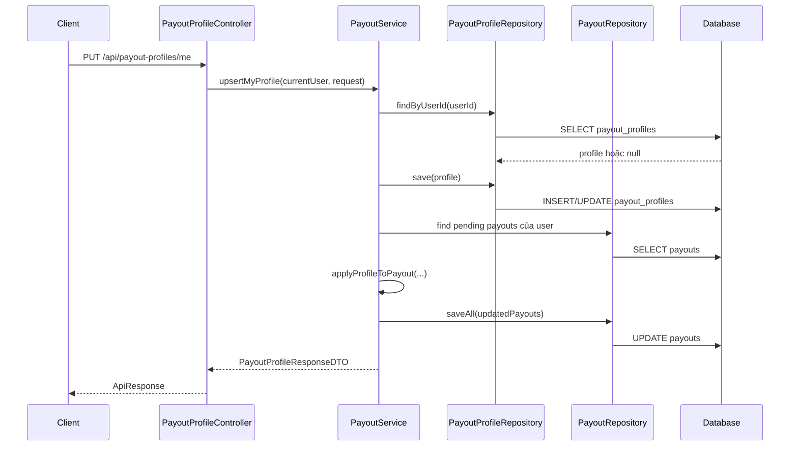
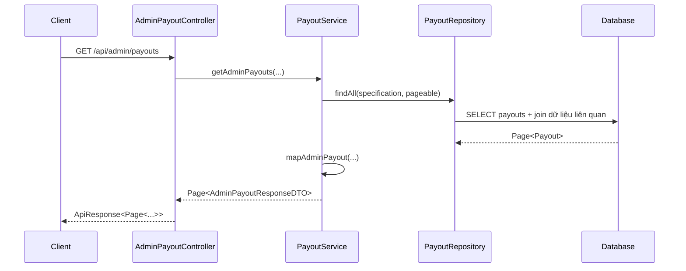
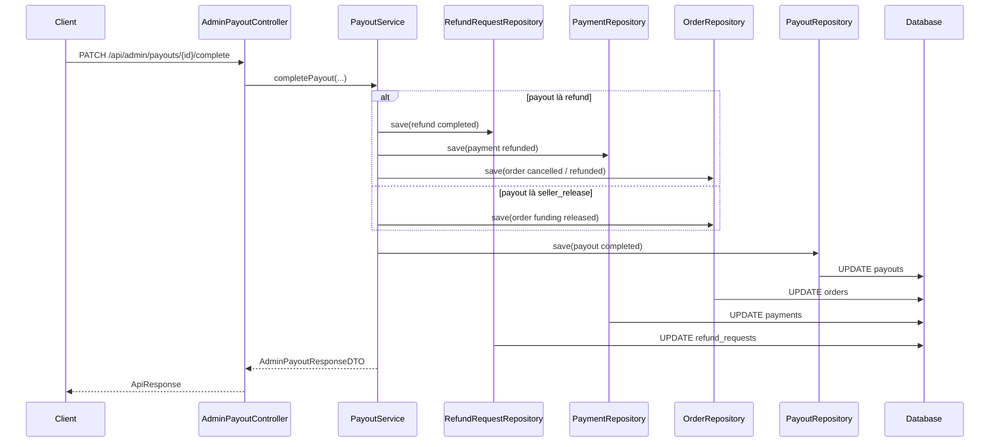

# Manual VietQR Payout, Payout Profile Và Admin Complete Payout

## 1. Bối cảnh

Trước bản sửa này, hệ thống có các trạng thái như:

- `refund approved`
- `funding released`

nhưng đó mới chỉ là **trạng thái nghiệp vụ trong hệ thống**.

Nó chưa chứng minh rằng:

- tiền hoàn về buyer đã thật sự được chuyển qua ngân hàng
- tiền cọc trả cho seller đã thật sự được chuyển qua ngân hàng

Nói đơn giản:

- hệ thống biết là “nên hoàn tiền” hoặc “nên giải ngân”
- nhưng chưa có lớp dữ liệu nào để theo dõi lần chuyển khoản thật

## 2. Khái niệm cần hiểu trước

### `Payout profile` là gì?

`Payout profile` là hồ sơ nhận tiền.

Nó lưu các thông tin như:

- tên ngân hàng
- mã BIN ngân hàng
- số tài khoản
- tên chủ tài khoản

Hồ sơ này dùng khi hệ thống hoặc admin muốn:

- hoàn tiền cho buyer
- giải ngân tiền cọc cho seller

### `Payout` là gì?

`Payout` là một bản ghi cho biết:

> “Hệ thống cần chuyển một khoản tiền thật cho ai đó”

Ví dụ:

- hoàn 2.000đ cho buyer
- giải ngân 2.000đ tiền cọc cho seller

Một `payout` có thể ở các trạng thái:

- `profile_required`
- `pending_transfer`
- `completed`
- `cancelled`

### `Manual VietQR payout` là gì?

Đây là cách làm thực dụng cho MVP:

1. hệ thống tạo thông tin người nhận
2. hệ thống sinh QR VietQR
3. admin hoặc kế toán chuyển khoản thủ công từ tài khoản công ty
4. sau khi chuyển xong, admin nhập `bankRef`
5. hệ thống mới đánh dấu payout hoàn tất

Điểm quan trọng:

- VietQR **không tự chuyển tiền**
- VietQR chỉ giúp điền sẵn thông tin chuyển khoản

## 3. Vì sao cách này phù hợp với đồ án hơn auto payout?

Muốn auto payout thật sự, thường cần:

- doanh nghiệp
- hợp đồng với ngân hàng hoặc PSP
- API chi hộ hoặc disbursement
- KYC/KYB
- đối soát giao dịch

Với đồ án sinh viên, hướng manual-but-tracked hợp lý hơn vì:

- làm thật được
- dễ demo
- có audit trail
- không phải phụ thuộc vào pháp lý doanh nghiệp

## 4. Các file chính trong project này

- `src/main/java/com/backend/old_bicycle_project/controller/PayoutProfileController.java`
- `src/main/java/com/backend/old_bicycle_project/controller/AdminPayoutController.java`
- `src/main/java/com/backend/old_bicycle_project/service/PayoutService.java`
- `src/main/java/com/backend/old_bicycle_project/service/impl/PayoutServiceImpl.java`
- `src/main/java/com/backend/old_bicycle_project/service/impl/RefundServiceImpl.java`
- `src/main/java/com/backend/old_bicycle_project/service/impl/OrderServiceImpl.java`
- `src/main/java/com/backend/old_bicycle_project/entity/PayoutProfile.java`
- `src/main/java/com/backend/old_bicycle_project/entity/Payout.java`
- `src/main/resources/db/migration/V11__manual_payout_profiles_and_records.sql`

## 5. Luồng 1: người dùng cập nhật payout profile

### Giải thích từng bước

1. Client gửi thông tin tài khoản nhận tiền.
2. Controller chỉ nhận request rồi gọi service.
3. Service tìm hồ sơ cũ của user.
4. Nếu chưa có thì tạo mới, nếu có rồi thì cập nhật.
5. Sau đó service kiểm tra xem user này có payout nào đang chờ vì thiếu tài khoản không.
6. Nếu có, service tự đổ thông tin ngân hàng vào payout đó và sinh QR VietQR.
7. Kết quả trả về cho client là hồ sơ mới nhất.

Ý nghĩa:

- user không cần tạo lại refund hoặc payout cũ
- chỉ cần bổ sung payout profile là các payout đang thiếu thông tin có thể chuyển sang `pending_transfer`

## 6. Luồng 2: admin xem danh sách payout

Admin sẽ thấy:

- loại payout
- người nhận
- số tiền
- order liên quan
- refund request liên quan
- QR VietQR
- `bankRef`
- trạng thái hiện tại

## 7. Luồng 3: admin xác nhận đã chuyển khoản thật

### Điều kiện quan trọng

Admin chỉ complete payout khi:

- payout đang là `pending_transfer`
- có `bankRef`

Nếu thiếu `bankRef`, backend ném lỗi:

- `PAYOUT_REFERENCE_REQUIRED`

Điều này giúp tránh việc đánh dấu “đã chuyển khoản” khi chưa có bằng chứng giao dịch ngân hàng.

## 8. Hệ thống đã đổi nghiệp vụ ở đâu?

### Với refund

Trước đây:

- admin approve refund
- rồi có thể xem như tiền đã hoàn

Bây giờ:

1. admin approve refund
2. hệ thống tạo `payout`
3. order sang `refund_pending_transfer`
4. chỉ khi admin complete payout với `bankRef` thì:
   - refund mới `completed`
   - payment mới `refunded`
   - order mới `cancelled + refunded`

### Với seller release

Trước đây:

- buyer confirm received
- hệ thống có thể set `released` ngay

Bây giờ:

1. buyer confirm received
2. order sang `seller_payout_pending`
3. hệ thống tạo payout cho seller
4. chỉ khi admin complete payout thì funding mới `released`

## 9. Ví dụ nhỏ để dễ hình dung

Giả sử buyer được hoàn lại 2.000đ.

### Trước bản sửa

- trạng thái có thể đã hiện như đã hoàn tiền
- nhưng chưa có dữ liệu nào chứng minh công ty đã chuyển thật

### Sau bản sửa

- tạo `payout` số tiền 2.000đ
- trạng thái `pending_transfer`
- admin chuyển khoản thủ công
- admin nhập:
  - `bankRef = IBFT20260319ABC123`
- lúc đó hệ thống mới đánh dấu payout hoàn tất

## 10. Những hiểu lầm dễ gặp

### Hiểu lầm 1: “Có VietQR là auto payout”

Sai.

VietQR chỉ là QR chứa thông tin nhận tiền.
Người thực hiện chuyển khoản vẫn là admin hoặc kế toán.

### Hiểu lầm 2: “User phải nhập bank ref”

Sai.

User chỉ nhập:

- ngân hàng
- số tài khoản
- tên chủ tài khoản

`bankRef` chỉ có sau khi công ty đã chuyển tiền thật.

### Hiểu lầm 3: “Completed trong order là tiền đã về seller”

Không còn đúng nữa.

Sau bản sửa:

- `completed + seller_payout_pending` nghĩa là giao dịch xe đã xong
- nhưng tiền cọc vẫn đang chờ giải ngân

## 11. Chốt ngắn

Bản sửa này thêm một lớp rất quan trọng:

- từ logic “nên hoàn tiền / nên giải ngân”
- sang logic “đã chuyển khoản thật hay chưa”

Nhờ vậy hệ thống:

- sát thực tế hơn
- có audit rõ hơn
- và sau này dễ nâng cấp lên auto payout bằng ngân hàng hoặc PSP hơn
