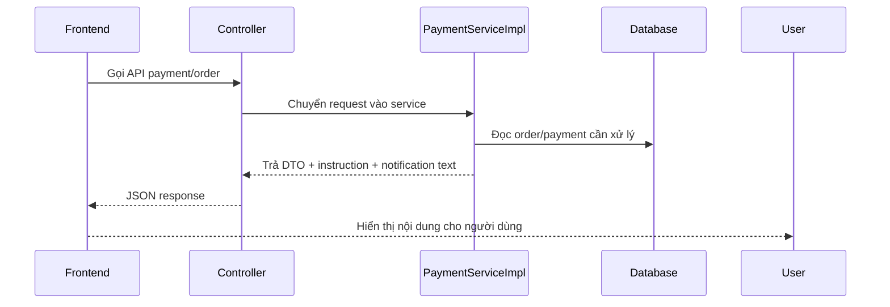

# Dọn mojibake ở copy thanh toán phía backend

## Bối cảnh

Trong một số response và notification của backend, chữ tiếng Việt bị lỗi mã hóa như `Ã`, `á»`, `Đ`.
Khi dữ liệu đó đi ra API, frontend vẫn render nguyên chuỗi lỗi, nên người dùng nhìn thấy nội dung rất khó đọc.

## Mojibake là gì?

`Mojibake` là hiện tượng chữ bị vỡ do dữ liệu được lưu hoặc đọc bằng sai bảng mã.

Ví dụ:

- Đúng: `Thanh toán đặt cọc thành công`
- Sai: `Thanh toán đặt cọc thành công`

Về bản chất, nội dung tiếng Việt gốc đã bị đọc sai kiểu mã hóa, thường là UTF-8 bị hiểu thành bảng mã khác.

## Vì sao lỗi này nguy hiểm?

Nếu lỗi nằm ở backend:

1. Service tạo message sai
2. Controller trả JSON chứa chuỗi sai
3. Frontend chỉ hiển thị lại chuỗi đó
4. Người dùng tưởng hệ thống bị lỗi hoặc thiếu chuyên nghiệp

Tức là frontend không phải lúc nào cũng là nơi gây ra lỗi chữ. Nếu nguồn dữ liệu từ backend đã sai, UI chỉ đang hiển thị lại lỗi đó.

## Lần này đã sửa gì?

File chính được dọn là:

- `src/main/java/com/backend/old_bicycle_project/service/impl/PaymentServiceImpl.java`

Các nhóm text đã được rewrite sạch sang UTF-8 chuẩn:

- thông báo thanh toán thành công cho buyer
- thông báo thanh toán thành công cho seller
- hướng dẫn chuyển khoản
- thông báo đơn hết hạn thanh toán
- thông báo late payment và auto-refund

## Luồng dữ liệu liên quan

Luồng đơn giản ở đây là:

Nếu `PaymentServiceImpl` tạo chuỗi bị lỗi, thì JSON trả ra cũng lỗi, và frontend sẽ hiển thị sai theo.

## Cách kiểm tra nhanh

Sau khi dọn:

1. search các pattern mojibake như `Ã`, `Đ`, `á»`
2. compile backend
3. mở UI liên quan để xem text có còn vỡ nữa không

## Kinh nghiệm rút ra

- Khi file đã có dấu hiệu mojibake, nên rewrite sạch block đang chạm thay vì vá từng ký tự lẻ tẻ.
- Với text người dùng nhìn thấy, cần ưu tiên UTF-8 chuẩn trước khi tiếp tục thêm logic mới.
- Nếu frontend hiển thị chữ lỗi, phải kiểm tra cả backend response, không nên mặc định là lỗi UI.
