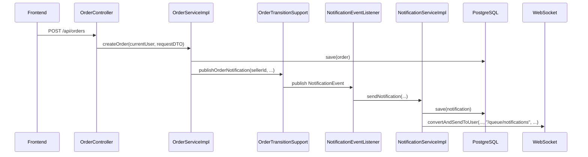
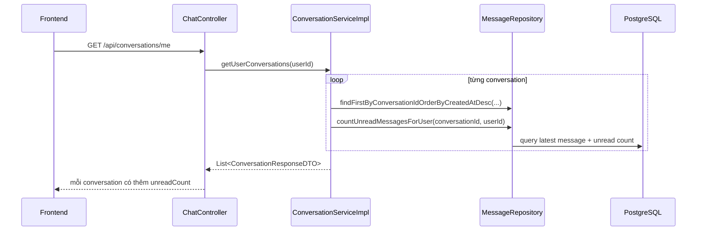
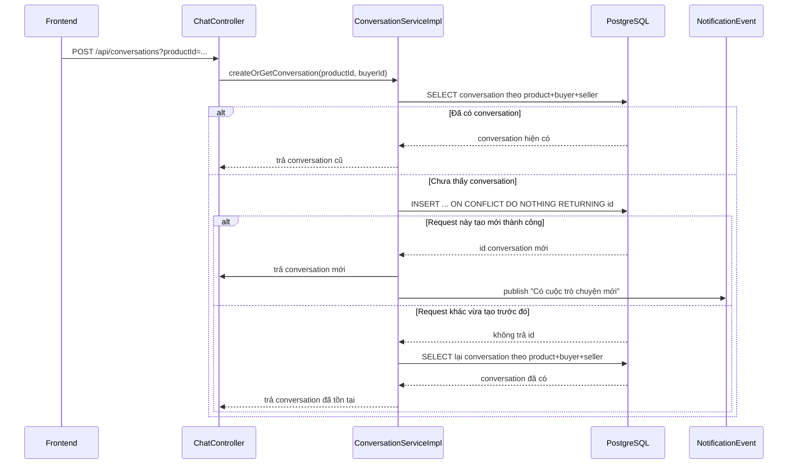

# Order Create Notification Và Conversation Unread Basics

## 1. Bối cảnh

Trong đợt này có 2 chỗ backend được bổ sung:

1. Khi buyer tạo yêu cầu mua mới, seller phải nhận được thông báo ngay.
2. Khi frontend tải danh sách cuộc trò chuyện, backend phải trả thêm `unreadCount` cho từng conversation để FE hiển thị badge đúng.

Nếu không có 2 phần này thì:

- Seller không thấy chuông thông báo khi có buyer mới gửi yêu cầu mua.
- FE phải tự đoán số tin chưa đọc của từng conversation, rất dễ sai khi reload trang hoặc đổi thiết bị.

## 2. Khái niệm cần biết

### Notification là gì?

`Notification` là một bản ghi thông báo trong hệ thống. Nó thường có:

- người nhận
- tiêu đề
- nội dung
- loại thông báo
- metadata để điều hướng

Ở project này, notification không chỉ lưu vào database mà còn được push realtime qua WebSocket.

### Unread count là gì?

`Unread count` là số tin nhắn chưa đọc.

Trong chat, số này không nên tự cộng bừa ở frontend. Cách chắc nhất là backend đếm:

- chỉ đếm tin thuộc conversation đó
- chỉ đếm tin do người khác gửi
- chỉ đếm tin có `isRead = false`

## 3. Flow 1: Buyer tạo order thì seller nhận notification

### File chính

- `src/main/java/com/backend/old_bicycle_project/service/impl/OrderServiceImpl.java`
- `src/main/java/com/backend/old_bicycle_project/service/impl/OrderTransitionSupport.java`
- `src/main/java/com/backend/old_bicycle_project/config/NotificationEventListener.java`
- `src/main/java/com/backend/old_bicycle_project/service/impl/NotificationServiceImpl.java`

### Dòng chảy



### Giải thích dễ hiểu

1. Buyer gửi request tạo order lên backend.
2. Backend tạo bản ghi `Order`.
3. Ngay sau khi lưu xong order, backend gọi `publishOrderNotification(...)` cho seller.
4. Event listener nhận event này.
5. `NotificationServiceImpl` tạo record notification trong database.
6. Sau đó backend push thêm notification qua WebSocket để FE có thể nhảy chuông realtime.

### Áp dụng trong code

Ở `OrderServiceImpl.createOrder(...)`, sau khi `orderRepository.save(...)` xong, code mới gọi:

- gửi title kiểu `Có yêu cầu mua mới`
- gửi content có tên buyer và tên sản phẩm
- gửi metadata chứa `orderId` và `productId`

Điểm quan trọng là notification chỉ nên bắn **sau khi order đã lưu thành công**, như vậy seller bấm vào mới có dữ liệu thật để xem.

## 4. Flow 2: Backend trả unreadCount cho từng conversation

### File chính

- `src/main/java/com/backend/old_bicycle_project/repository/MessageRepository.java`
- `src/main/java/com/backend/old_bicycle_project/service/impl/ConversationServiceImpl.java`
- `src/main/java/com/backend/old_bicycle_project/dto/response/ConversationResponseDTO.java`

### Dòng chảy



### Query đếm unread làm gì?

Repository mới có query:

- chỉ lấy message trong đúng conversation
- `sender.id <> userId`
- `isRead = false`

Nghĩa là:

- tin do chính mình gửi thì không tính là unread của mình
- tin đã đánh dấu đọc rồi thì không tính nữa

## 5. Vì sao cách này đúng hơn để hiển thị badge chat?

Nếu FE chỉ tự cộng số bằng local state thì sẽ có nhiều lỗi:

- reload trang là mất số
- đổi thiết bị thì sai
- mark as read ở tab khác thì badge cũ vẫn còn

Khi backend trả `unreadCount`, FE chỉ việc render theo dữ liệu thật từ server.

## 6. Ví dụ rất nhỏ

Giả sử conversation có 5 tin:

- 2 tin do seller gửi cho buyer và buyer chưa đọc
- 1 tin do buyer tự gửi
- 2 tin cũ đã đọc

Thì `unreadCount` của buyer phải là `2`, không phải `5`, cũng không phải `3`.

## 7. Chỗ dễ hiểu nhầm

### Hiểu nhầm 1: có event notification là đủ

Sai. Nếu chỉ có event mà không lưu DB thì:

- reload trang sẽ mất lịch sử notification
- trang `/notifications` không có gì để hiển thị

### Hiểu nhầm 2: unread count là việc của frontend

Sai một phần. FE có thể hiển thị badge, nhưng số badge đáng tin phải đi từ backend.

### Hiểu nhầm 3: cứ có conversation là unread phải > 0

Sai. Conversation mới tạo nhưng chưa có ai gửi tin thì `unreadCount` vẫn có thể bằng `0`.

## 8. Tóm tắt

- Buyer tạo order mới thì seller giờ có notification ngay.
- Notification được lưu DB rồi mới push WebSocket.
- API conversations giờ trả thêm `unreadCount`.
- Query unread chỉ đếm tin chưa đọc do người khác gửi.

Nhờ vậy FE có đủ dữ liệu để làm:

- chuông thông báo cho seller
- badge chưa đọc ở từng conversation
- giao diện chat ổn định hơn khi reload hoặc đổi thiết bị
## 9. Flow 3: Vì sao tạo conversation phải idempotent?

### Bài toán

Trong lúc chạy thử thật, backend đã tạo trùng `2` dòng trong bảng `conversations` cho cùng một bộ:

- `product_id`
- `buyer_id`
- `seller_id`

Hai dòng này được tạo gần như cùng lúc, chỉ lệch nhau khoảng `1 ms`.

Nếu để tình trạng này tồn tại:

- cột bên trái của trang chat sẽ hiện trùng cuộc trò chuyện
- unread badge có thể bị tách sai sang hai dòng
- notification chứa `conversationId` có thể trỏ sang hai bản ghi khác nhau

### Idempotent là gì?

`Idempotent` là một tính chất rất quan trọng trong backend.

Hiểu đơn giản:

- cùng một yêu cầu
- gọi lại nhiều lần
- kết quả cuối cùng vẫn phải giống như gọi một lần

Ví dụ nhỏ:

- buyer bấm nút “Nhắn tin người bán”
- FE vô tình gửi `2` request gần như cùng lúc
- backend đúng phải trả về **cùng một conversation**
- backend sai sẽ tạo ra **2 conversation khác nhau**

### Vì sao code cũ bị lỗi?

Code cũ làm theo kiểu:

1. `SELECT` xem conversation đã tồn tại chưa
2. nếu chưa có thì `INSERT`

Vấn đề là:

- request A kiểm tra: chưa có
- request B kiểm tra: cũng chưa có
- A insert thành công
- B cũng insert thành công

Đây là lỗi `race condition`, tức là lỗi tranh chấp thời điểm giữa hai request chạy song song.

### Cách sửa trong project này

Slice này sửa ở cả `service` và `database`.

#### 1. Service không còn tin hoàn toàn vào bước “check trước”

File:

- `src/main/java/com/backend/old_bicycle_project/service/impl/ConversationServiceImpl.java`

Backend vẫn thử tìm conversation cũ trước để trả nhanh nếu đã tồn tại.

Nhưng nếu chưa thấy, backend không dùng `save(...)` thông thường nữa. Thay vào đó, backend gọi SQL:

```sql
INSERT INTO conversations (product_id, buyer_id, seller_id, created_at, updated_at)
VALUES (:productId, :buyerId, :sellerId, now(), now())
ON CONFLICT ON CONSTRAINT uq_conversations_product_buyer_seller DO NOTHING
RETURNING id
```

Ý nghĩa:

- nếu chưa có conversation thì database tạo mới và trả `id`
- nếu request khác đã tạo trước rồi thì database **không tạo trùng nữa**
- lúc đó backend đọc lại conversation đã có sẵn và trả về

#### 2. Database tự chặn luôn dữ liệu trùng

Migration mới:

- `src/main/resources/db/migration/V23__deduplicate_conversations_and_add_unique_constraint.sql`

Migration này làm `3` việc:

1. tìm các conversation bị trùng theo bộ `product_id + buyer_id + seller_id`
2. giữ lại một dòng gốc, rồi chuyển:
   - `messages.conversation_id`
   - `notifications.metadata.conversationId`
   sang dòng gốc đó
3. xóa dòng trùng và thêm `UNIQUE CONSTRAINT`

Constraint mới là:

- `uq_conversations_product_buyer_seller`

Từ đây database sẽ không cho tạo trùng conversation cùng khóa nghiệp vụ nữa.

### Luồng mới chạy như thế nào?



### Giải thích lại như cho sinh viên năm nhất

Hãy tưởng tượng có một phòng chat dành cho:

- buyer A
- seller B
- sản phẩm X

Backend cần đảm bảo:

- bộ ba này chỉ có **một phòng chat duy nhất**

Nếu hai request đến cùng lúc, backend không thể chỉ nhìn bằng mắt thường kiểu:

- “hình như chưa có phòng đâu”

vì ngay sau câu đó, request khác có thể vừa tạo xong rồi.

Nên chốt cuối cùng phải để database quyết định.

Database giống như người gác cổng cuối:

- nếu chưa có phòng thì mở một phòng mới
- nếu đã có phòng rồi thì từ chối tạo trùng

### Những file chính liên quan

- `src/main/java/com/backend/old_bicycle_project/service/impl/ConversationServiceImpl.java`
- `src/main/java/com/backend/old_bicycle_project/repository/ConversationRepository.java`
- `src/main/java/com/backend/old_bicycle_project/entity/Conversation.java`
- `src/main/resources/db/migration/V23__deduplicate_conversations_and_add_unique_constraint.sql`
- `src/test/java/com/backend/old_bicycle_project/service/impl/ConversationServiceImplTest.java`

### Test hồi quy đã thêm

`ConversationServiceImplTest` hiện kiểm tra:

1. nếu conversation đã tồn tại thì backend trả lại dòng cũ, không tạo mới
2. nếu chưa có thì backend tạo mới và bắn notification
3. nếu một request khác vừa thắng cuộc đua trước, backend sẽ đọc lại conversation đã tồn tại thay vì tạo trùng
