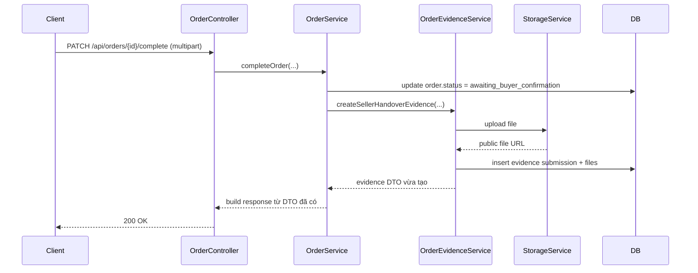

# Order Evidence Live Smoke Và Lỗi Query Hibernate Sau Khi Vừa Insert

## 1. Bối cảnh của vấn đề

Sau khi thêm tính năng:

- seller upload ảnh bàn giao xe
- buyer upload ảnh đã nhận xe

hệ thống chạy test unit vẫn pass, nhưng khi smoke thật bằng API thì bước:

- `PATCH /api/orders/{id}/complete`

lại trả:

- `9999 Uncategorized error`

Trong khi:

- order đang ở trạng thái đúng
- file upload lên storage vẫn thành công

Đây là dấu hiệu rất điển hình của một lỗi runtime nằm ở tầng JPA/Hibernate hoặc transaction, chứ không phải business rule đơn thuần.

## 2. Triệu chứng nhìn thấy từ bên ngoài

Luồng smoke thật ban đầu là:

1. buyer tạo order
2. seller/admin accept
3. seller/admin confirm cash deposit
4. seller upload ảnh bàn giao

Ở bước 4:

- API trả `9999`
- order không đổi sang `awaiting_buyer_confirmation`
- evidence cũng không hiện ra trong response

Điều đó cho thấy transaction đã bị rollback.

## 3. Gốc lỗi thật nằm ở đâu

Gốc lỗi không nằm ở:

- controller multipart
- validation file
- upload storage

Upload storage thực tế vẫn trả `200`.

Gốc lỗi nằm ở chỗ:

1. service vừa `save` order
2. service vừa `save` evidence
3. ngay sau đó service lại gọi query fetch evidence để build response

Trong project này, đoạn đó đi qua:

- [OrderServiceImpl.java](/e:/Old_bicycle_system/BE_old_bicycle_project/old_bicycle_project/src/main/java/com/backend/old_bicycle_project/service/impl/OrderServiceImpl.java)
- [OrderEvidenceServiceImpl.java](/e:/Old_bicycle_system/BE_old_bicycle_project/old_bicycle_project/src/main/java/com/backend/old_bicycle_project/service/impl/OrderEvidenceServiceImpl.java)
- [OrderEvidenceSubmissionRepository.java](/e:/Old_bicycle_system/BE_old_bicycle_project/old_bicycle_project/src/main/java/com/backend/old_bicycle_project/repository/OrderEvidenceSubmissionRepository.java)

Khi đó Hibernate ném lỗi kiểu:

- `This method should only be called if the entity is already initialized`

Nói đơn giản:

- persistence context đang có entity mới insert
- query fetch-join collection chạy ngay sau đó
- Hibernate bị vấp ở bước dựng object graph

Đây là lỗi runtime khá “khó chịu” vì:

- test mock không thấy
- compile không thấy
- chỉ live smoke mới lộ ra

## 4. Vì sao unit test ban đầu không bắt được

Vì test cũ đang mock:

- `OrderEvidenceService`
- `StorageService`
- repository save/query

Khi mock như vậy:

- không có Hibernate session thật
- không có flush thật
- không có fetch-join thật

Cho nên test vẫn xanh dù runtime thật bị lỗi.

## 5. Cách sửa đã dùng

Thay vì:

1. insert evidence
2. query lại evidence vừa insert để build response

ta đổi sang:

1. lấy `OrderEvidenceSubmissionResponseDTO` ngay từ hàm create evidence
2. nhét DTO đó trực tiếp vào response map
3. không query lại evidence mới insert trong cùng transaction

Riêng bước buyer confirm:

- evidence seller đã tồn tại từ trước
- nên có thể lấy evidence cũ trước
- sau đó thêm buyer evidence mới tạo vào map

## 6. Luồng sau khi sửa

Điểm quan trọng là:

- response được dựng từ DTO đã có
- không cần query lại evidence mới insert

## 7. Ứng dụng cụ thể trong project này

Các file chính đã đổi:

- [OrderServiceImpl.java](/e:/Old_bicycle_system/BE_old_bicycle_project/old_bicycle_project/src/main/java/com/backend/old_bicycle_project/service/impl/OrderServiceImpl.java)
- [OrderServiceImplTest.java](/e:/Old_bicycle_system/BE_old_bicycle_project/old_bicycle_project/src/test/java/com/backend/old_bicycle_project/service/impl/OrderServiceImplTest.java)

Regression protection mới:

- test `completeOrder` kiểm tra không query evidence lại ngay sau khi tạo
- smoke thật lại với API sau khi compile/reload backend

## 8. Live smoke sau khi sửa

Smoke thật đã pass với flow:

1. buyer tạo order cash partial
2. admin accept
3. admin confirm deposit
4. admin upload seller handover evidence
5. buyer upload buyer receipt evidence

Kết quả:

- `complete` trả `200`
- `confirm-received` trả `200`
- order đi đúng:
  - `deposited -> awaiting_buyer_confirmation -> completed`
- funding đi đúng:
  - `held -> seller_payout_pending`
- response có đủ:
  - `sellerHandoverEvidence`
  - `buyerReceiptEvidence`

## 9. Hiểu lầm dễ gặp

### Hiểu lầm 1: test unit pass thì runtime chắc chắn ổn

Không đúng.

Nếu test mock quá nhiều:

- JPA thật
- Hibernate thật
- query thật

sẽ không chạy.

### Hiểu lầm 2: đã `save()` xong thì query lại ngay luôn là an toàn

Không hẳn.

Trong cùng transaction, nhất là khi có:

- collection
- fetch join
- entity mới insert

thì query lại ngay có thể tạo lỗi khó đoán.

### Hiểu lầm 3: lỗi `9999` chắc chắn là do business rule sai

Không đúng.

`9999` chỉ nói rằng:

- có exception thường
- không phải `AppException`

Muốn biết thật sự là gì phải đọc stack trace hoặc làm integration/live smoke.

## 10. Chốt ngắn

Bài học chính ở đây là:

- đừng phụ thuộc hoàn toàn vào mock unit test cho các luồng JPA phức tạp
- với dữ liệu vừa insert trong cùng transaction, nên ưu tiên dùng DTO đã có thay vì query lại ngay

Đây là một ví dụ rất điển hình cho việc:

- logic nghiệp vụ đúng
- storage cũng đúng
- nhưng cách dựng response sau cùng lại làm cả transaction fail.
