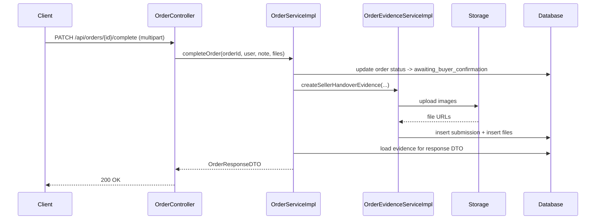

# Order Evidence Multipart Và Chứng Cứ Đơn Hàng: giải thích cho người mới học

## 1. Bối cảnh

Trước bản sửa này, luồng đơn hàng đã có:

- seller báo đã giao xe
- buyer xác nhận đã nhận xe
- admin xử lý refund

Nhưng hệ thống chỉ có **chữ** và **trạng thái**. Khi có tranh chấp, admin khó biết:

- seller có thật sự bàn giao xe chưa
- buyer có thật sự đã nhận xe chưa
- bằng chứng thực tế đang nằm ở đâu

Cho nên bản sửa này thêm một lớp mới:

- **order evidence**: chứng cứ gắn với đơn hàng

Ví dụ:

- seller upload ảnh lúc bàn giao xe
- buyer upload ảnh lúc xác nhận đã nhận xe

## 2. `Evidence` là gì?

`Evidence` là **bằng chứng**.

Trong dự án này, evidence là:

- ghi chú ngắn
- một hoặc nhiều ảnh
- gắn với một đơn hàng cụ thể

Hệ thống hiện dùng 2 loại:

- `seller_handover`: chứng cứ seller bàn giao xe
- `buyer_receipt`: chứng cứ buyer xác nhận đã nhận xe

## 3. Vì sao không gắn ảnh này vào `products`?

Vì đây không phải ảnh mô tả sản phẩm.

Ảnh product trả lời câu hỏi:

> “Chiếc xe này trông như thế nào khi đăng bán?”

Ảnh evidence trả lời câu hỏi:

> “Khi giao dịch diễn ra, hai bên đã bàn giao/nhận xe ra sao?”

Cho nên evidence phải gắn với:

- `order`

chứ không phải:

- `product`

## 4. Thiết kế bảng dữ liệu mới

### Bảng `order_evidence_submissions`

Bảng này đại diện cho **một lần nộp chứng cứ**.

Ví dụ:

- seller bấm `Báo đã giao xe`
- nhập ghi chú
- upload 2 ảnh

thì tạo ra **1 submission**.

Submission lưu:

- đơn hàng nào
- ai gửi
- vai trò gì
- loại chứng cứ gì
- ghi chú gì
- thời gian gửi

### Bảng `order_evidence_files`

Bảng này lưu **các file ảnh bên trong một submission**.

Ví dụ:

- cùng 1 submission của seller
- có 2 ảnh

thì bảng file sẽ có 2 dòng.

Điểm mạnh của cách chia 2 bảng:

- 1 lần gửi có thể chứa nhiều ảnh
- sau này dễ mở rộng thêm loại chứng cứ mới
- admin đọc dữ liệu rõ hơn

## 5. Vì sao controller dùng `multipart/form-data`?

Khi request chỉ có text JSON, ta dùng:

- `application/json`

Nhưng khi request có:

- text
- file ảnh

thì phải dùng:

- `multipart/form-data`

`multipart` có thể hiểu đơn giản là:

> “Request này được chia thành nhiều phần nhỏ. Có phần là text, có phần là file.”

Trong bản sửa này:

- `PATCH /api/orders/{id}/complete`
- `PATCH /api/orders/{id}/confirm-received`

đều nhận:

- `note`
- `files`

## 6. Luồng xử lý backend

Các file chính:

- `src/main/java/com/backend/old_bicycle_project/controller/OrderController.java`
- `src/main/java/com/backend/old_bicycle_project/service/impl/OrderServiceImpl.java`
- `src/main/java/com/backend/old_bicycle_project/service/impl/OrderEvidenceServiceImpl.java`
- `src/main/java/com/backend/old_bicycle_project/repository/OrderEvidenceSubmissionRepository.java`

## 7. Giải thích luồng từng bước

### Bước 1: client gửi request multipart

FE không gửi JSON thuần nữa.

Nó gửi:

- `note`
- danh sách file ảnh

### Bước 2: controller nhận và chuyển cho service

`OrderController` không tự xử lý upload.

Controller chỉ:

- nhận `MultipartFile`
- nhận `note`
- chuyển cho `OrderServiceImpl`

### Bước 3: service đổi trạng thái đơn hàng

Ví dụ seller báo đã giao:

- `status` đổi sang `awaiting_buyer_confirmation`

Nếu buyer xác nhận đã nhận:

- `status` đổi sang `completed`
- `funding_status` chuyển sang bước payout phù hợp

### Bước 4: evidence service upload ảnh

`OrderEvidenceServiceImpl` là nơi chuyên lo:

- validate số lượng ảnh
- validate chỉ nhận ảnh
- upload file lên storage

### Bước 5: lưu `submission` và `files`

Sau khi upload xong, service lưu:

- 1 dòng vào `order_evidence_submissions`
- nhiều dòng vào `order_evidence_files`

### Bước 6: map ngược ra DTO

Khi trả `OrderResponseDTO` hoặc `AdminRefundResponseDTO`, backend gắn thêm:

- `sellerHandoverEvidence`
- `buyerReceiptEvidence`

để FE render lại.

## 8. Vì sao seller phải có ít nhất 1 ảnh, còn buyer thì không bắt buộc?

Đây là quyết định nghiệp vụ.

- seller là bên chủ động nói: “Tôi đã giao xe.”
- nên seller phải đưa bằng chứng tối thiểu

Còn buyer:

- có thể xác nhận đã nhận mà không cần ảnh
- nhưng vẫn được phép upload ảnh nếu muốn

Điều này giúp:

- tăng độ tin cậy
- nhưng không tạo quá nhiều ma sát cho buyer

## 9. Admin dùng evidence như thế nào?

Ở màn admin dispute/refund, admin có thể xem:

- ảnh seller bàn giao
- ảnh buyer xác nhận đã nhận
- ghi chú của hai bên

Evidence **không tự động quyết định thắng/thua**.

Nó chỉ giúp admin có thêm dữ liệu để đánh giá.

## 10. Những hiểu lầm dễ gặp

### Hiểu lầm 1: “Ảnh evidence cũng là ảnh sản phẩm”

Không đúng.

Ảnh product dùng để bán hàng.
Ảnh evidence dùng để chứng minh hành vi giao dịch.

### Hiểu lầm 2: “Có evidence thì chắc chắn seller đúng”

Không đúng.

Evidence chỉ là một phần thông tin.
Admin vẫn phải xem:

- inspection report
- refund reason
- trạng thái order/payment

### Hiểu lầm 3: “Multipart chỉ là cách gửi file, không ảnh hưởng backend”

Không đúng.

Khi dùng multipart:

- controller signature phải đổi
- FE phải tạo `FormData`
- test cũng phải bao phủ case mới

## 11. Chốt ngắn

Bản sửa này thêm một lớp rất quan trọng cho giao dịch:

- **chứng cứ đơn hàng**

Nó giúp hệ thống chuyển từ:

- chỉ có text và status

sang:

- có thêm bằng chứng trực quan cho việc bàn giao/nhận xe

Đây là bước rất hữu ích cho:

- refund
- dispute
- payout audit
