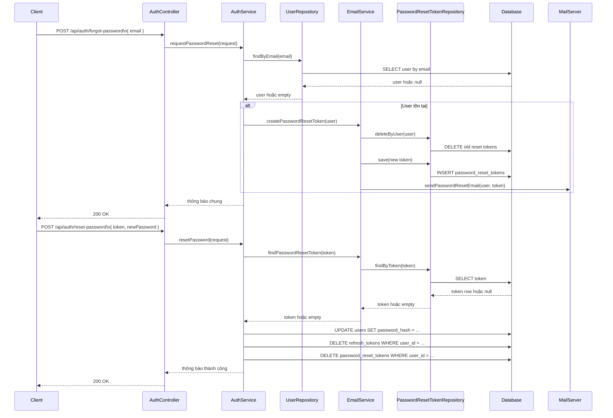
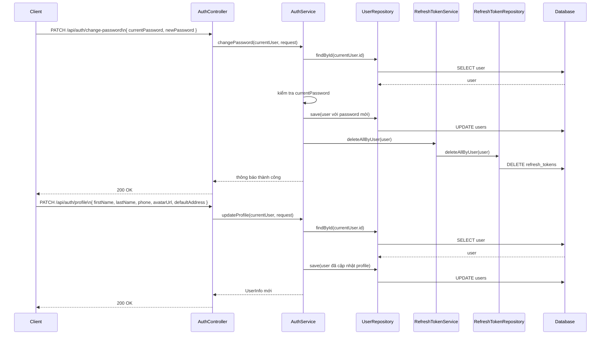

# Password Reset và Profile Management Cho Người Mới Học

Ngày cập nhật: 2026-03-13  
Phạm vi: giải thích luồng `forgot password`, `reset password`, `change password`, và `update profile` trong backend hiện tại.

## 1. Bối cảnh

Trong một hệ thống đăng nhập, chỉ có `register` và `login` là chưa đủ.

Người dùng thật sẽ gặp các tình huống như:

- quên mật khẩu
- muốn đổi mật khẩu
- muốn cập nhật số điện thoại
- muốn thay avatar
- muốn sửa địa chỉ mặc định

Vì vậy, backend cần có nhóm chức năng gọi là `account management`, tức là quản lý tài khoản sau khi đã đăng nhập hoặc khi bị mất quyền đăng nhập.

## 2. Các khái niệm cần biết

### Password reset là gì?

`Password reset` là luồng đặt lại mật khẩu khi người dùng **không còn nhớ mật khẩu cũ**.

Nó khác với `change password`.

- `change password`: người dùng vẫn đăng nhập được và biết mật khẩu hiện tại
- `reset password`: người dùng quên mật khẩu và cần một cách an toàn để tạo mật khẩu mới

### Profile management là gì?

`Profile management` là nhóm chức năng cho phép người dùng cập nhật thông tin cá nhân như:

- họ
- tên
- số điện thoại
- avatar
- địa chỉ mặc định

### Reset token là gì?

`Reset token` là một mã tạm thời do backend tạo ra để chứng minh rằng yêu cầu đặt lại mật khẩu là hợp lệ.

Hiểu rất đơn giản:

1. người dùng nói "tôi quên mật khẩu"
2. backend tạo một mã tạm thời
3. backend gửi mã này qua email
4. khi người dùng bấm vào link reset, backend kiểm tra mã đó còn hợp lệ không

## 3. Luồng tổng quát của `forgot password` và `reset password`

## 4. Giải thích luồng `client -> controller -> service -> repository -> database -> response`

### 4.1. Phần `forgot password`

#### Client gửi gì?

Client gửi email vào endpoint:

- `POST /api/auth/forgot-password`

File nhận request:

- `src/main/java/com/backend/old_bicycle_project/controller/AuthController.java`

#### Controller làm gì?

Controller nhận request rồi chuyển tiếp sang service.

Điểm quan trọng:

- controller **không tự tìm user**
- controller **không tự tạo token**
- controller **không tự gửi mail**

Nó chỉ đóng vai trò "cửa tiếp nhận".

#### Service làm gì?

Trong `AuthService.requestPasswordReset(...)`:

1. tìm user theo email
2. nếu user tồn tại thì gọi `EmailService`
3. `EmailService` tạo reset token mới
4. `EmailService` gửi mail
5. service luôn trả về **một câu trả lời chung**

Điểm này rất quan trọng về bảo mật.

Hệ thống không nên trả:

- "email tồn tại"
- "email không tồn tại"

Vì nếu trả khác nhau, người xấu có thể dò email nào đã đăng ký tài khoản.

#### Repository làm gì?

Trong flow này có 2 repository chính:

- `UserRepository`: tìm user theo email
- `PasswordResetTokenRepository`: xóa token cũ và lưu token mới

#### Database thay đổi gì?

Nếu user tồn tại:

- token cũ của user bị xóa
- token mới được insert vào bảng `password_reset_tokens`

Nếu user không tồn tại:

- không có gì thay đổi trong database

#### Response trả gì?

Backend vẫn trả một thông báo chung, ví dụ:

- `Nếu email tồn tại, hệ thống đã gửi hướng dẫn đặt lại mật khẩu.`

Đây là một kỹ thuật bảo mật cơ bản nhưng rất nên có.

### 4.2. Phần `reset password`

#### Client gửi gì?

Client gửi:

- `token`
- `newPassword`

vào endpoint:

- `POST /api/auth/reset-password`

#### Controller làm gì?

Controller chuyển request vào `AuthService.resetPassword(...)`.

#### Service làm gì?

Service thực hiện các bước:

1. kiểm tra password policy
2. tìm reset token
3. kiểm tra token có hết hạn không
4. đổi `password_hash` của user
5. xóa toàn bộ `refresh token` cũ
6. xóa toàn bộ `password reset token` của user

#### Repository làm gì?

Các lớp tham gia:

- `PasswordResetTokenRepository`: đọc token và xóa token
- `RefreshTokenService` -> `RefreshTokenRepository`: xóa toàn bộ refresh token cũ
- `UserRepository`: lưu mật khẩu mới

#### Database thay đổi gì?

- dòng `users.password_hash` được cập nhật
- các dòng trong `refresh_tokens` của user bị xóa
- các dòng trong `password_reset_tokens` của user bị xóa

#### Response trả gì?

Response trả thông báo thành công, yêu cầu người dùng đăng nhập lại.

Điều này hợp lý vì các phiên cũ đã bị thu hồi.

## 5. Luồng `change password` và `update profile`

## 6. Vì sao đổi hoặc reset mật khẩu lại phải xóa refresh token?

Đây là một ý rất quan trọng.

### Tình huống ví dụ

Giả sử:

1. bạn đang đăng nhập trên điện thoại
2. bạn cũng đăng nhập trên laptop
3. ai đó biết được refresh token cũ của bạn
4. bạn phát hiện có vấn đề và đổi mật khẩu

Nếu hệ thống **không xóa refresh token cũ**:

- thiết bị hoặc phiên cũ vẫn có thể xin access token mới
- tài khoản vẫn chưa thực sự an toàn

Cho nên trong code hiện tại:

- `resetPassword(...)` xóa refresh token
- `changePassword(...)` cũng xóa refresh token
- `logout(...)` cũng xóa refresh token

Đây là cách backend thu hồi các phiên cũ.

## 7. Ánh xạ sang code thật trong dự án

Các file quan trọng:

- Controller:
  `src/main/java/com/backend/old_bicycle_project/controller/AuthController.java`
- Service chính:
  `src/main/java/com/backend/old_bicycle_project/service/AuthService.java`
- Service gửi mail và quản lý reset token:
  `src/main/java/com/backend/old_bicycle_project/service/EmailService.java`
- Entity reset token:
  `src/main/java/com/backend/old_bicycle_project/entity/PasswordResetToken.java`
- Repository reset token:
  `src/main/java/com/backend/old_bicycle_project/repository/PasswordResetTokenRepository.java`
- Refresh token service:
  `src/main/java/com/backend/old_bicycle_project/service/RefreshTokenService.java`
- Refresh token repository:
  `src/main/java/com/backend/old_bicycle_project/repository/RefreshTokenRepository.java`
- Migration:
  `src/main/resources/db/migration/V6__password_reset_tokens.sql`

## 8. Lỗi người mới học hay gặp

### Lỗi 1: Nghĩ `change password` và `reset password` là một

Không đúng.

- `change password` cần biết mật khẩu hiện tại
- `reset password` cần token tạm thời

### Lỗi 2: Dùng chung một loại token cho nhiều mục đích

Không nên dùng chung:

- token xác thực email
- refresh token
- reset token

Mỗi loại token có nhiệm vụ khác nhau.

### Lỗi 3: Chỉ đổi mật khẩu nhưng không thu hồi các phiên cũ

Đây là một lỗ hổng bảo mật phổ biến.

### Lỗi 4: Chỉ kiểm tra password policy ở lúc register

Sai.

Nếu `reset password` hoặc `change password` không kiểm tra cùng policy, hệ thống sẽ bị lệch chuẩn.

## 9. Câu chốt dễ nhớ

`Forgot password` là xin quyền đặt lại mật khẩu.  
`Reset token` là bằng chứng tạm thời cho quyền đó.  
`Reset password` là dùng bằng chứng đó để đổi mật khẩu.  
`Change password` là đổi mật khẩu khi vẫn còn biết mật khẩu cũ.  
`Profile management` là cập nhật thông tin cá nhân của tài khoản.

Một hệ thống account management tốt không chỉ giúp người dùng đăng nhập được, mà còn giúp họ **khôi phục** và **bảo vệ** tài khoản một cách an toàn.
