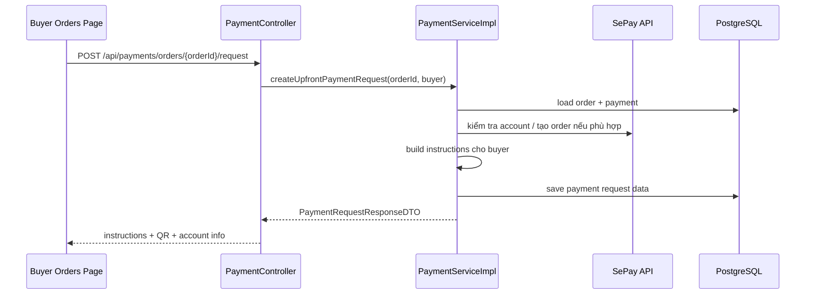

# Payment Instructions: Ẩn Copy Khả Năng Provider Khỏi UI Buyer Basics (2026-03-24)

## Vấn đề

Trong màn `Đơn mua` của buyer, backend trả về `paymentRequest.instructions`.

Trước thay đổi này, ở nhánh chuyển khoản tĩnh cho tài khoản không đi qua VA order API BIDV, chuỗi `instructions` có thêm một đoạn giải thích nội bộ kiểu:

- tài khoản SePay hiện chưa hỗ trợ VA order API cho ngân hàng này
- hệ thống đang dùng QR/chuyển khoản trực tiếp và xác nhận bằng webhook

Đoạn này đúng ở góc nhìn kỹ thuật, nhưng không tốt ở góc nhìn UX cho buyer.

## Vì sao không nên hiện đoạn đó cho buyer

Buyer chỉ cần biết:

1. chuyển đúng số tiền
2. dùng đúng nội dung chuyển khoản
3. chờ hệ thống xác nhận thanh toán

Buyer không cần biết chi tiết nội bộ như:

- tài khoản nào có hay không có VA order API
- provider đang fallback từ nhánh nào sang nhánh nào

Nếu đưa quá nhiều chi tiết kỹ thuật vào `instructions`, giao diện dễ bị:

- dài
- nhiễu
- làm người dùng thấy hệ thống “thiếu ổn định”, dù flow thực tế vẫn chạy đúng

## Thay đổi trong code

File:

- `src/main/java/com/backend/old_bicycle_project/service/impl/PaymentServiceImpl.java`

Ở method `provisionPayment(...)`, nhánh non-BIDV trước đây tự truyền một chuỗi giải thích riêng vào `buildStaticTransferProvision(...)`.

Sau thay đổi:

- nhánh này dùng lại `buildStaticInstructions(payment)`

Điều đó có nghĩa:

- buyer vẫn nhận hướng dẫn chuyển khoản bình thường
- nhưng không còn thấy copy nội bộ kiểu “SePay chưa hỗ trợ VA order API...”

## Flow backend ngắn gọn

## Điều quan trọng cần nhớ

`instructions` là chuỗi hướng dẫn cho người dùng cuối.

Nó nên trả lời câu hỏi:

- “Tôi cần làm gì tiếp theo?”

chứ không nên trả lời quá sâu câu hỏi:

- “Backend đang fallback qua nhánh tích hợp nào?”

Thông tin kỹ thuật provider-side vẫn nên giữ trong:

- log
- knowledge note
- tài liệu nội bộ

thay vì đẩy hết ra UI buyer.
