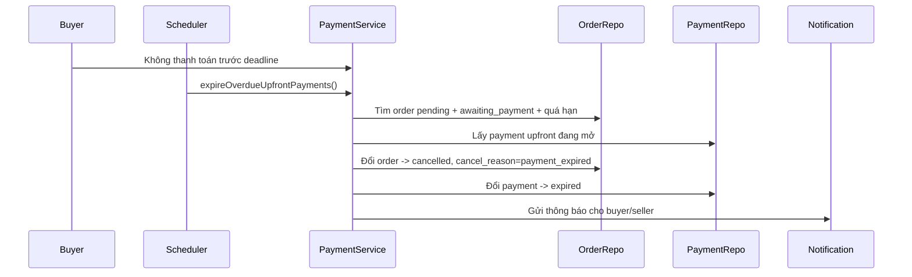
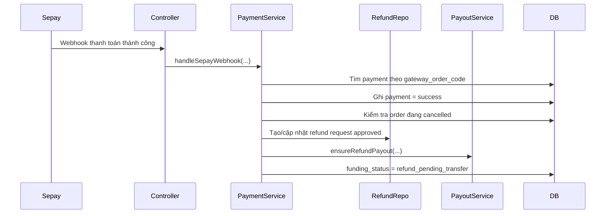

# Payment Timeout, Auto-Cancel Và Late Payment Trong Dự Án

## 1. Bối cảnh

Trước slice này, order có `payment_deadline` nhưng hệ thống chưa tự hủy khi buyer trả chậm.

Điều đó tạo ra 2 vấn đề:

1. Đơn vẫn nằm ở trạng thái `awaiting_payment` quá lâu.
2. Nếu tiền vào sau khi đơn đáng lẽ phải hết hạn, code chưa có nhánh xử lý rõ ràng.

Trong dự án marketplace, đây là vấn đề quan trọng vì payment không chỉ là “đã trả hay chưa”, mà còn liên quan tới:

- khóa sản phẩm,
- hoàn tiền,
- giải ngân,
- và trải nghiệm của cả buyer lẫn seller.

## 2. Khái niệm cần hiểu

### Payment timeout là gì?

`Payment timeout` là khoảng thời gian hệ thống cho buyer hoàn tất khoản thanh toán ứng trước.

Ví dụ:

- seller chấp nhận đơn lúc `10:00`
- hệ thống cho buyer đến `10:00` ngày hôm sau để thanh toán

Sau mốc đó, hệ thống coi yêu cầu thanh toán là hết hạn.

### Auto-cancel là gì?

`Auto-cancel` nghĩa là backend tự động hủy đơn khi quá hạn thanh toán, không cần admin bấm tay.

### Late payment là gì?

`Late payment` là trường hợp tiền vào sau khi đơn đã bị hủy do quá hạn.

Ví dụ:

1. buyer quét QR lúc `21:59`
2. scheduler hủy đơn lúc `22:00`
3. buyer xác nhận chuyển khoản trong app bank lúc `22:01`
4. webhook về backend lúc `22:02`

Khi đó, tiền thật đã vào nhưng order đã bị hủy.

## 3. Vì sao phải xử lý riêng late payment?

Nếu backend tự hồi sinh order ngay khi nhận webhook muộn thì sẽ rất nguy hiểm:

- seller có thể nghĩ đơn đã hết hiệu lực rồi,
- sản phẩm có thể đã mở lại cho buyer khác,
- admin khó audit vì order bị “sống lại” ngoài ý muốn.

Vì vậy rule mới của dự án là:

- nếu payment đến muộn sau khi đơn đã hết hạn,
- **không khôi phục order**
- mà chuyển sang `refund_pending_transfer`
- rồi tạo nhánh hoàn tiền thủ công cho buyer.

## 4. Các thay đổi chính trong code

### Entity và migration

File chính:

- [V17__payment_timeout_and_expiry.sql](/e:/Old_bicycle_system/BE_old_bicycle_project/old_bicycle_project/src/main/resources/db/migration/V17__payment_timeout_and_expiry.sql)
- [Order.java](/e:/Old_bicycle_system/BE_old_bicycle_project/old_bicycle_project/src/main/java/com/backend/old_bicycle_project/entity/Order.java)
- [Payment.java](/e:/Old_bicycle_system/BE_old_bicycle_project/old_bicycle_project/src/main/java/com/backend/old_bicycle_project/entity/Payment.java)
- [OrderCancelReason.java](/e:/Old_bicycle_system/BE_old_bicycle_project/old_bicycle_project/src/main/java/com/backend/old_bicycle_project/entity/enums/OrderCancelReason.java)
- [PaymentStatus.java](/e:/Old_bicycle_system/BE_old_bicycle_project/old_bicycle_project/src/main/java/com/backend/old_bicycle_project/entity/enums/PaymentStatus.java)

Thay đổi:

- thêm `PaymentStatus.expired`
- thêm `payments.expires_at`
- thêm `orders.cancel_reason`
- thêm `orders.cancelled_at`

### Scheduler

File:

- [OldBicycleProjectApplication.java](/e:/Old_bicycle_system/BE_old_bicycle_project/old_bicycle_project/src/main/java/com/backend/old_bicycle_project/OldBicycleProjectApplication.java)
- [PaymentExpiryScheduler.java](/e:/Old_bicycle_system/BE_old_bicycle_project/old_bicycle_project/src/main/java/com/backend/old_bicycle_project/service/impl/PaymentExpiryScheduler.java)

Thay đổi:

- bật `@EnableScheduling`
- thêm job quét định kỳ để gọi `paymentService.expireOverdueUpfrontPayments()`

### Service

File:

- [PaymentServiceImpl.java](/e:/Old_bicycle_system/BE_old_bicycle_project/old_bicycle_project/src/main/java/com/backend/old_bicycle_project/service/impl/PaymentServiceImpl.java)
- [OrderServiceImpl.java](/e:/Old_bicycle_system/BE_old_bicycle_project/old_bicycle_project/src/main/java/com/backend/old_bicycle_project/service/impl/OrderServiceImpl.java)

Thay đổi:

- `createUpfrontPaymentRequest(...)` sẽ tự expire order nếu deadline đã qua
- `expireOverdueUpfrontPayments()` xử lý batch các order quá hạn
- `confirmSuccessfulPayment(...)` phát hiện payment đến muộn sau khi order đã `cancelled`
- khi payment đến muộn, hệ thống tạo hoặc cập nhật `RefundRequest`, chuyển funding sang `refund_pending_transfer`, rồi gọi payout service để chuẩn bị hoàn tiền
- `confirmDeposit(...)` cho cash order cũng chặn case đã quá hạn
- `cancelOrder(...)` giờ lưu rõ `cancelReason` và `cancelledAt`

## 5. Luồng end-to-end

### 5.1 Luồng quá hạn thanh toán

### 5.2 Luồng late payment sau khi đơn đã hủy

## 6. Giải thích lại theo kiểu từng lớp

### Client gửi gì?

Có 2 kiểu:

1. Buyer mở yêu cầu thanh toán hoặc seller xác nhận cash deposit
2. SePay gọi webhook khi có tiền vào

### Controller làm gì?

Controller nhận request rồi gọi service tương ứng:

- payment controller gọi service tạo payment request
- webhook controller gọi `handleSepayWebhook(...)`

### Service quyết định gì?

Service là nơi chứa business rule:

- deadline đã qua thì không cho thanh toán nữa
- order quá hạn thì tự hủy
- payment đến muộn thì không khôi phục order

### Repository đọc/ghi gì?

- [OrderRepository.java](/e:/Old_bicycle_system/BE_old_bicycle_project/old_bicycle_project/src/main/java/com/backend/old_bicycle_project/repository/OrderRepository.java)
- [PaymentRepository.java](/e:/Old_bicycle_system/BE_old_bicycle_project/old_bicycle_project/src/main/java/com/backend/old_bicycle_project/repository/PaymentRepository.java)
- [RefundRequestRepository.java](/e:/Old_bicycle_system/BE_old_bicycle_project/old_bicycle_project/src/main/java/com/backend/old_bicycle_project/repository/RefundRequestRepository.java)

Repository giúp:

- tìm order quá hạn,
- tìm payment đang mở,
- lưu refund request mới hoặc cập nhật refund request cũ.

### Database thay đổi gì?

Khi quá hạn:

- `orders.status = cancelled`
- `orders.cancel_reason = payment_expired`
- `orders.cancelled_at = now`
- `payments.status = expired`

Khi payment đến muộn:

- `payments.status = success`
- `orders.funding_status = refund_pending_transfer`
- `refund_requests.status = approved`
- bảng `payouts` có record refund pending transfer

### Response trả về gì?

- API tạo payment sẽ báo lỗi `PAYMENT_EXPIRED` nếu deadline đã qua
- webhook thành công vẫn trả success, nhưng order không bị khôi phục
- FE sẽ nhận order đã đổi sang trạng thái hủy hoặc chờ hoàn tiền

## 7. Ví dụ nhỏ

### Trước khi sửa

- order quá hạn nhưng vẫn treo ở `awaiting_payment`
- buyer chuyển tiền muộn có thể làm logic rối

### Sau khi sửa

- scheduler tự dọn order quá hạn
- payment muộn được đưa sang nhánh hoàn tiền thủ công
- admin có audit rõ hơn

## 8. Lỗi dễ hiểu sai

### Hiểu sai 1: “Hết hạn thì ngân hàng tự hoàn tiền”

Không đúng.

Hết hạn ở đây là rule nội bộ của hệ thống marketplace. Nếu tiền đã vào muộn thì backend vẫn phải xử lý nó.

### Hiểu sai 2: “Webhook đến muộn thì revive order cho tiện”

Không nên.

Cách đó dễ tạo xung đột trạng thái và gây rủi ro cho seller.

### Hiểu sai 3: “Cash order không cần deadline”

Không đúng.

Ngay cả cash order, nếu hai bên không xác nhận đúng hạn thì order cũng phải bị chặn để trạng thái không treo mãi.

## 9. File nên đọc tiếp nếu muốn hiểu sâu hơn

- [PaymentServiceImpl.java](/e:/Old_bicycle_system/BE_old_bicycle_project/old_bicycle_project/src/main/java/com/backend/old_bicycle_project/service/impl/PaymentServiceImpl.java)
- [PaymentExpiryScheduler.java](/e:/Old_bicycle_system/BE_old_bicycle_project/old_bicycle_project/src/main/java/com/backend/old_bicycle_project/service/impl/PaymentExpiryScheduler.java)
- [OrderServiceImpl.java](/e:/Old_bicycle_system/BE_old_bicycle_project/old_bicycle_project/src/main/java/com/backend/old_bicycle_project/service/impl/OrderServiceImpl.java)
- [PaymentRepository.java](/e:/Old_bicycle_system/BE_old_bicycle_project/old_bicycle_project/src/main/java/com/backend/old_bicycle_project/repository/PaymentRepository.java)
- [OrderRepository.java](/e:/Old_bicycle_system/BE_old_bicycle_project/old_bicycle_project/src/main/java/com/backend/old_bicycle_project/repository/OrderRepository.java)
- [RefundRequestRepository.java](/e:/Old_bicycle_system/BE_old_bicycle_project/old_bicycle_project/src/main/java/com/backend/old_bicycle_project/repository/RefundRequestRepository.java)

## 10. Bổ sung ngày 2026-03-31: order quá hạn có làm sản phẩm public lại không?

Có, theo hành vi hiện tại thì order quá hạn thanh toán sẽ làm mất khóa giao dịch độc quyền, nhưng không tự ẩn sản phẩm.

Nói đơn giản hơn:

- order bị chuyển sang `cancelled`
- `funding_status` về `unpaid`
- payment đang mở bị chuyển sang `expired`
- nhưng `product.status` không bị đổi sang `hidden`

Điều này có nghĩa là nếu sản phẩm trước đó đang `active`, nó vẫn giữ `active`.

### Vì sao lại như vậy?

Flow timeout nằm ở:

- [PaymentServiceImpl.java](/e:/Old_bicycle_system/BE_old_bicycle_project/old_bicycle_project/src/main/java/com/backend/old_bicycle_project/service/impl/PaymentServiceImpl.java)
- [PaymentSettlementSupport.java](/e:/Old_bicycle_system/BE_old_bicycle_project/old_bicycle_project/src/main/java/com/backend/old_bicycle_project/service/impl/PaymentSettlementSupport.java)

Khi scheduler hoặc API đi vào nhánh hết hạn, code chỉ cập nhật `order` và `payment`. Không có lệnh nào đổi `product.setStatus(...)` trong nhánh timeout này.

Khóa public của sản phẩm trong dự án không chỉ nhìn vào `product.status`, mà còn nhìn vào trạng thái order đang giữ chỗ.

Query khóa độc quyền nằm ở:

- [OrderRepository.java](/e:/Old_bicycle_system/BE_old_bicycle_project/old_bicycle_project/src/main/java/com/backend/old_bicycle_project/repository/OrderRepository.java)

Query đó chỉ xem là đang khóa khi:

- `pending + awaiting_payment`
- `deposited`
- `awaiting_buyer_confirmation`

Sau khi timeout:

- order thành `cancelled`
- nên không còn nằm trong nhóm khóa này nữa

Kết quả là sản phẩm không bị ẩn, và cũng không còn bị giữ chỗ bởi order đã hết hạn.

### Test regression đã thêm

File test:

- [PaymentServiceImplTest.java](/e:/Old_bicycle_system/BE_old_bicycle_project/old_bicycle_project/src/test/java/com/backend/old_bicycle_project/service/impl/PaymentServiceImplTest.java)

Test mới:

- `expireOverdueUpfrontPaymentsDoesNotHideProductAfterTimeout()`

Test này kiểm tra:

1. order quá hạn bị chuyển sang `cancelled`
2. `funding_status` về `unpaid`
3. `product.status` vẫn là `active`

### Phân biệt với case refund muộn

Đừng nhầm với case `late payment`.

Nếu tiền vào sau khi order đã hủy, hệ thống sẽ chuyển sang nhánh `refund_pending_transfer`. Ở nhánh đó, khi admin hoàn tất refund thủ công, code mới gọi:

- [PayoutExecutionSupport.java](/e:/Old_bicycle_system/BE_old_bicycle_project/old_bicycle_project/src/main/java/com/backend/old_bicycle_project/service/impl/PayoutExecutionSupport.java)
- [ProductService.java](/e:/Old_bicycle_system/BE_old_bicycle_project/old_bicycle_project/src/main/java/com/backend/old_bicycle_project/service/ProductService.java)

và lúc đó sản phẩm mới bị chuyển sang `hidden`.
