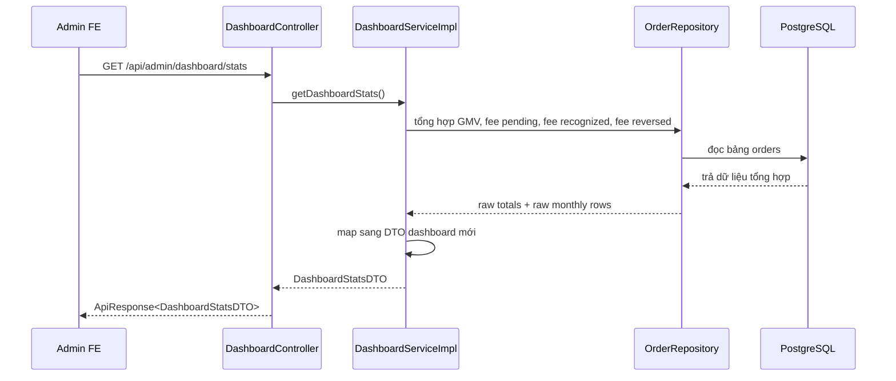

# Policy V2: Phí sàn tính trên tổng giá trị xe và tách rõ GMV với doanh thu sàn

## 1. Bối cảnh

Ở phiên bản cũ, dự án có trường `service_fee` nhưng chưa có cơ chế hoàn chỉnh để trả lời các câu hỏi sau:

- Phí sàn được tính từ đâu?
- Buyer trả bao nhiêu?
- Seller bị trừ bao nhiêu khi payout?
- Refund có hoàn lại phí cho buyer hay không?
- Dashboard đang hiển thị `GMV` hay đang hiển thị doanh thu sàn thật?

Vì vậy dự án chốt `Policy V2` để chuẩn hóa lại cách hiểu về tiền trong hệ thống.

---

## 2. Khái niệm cần hiểu

### Phí sàn

Phí sàn là khoản phí nền tảng thu cho dịch vụ làm trung gian giao dịch.

Trong dự án này, phí sàn:

- được tính trên `total_amount`
- được chia đôi cho buyer và seller
- được snapshot tại thời điểm tạo order

### GMV

`GMV` là viết tắt của `Gross Merchandise Value`.

Hiểu đơn giản:

- đây là tổng giá trị của các xe đã giao dịch xong
- đây là chỉ số đo quy mô giao dịch
- đây không phải doanh thu sàn

### Doanh thu sàn được ghi nhận

Đây là phần phí sàn mà hệ thống được phép xem là doanh thu thật.

Trong `Policy V2`, phí sàn chỉ được ghi nhận khi:

- giao dịch đã đi tới trạng thái cuối phù hợp
- payout seller đã hoàn tất
- `platform_fee_status = recognized`

Nếu đơn bị refund hợp lệ thì phí không còn được xem là doanh thu nữa.

---

## 3. Policy V2 chốt như thế nào?

### 3.1. Công thức nền

```text
fee_base_amount = total_amount
platform_fee_total = total_amount * platform_fee_rate
```

Rule backend hiện tại:

- `platform_fee_rate = 2%`
- làm tròn tới `1.000 VND`
- tối thiểu `20.000`
- tối đa `500.000`

### 3.2. Chia phí

```text
buyer_fee_amount + seller_fee_amount = platform_fee_total
```

- Buyer trả phần của mình trong payment hiện tại.
- Seller chịu phần của mình qua payout deduction.

### 3.3. Buyer phải trả bao nhiêu?

Nếu `partial`:

```text
buyer_charge_amount = required_upfront_amount + buyer_fee_amount
```

Nếu `full`:

```text
buyer_charge_amount = total_amount + buyer_fee_amount
```

### 3.4. Seller nhận bao nhiêu?

Nếu `partial`:

```text
seller_gross_payout_amount = required_upfront_amount
seller_net_payout_amount = required_upfront_amount - seller_fee_amount
```

Nếu `full`:

```text
seller_gross_payout_amount = total_amount
seller_net_payout_amount = total_amount - seller_fee_amount
```

### 3.5. Refund và doanh thu

Nếu refund hợp lệ:

- buyer được hoàn lại số tiền đã bị charge
- trong số đó có cả `buyer_fee_amount`
- seller không còn bị trừ fee
- `platform_fee_status` phải chuyển sang `reversed`

Nghĩa là:

- tiền đã vào tài khoản nền tảng chưa chắc là doanh thu
- chỉ khi rule nghiệp vụ cho phép thì phí sàn mới thành doanh thu thật

---

## 4. Backend đã implement đến đâu?

## Phase 1: Data model

Đã thêm các field snapshot cho `orders`, `payments`, `payouts` và bảng audit `financial_transactions`.

Ví dụ:

- `orders.platform_fee_total`
- `orders.buyer_fee_amount`
- `orders.seller_fee_amount`
- `orders.platform_fee_status`
- `payments.protected_amount`
- `payments.buyer_fee_amount`
- `payouts.gross_amount`
- `payouts.fee_deduction_amount`
- `payouts.net_amount`

Mục tiêu của phase này là để database có chỗ lưu đúng nghĩa của từng khoản tiền.

## Phase 2: Runtime core

Đã nối policy vào hành vi chạy thật của backend:

- `OrderServiceImpl` tự tính phí bằng `PlatformFeeService`
- không còn tin `serviceFee` do client gửi lên
- `PaymentServiceImpl` thu đúng `buyer_charge_amount`
- webhook chỉ cộng `protected_amount` vào `paid_amount`
- `PayoutServiceImpl` tạo payout theo `gross / fee deduction / net`
- `RefundServiceImpl` refund theo số tiền buyer thực bị charge
- `platform_fee_status` được chuyển sang `recognized` hoặc `reversed` ở đúng thời điểm

## Phase 3: Dashboard reporting backend

Đã tách được 2 lớp số liệu rất quan trọng:

- `GMV`
- `recognized platform revenue`

Dashboard backend bây giờ trả riêng:

- `totalGmv`
- `pendingPlatformFee`
- `recognizedPlatformRevenue`
- `reversedPlatformFee`
- `monthlyGmv`
- `monthlyRecognizedPlatformRevenue`

Để FE cũ chưa bị gãy ngay, backend vẫn giữ:

- `totalRevenue` như alias tạm thời của `totalGmv`
- `monthlyRevenue` như alias tạm thời của `monthlyGmv`

Điều này rất quan trọng vì:

- FE hiện tại vẫn đang dùng `totalRevenue` và `monthlyRevenue`
- nhưng backend mới không được tiếp tục hiểu nhầm đó là doanh thu sàn

---

## 5. Flow dashboard admin sau slice này



### Giải thích từng lớp

1. Client gửi request lấy thống kê dashboard.
2. `DashboardController` chỉ nhận request và chuyển việc cho service.
3. `DashboardServiceImpl` quyết định metric nào là `GMV`, metric nào là doanh thu sàn thật.
4. `OrderRepository` chạy các query tổng hợp trên bảng `orders`.
5. Database trả về tổng tiền và dữ liệu theo tháng.
6. Service đổi raw data thành `DashboardStatsDTO`.
7. API trả về cho FE.

---

## 6. Vì sao dashboard cũ bị sai nghĩa?

Trước đây backend làm gần như thế này:

```text
totalRevenue = SUM(total_amount của các đơn completed)
```

Vấn đề là:

- `total_amount` là giá trị xe
- nó phản ánh quy mô giao dịch
- nó không nói được sàn thật sự giữ lại bao nhiêu tiền phí

Nói cách khác:

- số đó phù hợp để gọi là `GMV`
- số đó không phù hợp để gọi là `doanh thu sàn`

Đây là lỗi rất hay gặp khi mới thiết kế dashboard tài chính:

- thấy tiền lớn là gọi luôn là revenue
- nhưng không kiểm tra xem nền tảng có thực sự được quyền giữ khoản tiền đó hay không

---

## 7. Vì sao monthly GMV không dùng thẳng created_at nữa?

`created_at` là thời điểm order được tạo.

Nhưng dashboard muốn nhìn theo góc độ giao dịch đã hoàn tất hơn là thời điểm order vừa xuất hiện.

Trong khi hệ thống hiện chưa có cột `completed_at` riêng, backend đang dùng mốc gần đúng:

```text
COALESCE(platform_fee_recognized_at, updated_at, created_at)
```

Ý nghĩa:

- nếu order có `platform_fee_recognized_at` thì ưu tiên mốc này
- nếu chưa có thì fallback sang `updated_at`
- nếu vẫn chưa có thì mới dùng `created_at`

Đây là giải pháp chuyển tiếp.

Nó không hoàn hảo bằng `completed_at` riêng, nhưng tốt hơn việc luôn group theo ngày tạo order.

---

## 8. Áp dụng vào project này như thế nào?

Các file backend chính của slice này:

- `DashboardController`
- `DashboardServiceImpl`
- `OrderRepository`
- `DashboardStatsDTO`

Các file nghiệp vụ nền đã có từ slice trước:

- `OrderServiceImpl`
- `PaymentServiceImpl`
- `PayoutServiceImpl`
- `RefundServiceImpl`
- `PlatformFeeServiceImpl`

Luồng tư duy đúng sau các slice này là:

1. Order chụp snapshot phí.
2. Payment biết rõ buyer charge và protected amount.
3. Payout biết rõ gross, fee deduction và net.
4. Refund biết hoàn lại phần buyer thực đã trả.
5. Dashboard đọc đúng bản chất của tiền, không gộp GMV với doanh thu sàn.

---

## 9. Những gì vẫn chưa xong?

Phần backend cốt lõi đã đi khá xa, nhưng vẫn còn:

- FE buyer chưa hiển thị breakdown giá mới
- FE payout UI chưa hiển thị rõ `gross / fee deduction / net`
- request public vẫn còn dấu vết cũ của `serviceFee` ở FE
- hệ thống chưa có `completed_at` riêng cho order

Riêng FE admin dashboard đã được nối với metric mới:

- dùng `totalGmv` thay cho cách hiểu mơ hồ của `totalRevenue`
- hiển thị riêng `doanh thu sàn đã ghi nhận`
- chỉ lấy đúng dữ liệu của tháng hiện tại

Nói ngắn gọn:

- backend đã bắt đầu nói đúng về tiền
- FE vẫn cần được cập nhật để hiển thị đúng ý nghĩa các số liệu đó

---

## 10. Kết luận

`Policy V2` không chỉ là thêm vài cột trong database.

Điểm quan trọng hơn là:

- backend đã biết phí sàn được tính như thế nào
- payment, payout và refund đã đi gần đúng với policy
- dashboard backend đã tách được `GMV` khỏi `recognized platform revenue`
- FE admin dashboard cũng đã hiển thị 2 khái niệm này tách riêng

Đây là bước rất quan trọng để dự án có thể tiến từ:

- “có dữ liệu tiền”

sang:

- “hiểu đúng dữ liệu tiền đang có nghĩa gì”
