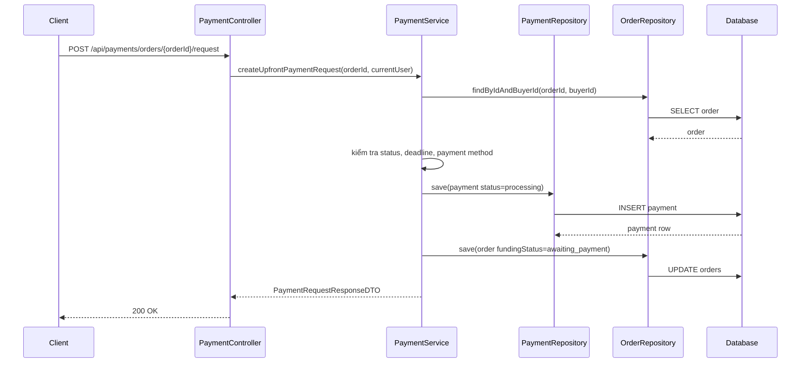
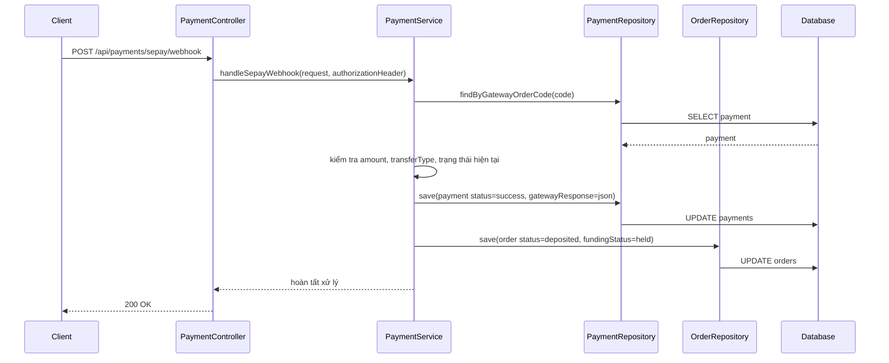
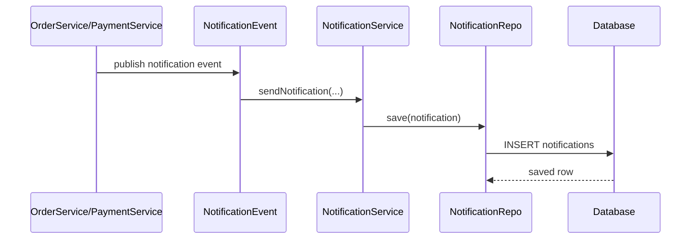

# PostgreSQL `jsonb`, Smoke Test Payment, và vì sao lỗi chỉ lộ ra khi chạy DB thật

## 1. Bối cảnh

Trong lúc chạy smoke test cho luồng:

`auth -> order -> accept -> payment request -> webhook`

hệ thống bị lỗi ở bước tạo payment request.

Lỗi thật không phải do SePay, mà là do backend đang ghi dữ liệu JSON xuống PostgreSQL sai kiểu.

## 2. Định nghĩa rất cơ bản

### `jsonb` là gì?

`jsonb` là một kiểu dữ liệu của PostgreSQL dùng để lưu JSON.

Bạn có thể hiểu đơn giản:

- `varchar` lưu chuỗi văn bản bình thường
- `jsonb` lưu dữ liệu JSON có cấu trúc

Ví dụ:

```json
{
  "orderId": "123",
  "paymentId": "456"
}
```

Nếu lưu vào `jsonb`, database hiểu đây là dữ liệu JSON.

Nếu lưu vào `varchar`, database chỉ hiểu đây là một chuỗi ký tự.

## 3. Vấn đề đã xảy ra là gì?

Trong database:

- `payments.gateway_response` có kiểu `jsonb`
- `notifications.metadata` có kiểu `jsonb`

Nhưng trong entity Java:

- [Payment.java](/e:/Old_bicycle_system/BE_old_bicycle_project/old_bicycle_project/src/main/java/com/backend/old_bicycle_project/entity/Payment.java)
- [Notification.java](/e:/Old_bicycle_system/BE_old_bicycle_project/old_bicycle_project/src/main/java/com/backend/old_bicycle_project/entity/Notification.java)

hai field này lại đang là `String`.

Điều đó chưa đủ để Hibernate tự hiểu rằng:

- chuỗi này phải được ghi xuống dưới dạng `jsonb`

Kết quả là Hibernate gửi parameter xuống Postgres như `varchar`.

Postgres nhìn thấy:

- cột bên trái là `jsonb`
- dữ liệu bên phải là `varchar`

và báo lỗi.

## 4. Lỗi thật trong log có nghĩa là gì?

Thông báo lỗi chính là:

```text
ERROR: column "gateway_response" is of type jsonb but expression is of type character varying
```

Dịch dễ hiểu:

- cột này yêu cầu dữ liệu kiểu `jsonb`
- nhưng backend lại đưa cho database một chuỗi `varchar`

Database không tự đoán để ép kiểu cho bạn trong trường hợp này.

## 5. Vì sao lỗi này không lộ ra sớm?

Vì có những bug chỉ lộ ra khi chạy với PostgreSQL thật.

Trong dự án kiểu Spring Boot:

- code Java có thể compile bình thường
- unit test có thể vẫn pass
- nhưng khi chạy vào Postgres thật mới lộ lỗi mapping

Đây là lý do smoke test trên môi trường gần thật rất quan trọng.

## 6. Smoke test là gì?

`Smoke test` là một bài test nhanh để kiểm tra:

- luồng chính có chạy được hay không
- hệ thống có bị gãy ở những bước cơ bản nhất hay không

Nó không phải test sâu mọi trường hợp.

Nó giống như:

- bật máy lên xem máy có nổ không
- chưa phải chạy hết mọi tính năng nâng cao

Trong lần này, smoke test tập trung vào:

1. đăng ký
2. đăng nhập
3. tạo order
4. seller accept order
5. buyer tạo payment request
6. webhook mock xác nhận thanh toán

## 7. Luồng tạo payment request



## 8. Lỗi nằm ở đâu trong luồng này?

Lỗi nằm ở bước:

- `PaymentRepository -> Database: INSERT payment`

Khi backend cố lưu `gateway_response`, Postgres từ chối vì sai kiểu dữ liệu.

Nghĩa là:

- controller không sai
- business flow chính không sai
- repository cũng không sai về ý tưởng
- cái sai nằm ở **mapping giữa Java entity và kiểu dữ liệu thật của PostgreSQL**

## 9. Luồng webhook sau khi payment request tạo thành công



## 10. Cách sửa đã áp dụng

Ta không đổi schema database.

Ta sửa ở entity để Hibernate hiểu:

- lúc ghi dữ liệu thì ép sang `jsonb`
- lúc đọc dữ liệu thì trả về dạng text để Java nhận vào `String`

Đoạn sửa chính:

```java
@Column(name = "gateway_response", columnDefinition = "jsonb")
@ColumnTransformer(read = "gateway_response::text", write = "?::jsonb")
private String gatewayResponse;
```

và:

```java
@Column(name = "metadata", columnDefinition = "jsonb")
@ColumnTransformer(read = "metadata::text", write = "?::jsonb")
private String metadata;
```

## 11. Giải thích `@ColumnTransformer` theo kiểu rất dễ hiểu

Hãy coi `@ColumnTransformer` như một bộ phiên dịch nhỏ giữa Java và database.

### Khi ghi:

```java
write = "?::jsonb"
```

nghĩa là:

- giá trị Java truyền vào sẽ được ép kiểu sang `jsonb`

Ví dụ:

- Java gửi chuỗi:

```json
{"orderId":"1","paymentId":"2"}
```

- câu SQL sẽ xử lý nó như:

```sql
?::jsonb
```

Tức là:

- đây không còn là chuỗi thường nữa
- mà là JSON thật trong mắt PostgreSQL

### Khi đọc:

```java
read = "metadata::text"
```

nghĩa là:

- database sẽ chuyển `jsonb` thành text trước khi trả cho Java

Điều này giúp field Java kiểu `String` nhận dữ liệu dễ hơn.

## 12. Vì sao không sửa bằng cách đổi cột thành `text`?

Vì `jsonb` có ích hơn `text`.

Ví dụ:

- dữ liệu JSON có cấu trúc rõ ràng
- database có thể query JSON tốt hơn
- dữ liệu metadata/gateway response hợp lý khi giữ dạng JSON

Cho nên hướng đúng hơn là:

- giữ schema `jsonb`
- sửa mapping của backend

## 13. Luồng notification liên quan gì ở đây?

Sau khi `accept order` hoặc `payment success`, hệ thống bắn notification.

Luồng này đi như sau:



Ở đây field `metadata` cũng là `jsonb`.

Nên bug ở `payments.gateway_response` và `notifications.metadata` là cùng một nhóm lỗi:

- **Java đang gửi chuỗi**
- **Postgres đang chờ `jsonb`**

## 14. Kết quả sau khi sửa

Sau khi fix:

- payment request tạo thành công
- webhook mock chạy thành công
- payment chuyển sang `success`
- order chuyển sang `deposited` và `held`
- notification của buyer và seller được lưu thành công trong DB

## 15. Bài học quan trọng cho người mới học

### Bài học 1: Compile pass không có nghĩa là runtime đúng

Code Java có thể chạy build bình thường nhưng vẫn sai khi chạm DB thật.

### Bài học 2: Kiểu dữ liệu giữa code và DB phải khớp nhau

Không chỉ enum mới cần khớp.

Ngay cả:

- `jsonb`
- `uuid`
- `timestamp`
- `numeric`

cũng phải map đúng.

### Bài học 3: Smoke test giúp lộ ra bug tích hợp

Unit test thường không đủ để bắt các lỗi kiểu:

- mapping DB
- config môi trường
- storage bucket thiếu
- webhook flow

## 16. Áp dụng vào dự án này

Trong dự án hiện tại:

- `PaymentController` nhận request thanh toán
- `PaymentServiceImpl` xử lý nghiệp vụ payment
- `PaymentRepository` ghi dữ liệu xuống `payments`
- PostgreSQL ở Supabase giữ dữ liệu thật

Chỉ cần một field map sai kiểu, toàn bộ luồng payment có thể gãy.

Đó là lý do vì sao một fix nhỏ ở entity lại có tác động lớn đến hệ thống.

## 17. Lỗi dễ hiểu sai

### Hiểu sai 1: “SePay bị lỗi”

Không đúng.

Luồng hỏng trước cả khi chạm vào integration thật.

### Hiểu sai 2: “Repository sai”

Không hẳn.

Repository chỉ gọi `save`.

Vấn đề nằm ở cách Hibernate map field vào SQL.

### Hiểu sai 3: “Chỉ cần sửa service”

Không đúng.

Service không giải quyết được lỗi sai kiểu dữ liệu ở tầng entity/database mapping.

## 18. Tóm tắt ngắn

- `jsonb` là kiểu JSON của PostgreSQL
- field Java kiểu `String` không tự động có nghĩa là Postgres sẽ nhận nó như `jsonb`
- cần chỉ rõ cách ép kiểu khi ghi và đọc
- smoke test trên DB thật đã giúp lộ bug này
- sau khi fix mapping, luồng payment mock đã đi hết thành công
