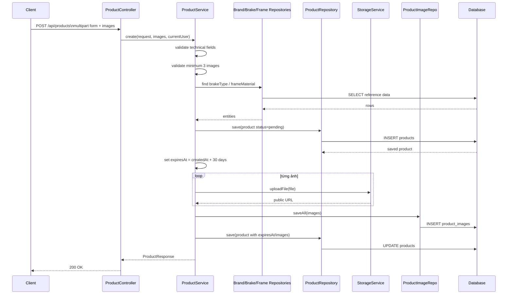
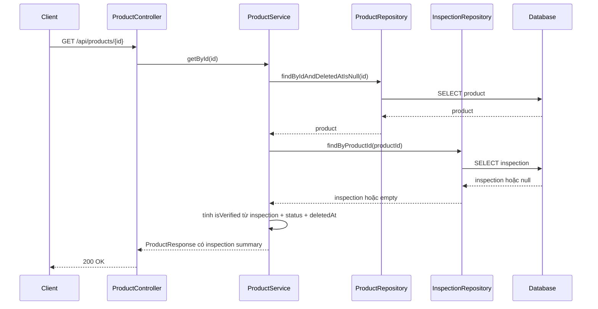
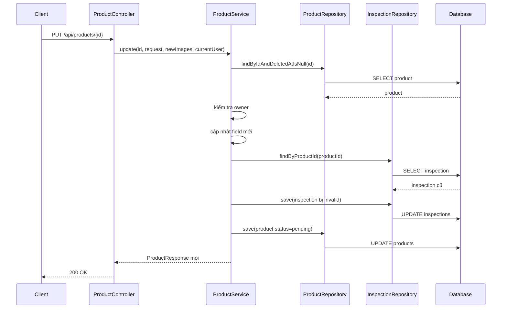
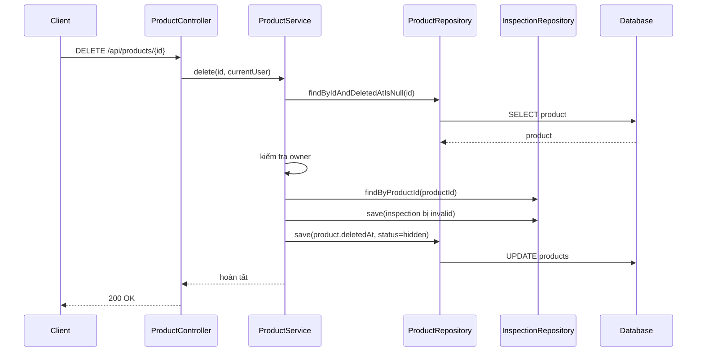

# Product và Inspection Hardening Cơ Bản

Ngày cập nhật: 2026-03-13  
Phạm vi: giải thích các thay đổi vừa làm cho `Product` và `Inspection` theo cách dễ hiểu cho người mới học.

## 1. Bối cảnh

Trong đợt sửa này, backend của dự án được cập nhật để phần `Product` và `Inspection` bám sát SRS hơn.

Các điểm chính đã làm là:

- bắt buộc đủ thông tin kỹ thuật khi đăng tin
- bắt buộc tối thiểu 3 ảnh
- tự đặt thời hạn tin đăng 30 ngày
- xóa mềm thay vì xóa cứng
- hiển thị `verified badge` dựa trên kiểm định thật
- đưa thông tin kiểm định vào response của sản phẩm

## 2. Các khái niệm cần hiểu trước

### Validation là gì?

`Validation` là bước kiểm tra dữ liệu đầu vào trước khi lưu xuống database.

Ví dụ:

- seller đăng xe nhưng quên `frameSize`
- backend phát hiện dữ liệu thiếu
- backend từ chối tạo tin

### Soft delete là gì?

`Soft delete` là không xóa hẳn dữ liệu, mà chỉ đánh dấu bản ghi đó đã bị xóa.

Trong lần sửa này, cách đánh dấu là dùng cột:

- `deleted_at`

Nếu cột này có giá trị, hệ thống hiểu rằng tin đó đã bị xóa mềm.

### Verified badge là gì?

`Verified badge` là trạng thái cho biết xe đã được kiểm định và kết quả kiểm định vẫn còn hiệu lực.

Điểm quan trọng:

- đã từng có inspection chưa chắc còn verified
- muốn còn verified thì inspection phải còn hạn và phải pass

### Invalidate inspection là gì?

`Invalidate` nghĩa là làm cho một kết quả cũ không còn hợp lệ nữa.

Trong bài toán này:

- nếu seller sửa sản phẩm
- inspection cũ có thể không còn đáng tin nữa
- cho nên badge verified phải bị hủy

## 3. Luồng tạo product mới

## 4. Giải thích luồng `client -> controller -> service -> repository -> database -> response`

### 4.1. Client gửi gì?

Client gửi request multipart vào:

- `POST /api/products`

Nội dung gồm:

- thông tin sản phẩm
- danh sách ảnh

### 4.2. Controller làm gì?

Trong file:

- `src/main/java/com/backend/old_bicycle_project/controller/ProductController.java`

controller nhận request rồi gọi:

- `productService.create(...)`

Controller không tự:

- kiểm tra business rule
- upload ảnh
- lưu database

Controller chỉ nhận request và chuyển việc xuống service.

### 4.3. Service làm gì?

Trong file:

- `src/main/java/com/backend/old_bicycle_project/service/ProductService.java`

service thực hiện phần nghiệp vụ chính:

1. kiểm tra `frameSize`, `wheelSize`
2. kiểm tra có ít nhất 3 ảnh
3. lấy dữ liệu tham chiếu như brake type và frame material
4. tạo `Product`
5. lưu product lần đầu
6. tự tính `expiresAt = createdAt + 30 ngày`
7. upload ảnh
8. lưu `ProductImage`
9. trả `ProductResponse`

Đây chính là lý do service được gọi là nơi chứa logic nghiệp vụ.

### 4.4. Repository làm gì?

Các repository tham gia:

- `ProductRepository`
- `ProductImageRepository`
- các repository dữ liệu tham chiếu như `BrakeTypeRepository`, `FrameMaterialRepository`

Repository không quyết định luật nghiệp vụ. Repository chỉ có nhiệm vụ đọc và ghi dữ liệu.

### 4.5. Database thay đổi gì?

Database nhận:

- một dòng mới trong bảng `products`
- nhiều dòng mới trong bảng `product_images`

### 4.6. Response trả gì?

Backend trả về `ProductResponse` chứa:

- thông tin sản phẩm
- danh sách ảnh
- thông tin seller
- `expiresAt`

## 5. Luồng xem chi tiết product với verified badge

## 6. Vì sao `verified badge` không nên hard-code?

Trước đây, `ProductResponse` đang hard-code:

- `isVerified = false`

Cách này có vấn đề vì:

- dù xe đã pass inspection thật, response vẫn báo `false`
- dữ liệu hiển thị ra ngoài không phản ánh đúng nghiệp vụ

Sau khi sửa, service tính `isVerified` từ dữ liệu thật:

- inspection có tồn tại không
- inspection có `passed = true` không
- `validUntil` còn hạn không
- product có đang bị xóa/ẩn/bán không

Điều này giúp response phản ánh đúng trạng thái thật hơn.

## 7. Luồng update product và hủy hiệu lực inspection cũ

## 8. Giải thích vì sao update product lại phải làm hỏng inspection cũ

Giả sử:

1. xe đã được kiểm định
2. inspection báo đạt
3. seller sửa lại thông tin hoặc thay linh kiện

Nếu hệ thống vẫn giữ nguyên inspection cũ thì buyer sẽ hiểu sai rằng:

- sản phẩm hiện tại vẫn giống lúc inspection diễn ra

Trong thực tế, điều đó có thể không đúng nữa.

Cho nên ở lần sửa này:

- update product sẽ reset status về `pending`
- inspection cũ bị invalid
- verified badge không còn giữ nguyên

Đây là cách làm để giữ dữ liệu trung thực hơn với thực tế.

## 9. Luồng soft delete

## 10. Ánh xạ sang file code thật

Các file quan trọng của slice này:

- Controller:
  `src/main/java/com/backend/old_bicycle_project/controller/ProductController.java`
- Product service:
  `src/main/java/com/backend/old_bicycle_project/service/ProductService.java`
- Inspection service:
  `src/main/java/com/backend/old_bicycle_project/service/impl/InspectionServiceImpl.java`
- Product repository:
  `src/main/java/com/backend/old_bicycle_project/repository/ProductRepository.java`
- Inspection repository:
  `src/main/java/com/backend/old_bicycle_project/repository/InspectionRepository.java`
- Search specification:
  `src/main/java/com/backend/old_bicycle_project/specification/ProductSpecification.java`
- Product entity:
  `src/main/java/com/backend/old_bicycle_project/entity/Product.java`
- Migration:
  `src/main/resources/db/migration/V7__product_inspection_br_hardening.sql`
- Test:
  `src/test/java/com/backend/old_bicycle_project/service/ProductServiceTest.java`

## 11. Lỗi người mới học hay gặp

### Lỗi 1: Chỉ thêm field vào entity là nghĩ xong feature

Không đúng.

Nếu thêm `deletedAt` vào entity mà không có migration và không sửa query, feature vẫn chưa hoàn chỉnh.

### Lỗi 2: Chỉ kiểm tra dữ liệu ở frontend

Không đủ.

Frontend có thể bị bypass. Backend mới là nơi chốt cuối cùng.

### Lỗi 3: Lưu một cột `isVerified` riêng rồi cập nhật tay ở nhiều nơi

Cách này dễ làm dữ liệu bị lệch.

Ở đây, `isVerified` được suy ra từ inspection hợp lệ nên an toàn hơn.

### Lỗi 4: Xóa cứng khi SRS cần soft delete

Xóa cứng sẽ làm mất lịch sử và khó audit.

## 12. Câu chốt dễ nhớ

Một feature backend không thật sự “xong” chỉ vì controller đã nhận được request.

Nó chỉ gần đúng khi:

- dữ liệu đầu vào được kiểm tra
- service xử lý đúng luật nghiệp vụ
- repository đọc/ghi đúng dữ liệu
- database có cấu trúc hỗ trợ
- response phản ánh đúng trạng thái thật
- có test chứng minh điều đó
