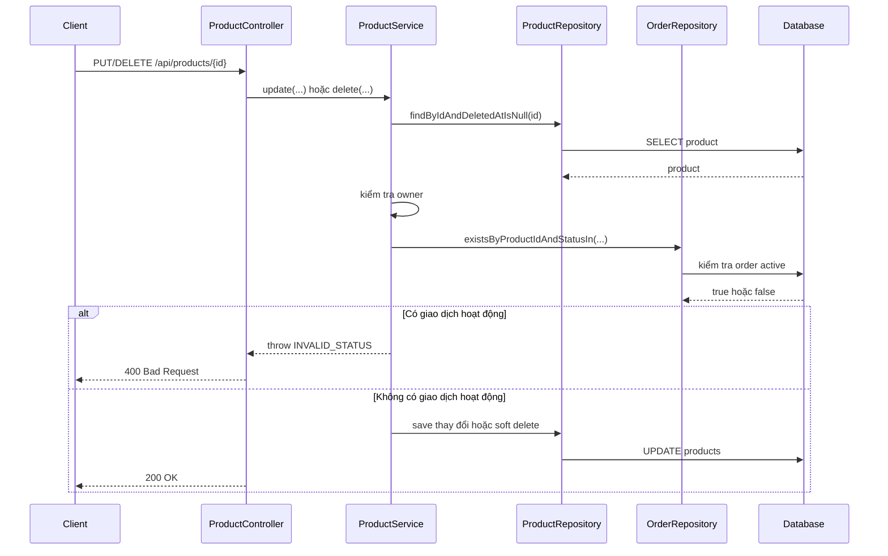

# Guard giao dịch khi sửa hoặc xóa tin đăng

Ngày cập nhật: 2026-03-17  
Phạm vi: giải thích vì sao backend không cho seller sửa hoặc xóa tin đăng khi sản phẩm đang có giao dịch hoạt động.

## 1. Bối cảnh

Trong SRS có hai ý rất quan trọng:

- `FR-SELL-002`: seller không được sửa tin đang trong giao dịch
- `FR-SELL-004`: seller không được xóa tin đang có đặt cọc active

Trước khi bổ sung guard này, backend đã có API `PUT /api/products/{id}` và `DELETE /api/products/{id}`. Tuy nhiên service chưa chặn trường hợp sản phẩm đã gắn với order đang hoạt động.

Điều đó tạo ra rủi ro:

- buyer đang giao dịch theo dữ liệu cũ
- seller lại sửa giá, mô tả, ảnh hoặc thông số
- tệ hơn nữa là seller có thể xóa mềm tin trong lúc order vẫn còn sống

## 2. Khái niệm cần hiểu

### Active transaction là gì?

Trong slice này, có thể hiểu đơn giản là sản phẩm đang có order ở một trong hai trạng thái:

- `pending`
- `deposited`

Hai trạng thái này cho thấy giao dịch chưa kết thúc, nên tin đăng không nên bị sửa hoặc xóa tự do nữa.

### Guard clause là gì?

`Guard clause` là cách kiểm tra điều kiện ngay ở đầu hàm. Nếu điều kiện không hợp lệ thì dừng luôn.

Ví dụ:

```java
if (orderRepository.existsByProductIdAndStatusIn(product.getId(), ACTIVE_TRANSACTION_STATUSES)) {
    throw new AppException(ErrorCode.INVALID_STATUS);
}
```

Ý tưởng của đoạn này là:

- nếu sản phẩm đang bị khóa bởi giao dịch
- thì backend dừng ngay
- không cho đi tiếp đến phần update hoặc delete

## 3. Luồng xử lý mới



## 4. Giải thích theo flow backend

### 4.1. Client gửi gì?

Client gọi:

- `PUT /api/products/{id}` để sửa tin
- `DELETE /api/products/{id}` để xóa mềm tin

### 4.2. Controller làm gì?

Controller nhận request và chuyển xuống `ProductService`.

Trong đợt sửa này, endpoint seller ở `ProductController` cũng được siết lại cho đúng hơn với SRS:

- chỉ role `SELLER` mới được tạo, sửa, xóa, và xem danh sách tin của chính mình

### 4.3. Service làm gì?

`ProductService` là nơi chứa luật nghiệp vụ chính.

Ở đây service làm ba việc trước khi cho sửa hoặc xóa:

1. kiểm tra người gọi có đúng là chủ tin không
2. kiểm tra sản phẩm có đang ở trạng thái `sold` không
3. kiểm tra có order `pending` hoặc `deposited` gắn với sản phẩm không

Nếu một trong ba điều kiện không hợp lệ, service ném lỗi ngay.

### 4.4. Repository làm gì?

`OrderRepository` có hàm:

```java
existsByProductIdAndStatusIn(...)
```

Hàm này không tự quyết định nghiệp vụ. Nó chỉ trả lời câu hỏi:

- với product hiện tại
- có order nào nằm trong tập trạng thái đang bị khóa không?

### 4.5. Database thay đổi gì?

Nếu bị chặn:

- database không đổi gì

Nếu được phép:

- update lưu thông tin mới của product
- hoặc soft delete bằng cách set `deletedAt` và chuyển `status`

## 5. API admin mới được mở thêm

Để hỗ trợ phần moderation cơ bản, backend bổ sung thêm:

- `GET /api/admin/products`
- `PATCH /api/admin/products/{id}/status`

Hai API này giúp admin xem danh sách tin theo trạng thái và đổi trạng thái moderation ở mức cơ bản như `pending`, `active`, `hidden`.

Điểm quan trọng là route admin được tách ra controller riêng, không nhét chung vào `ProductController`. Cách làm này giúp:

- đường dẫn rõ ràng hơn
- trách nhiệm controller tách bạch hơn
- tránh bị dính base path `/api/products`

## 6. Test đã được thêm như thế nào?

File test:

- `src/test/java/com/backend/old_bicycle_project/service/ProductServiceTest.java`

Hai case mới:

- `updateRejectsWhenProductHasActiveTransaction`
- `deleteRejectsWhenProductHasActiveTransaction`

Ý nghĩa:

- nếu repository báo sản phẩm đang có order hoạt động
- service phải ném `INVALID_STATUS`
- và không được gọi `save(...)`

Đây là cách test rất tốt cho business rule, vì nó chứng minh backend chặn đúng ở tầng service thay vì chỉ chặn ở frontend.

## 7. Những lỗi người mới hay gặp

### Lỗi 1: Chỉ kiểm tra ở frontend

Không đủ.

Frontend có thể bị bỏ qua. Backend mới là nơi chốt cuối cùng.

### Lỗi 2: Chỉ nhìn vào `Product.status`

Chưa đủ.

Một sản phẩm có thể vẫn đang `active`, nhưng thực tế đã có order `pending` hoặc `deposited`. Nếu chỉ nhìn `Product.status`, backend sẽ bỏ sót ràng buộc giao dịch.

### Lỗi 3: Mở endpoint admin trong controller seller

Cách này dễ làm route sai hoặc trách nhiệm controller bị lẫn.

Tách `AdminProductController` là cách rõ ràng hơn.

## 8. Áp dụng vào project này

Các file chính:

- `src/main/java/com/backend/old_bicycle_project/controller/ProductController.java`
- `src/main/java/com/backend/old_bicycle_project/controller/AdminProductController.java`
- `src/main/java/com/backend/old_bicycle_project/service/ProductService.java`
- `src/main/java/com/backend/old_bicycle_project/repository/OrderRepository.java`
- `src/test/java/com/backend/old_bicycle_project/service/ProductServiceTest.java`

## 9. Câu chốt dễ nhớ

Khi một sản phẩm đã bước vào giao dịch, tin đăng đó không còn là dữ liệu “riêng” của seller nữa.

Nó đã trở thành dữ liệu chung của cả giao dịch, nên backend phải khóa sửa/xóa để giữ cho:

- buyer hiểu đúng
- seller không lách quy tắc
- và dữ liệu đơn hàng không bị lệch với dữ liệu tin đăng
