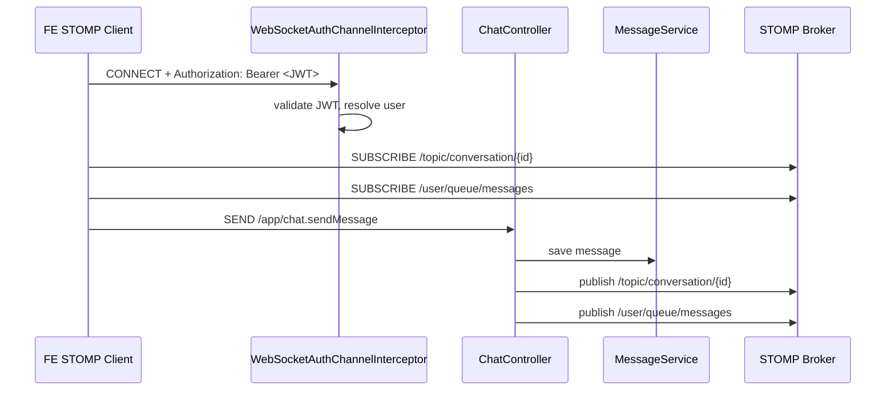
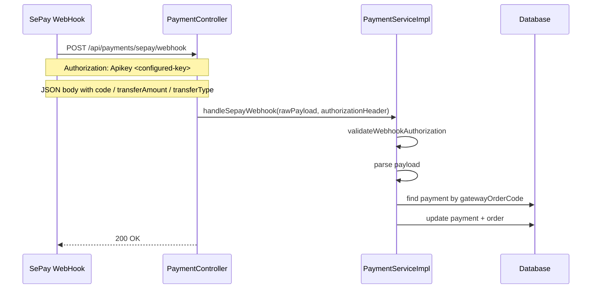

# Product Moderation, Reference Data, Và Realtime/Webhook Edge Cases - 2026-03-17

## Mục tiêu

Tranche này đóng ba khoảng trống có ROI cao cho backend:

- làm sâu hơn moderation flow của tin đăng
- hoàn thiện CRUD admin cho reference data để FE quản trị có API thật
- tăng regression cho chat realtime và payment webhook-only

## Kết quả chính

### Tin đăng

- Seller có thể `hide` tin của chính mình.
- Seller có thể `show` lại tin đã `hidden`.
- Khi seller `show`, backend đưa tin về `pending` thay vì `active`.
- Admin có thể:
  - lọc danh sách tin theo `status`, `sellerId`, `keyword`
  - `approve` nhanh
  - `hide` nhanh

### Reference data

Admin hiện đã có CRUD cho:

- brand
- category
- brake type
- frame material

Public FE có thể dùng 4 endpoint read tương ứng để build filter, form, dropdown, search sidebar.

### Realtime và webhook

- WebSocket auth đã có guard rõ hơn cho `CONNECT`, `SEND`, `SUBSCRIBE`.
- Chat read-state đã có regression cho case user ngoài conversation.
- Payment webhook-only đã có regression cho malformed JSON, thiếu `code`, và snake_case payload.

## Luồng seller relist và admin duyệt lại

```mermaid
flowchart TD
    A[Seller listing đang hidden] --> B[PATCH /api/products/{id}/show]
    B --> C{Status hiện tại có phải hidden?}
    C -- Không --> D[Reject]
    C -- Có --> E[Set status = pending]
    E --> F[Gia hạn expiresAt]
    F --> G[Admin nhìn thấy trong GET /api/admin/products?status=pending]
    G --> H[PATCH /api/admin/products/{id}/approve]
    H --> I[Set status = active]
    G --> J[PATCH /api/admin/products/{id}/hide]
    J --> K[Set status = hidden]
```

## Luồng WebSocket chat hiện tại



## Luồng payment webhook-only hiện tại



## Lưu ý tích hợp FE

- Tất cả REST API vẫn dùng `ApiResponse<T>` với `code`, `message`, `result`.
- Các endpoint trả `Page<T>` sẽ có `result.content`, `result.totalElements`, `result.totalPages`, `result.number`, `result.size`.
- Product create/update vẫn là `multipart/form-data`.
- Seller `show` không đồng nghĩa với “hiển thị ngay”; FE phải hiển thị lại trạng thái `pending`.
- Admin reference-data delete có thể fail với `REFERENCE_DATA_IN_USE` nếu dữ liệu đang được product sử dụng.

## Gaps còn lại

- seller reply review
- groupset / size-chart management
- live reconnect coverage cho chat realtime
- payment phase sau upfront
