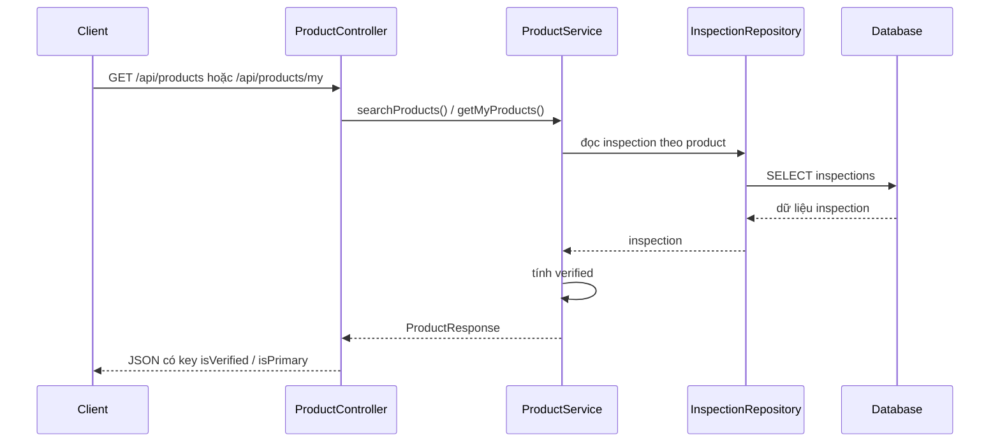

# ProductResponse boolean JSON contract basics - 2026-03-25

## 1. Bối cảnh

Có một lỗi lệch dữ liệu giữa backend và frontend:

- backend trả dữ liệu sản phẩm có cờ "đã kiểm định hợp lệ"
- nhưng frontend seller/admin lại hiểu sai cờ này
- kết quả là cùng một xe:
  - marketplace public vẫn hiển thị
  - nhưng seller dashboard lại báo "Chưa đủ điều kiện hiển thị công khai"

## 2. Khái niệm cần nhớ

### Boolean field là gì?

Boolean là kiểu dữ liệu chỉ có 2 giá trị:

- `true`
- `false`

Ví dụ:

```java
private boolean isVerified;
```

Biến này đang diễn tả:

- `true`: sản phẩm đang đủ điều kiện verified
- `false`: sản phẩm chưa đủ điều kiện

### JSON contract là gì?

JSON contract là tên key mà backend gửi ra cho frontend.

Ví dụ backend mong muốn gửi:

```json
{
  "isVerified": true
}
```

Nếu frontend đọc key `isVerified` mà backend lại gửi key `verified`, hai bên sẽ hiểu lệch nhau dù dữ liệu gốc là đúng.

## 3. Lỗi gốc trong task này

`ProductResponse` dùng field boolean:

```java
private boolean isVerified;
```

và `ImageInfo` dùng:

```java
private boolean isPrimary;
```

Khi serialize bằng Jackson, các key này mặc định ra:

```json
{
  "verified": true,
  "primary": true
}
```

chứ không phải:

```json
{
  "isVerified": true,
  "isPrimary": true
}
```

Trong khi frontend của dự án đang đọc:

- `product.isVerified`
- `image.isPrimary`

Nên frontend hiểu thành:

- `undefined` cho `isVerified`
- `undefined` cho `isPrimary`

`undefined` trong điều kiện boolean thường bị xem như `false`.

## 4. Đã sửa như thế nào trong backend

### 4.1 Ép tên JSON đúng contract FE cần

Trong `ProductResponse.java`, getter/setter của 2 field boolean được gắn:

- `@JsonProperty("isVerified")`
- `@JsonProperty("isPrimary")`

Mục tiêu là backend xuất ra JSON đúng key mà frontend đang sử dụng.

## 5. Luồng dữ liệu liên quan



## 6. Vì sao sửa này quan trọng

Nếu không sửa:

- seller/admin UI có thể báo sai trạng thái public
- badge "đã kiểm định" có thể không hiện
- ảnh primary có thể bị chọn sai ở client

Nếu sửa:

- backend và frontend nói cùng một "ngôn ngữ" JSON
- trạng thái public hiển thị đồng nhất hơn

## 7. Bài học rút ra

Khi một DTO Java có field boolean bắt đầu bằng `is`, đừng giả định JSON cũng sẽ giữ nguyên tiền tố `is`.

Cần làm ít nhất một trong hai cách:

1. khóa tên JSON bằng annotation ở backend
2. normalize dữ liệu ở frontend trước khi dùng

Trong task này đã làm cả hai để giảm rủi ro lệch contract.
