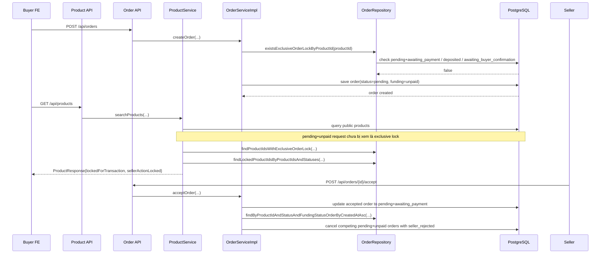

# Product Transaction Lock Và Multi-Buyer Request Basics - 2026-03-28

## Bối cảnh

Trước đây dự án dùng tư duy rất đơn giản:

- buyer đầu tiên tạo order thành công
- listing bị xem là đang có giao dịch mở
- buyer khác không còn gửi request được nữa

Cách đó dễ làm, nhưng không giống tình huống marketplace thật. Trong thực tế, seller có thể nhận nhiều yêu cầu mua rồi mới chọn một buyer.

Ở lần cập nhật này, backend được chỉnh lại để:

- cho phép nhiều order request cùng tồn tại ở giai đoạn chờ seller quyết định
- chỉ khóa public listing khi seller đã chấp nhận một request
- tự từ chối các request còn lại sau khi seller chọn một buyer

## Khái niệm quan trọng

### `status` của order là gì?

`status` là trạng thái vòng đời chính của order.

Ví dụ:

- `pending`
- `deposited`
- `awaiting_buyer_confirmation`
- `completed`
- `cancelled`

### `funding_status` là gì?

`funding_status` là trạng thái tiền bên trong order.

Ví dụ:

- `unpaid`
- `awaiting_payment`
- `held`
- `seller_payout_pending`
- `refund_pending_transfer`

### Vì sao phải nhìn cả hai field cùng lúc?

Vì sau cập nhật này, `pending` không còn đủ để hiểu nghiệp vụ.

Ta phải đọc theo cặp:

- `pending + unpaid`
  - buyer đã gửi request
  - seller chưa chốt
  - chưa bước vào thanh toán độc quyền
- `pending + awaiting_payment`
  - seller đã chấp nhận request này
  - buyer đang ở bước thanh toán
  - listing đã bị khóa độc quyền

## Hai cờ mà backend trả về cho product

### `lockedForTransaction`

Đây là cờ cho biết listing đã bước vào giao dịch độc quyền hay chưa.

Nó chỉ là `true` khi có một trong các trường hợp:

- `pending + awaiting_payment`
- `deposited`
- `awaiting_buyer_confirmation`

Ý nghĩa:

- buyer khác không còn thấy listing ngoài marketplace
- detail page cũng không cho tạo thêm request mới

### `sellerActionLocked`

Đây là cờ khác, dành cho phía seller.

Nó dùng để báo rằng seller chưa được sửa, ẩn, xóa listing vì đang có order mở liên quan đến listing đó.

Trong code hiện tại, cờ này là `true` khi product đang có order ở các trạng thái:

- `pending`
- `deposited`
- `awaiting_buyer_confirmation`

Ý nghĩa:

- listing có thể vẫn còn public nếu chỉ mới có các request `pending + unpaid`
- nhưng seller UI vẫn phải khóa các thao tác sửa/ẩn/xóa để tránh đổi listing giữa lúc có buyer đang chờ

## Luồng backend sau khi cập nhật

## Giải thích từng lớp

### 1. Client gửi gì?

Buyer FE gửi `POST /api/orders` để tạo request mua.

Seller FE gửi `POST /api/orders/{id}/accept` để chọn một buyer.

FE seller pages và marketplace pages gọi product APIs để lấy `lockedForTransaction` và `sellerActionLocked`.

### 2. Controller làm gì?

Controller chỉ nhận request rồi chuyển xuống service.

Rule nghiệp vụ không nằm ở controller.

### 3. Service làm gì?

`OrderServiceImpl` quyết định:

- có cho tạo request mới không
- có cho seller accept request không
- có phải tự từ chối các request còn lại không

`ProductService` quyết định:

- listing nào còn được public
- listing nào phải gắn `lockedForTransaction`
- listing nào phải gắn `sellerActionLocked`

### 4. Repository làm gì?

`OrderRepository` có 3 loại truy vấn quan trọng:

- kiểm tra exclusive lock
- lấy danh sách product đang có exclusive lock
- lấy danh sách product đang có open order để khóa thao tác seller

`ProductRepository` cũng có thêm `findByIdForUpdate(...)` với `PESSIMISTIC_WRITE`.

Điểm này rất quan trọng vì nó khóa dòng `product` ngay trong transaction khi:

- buyer tạo request mua mới
- seller accept một request

Nhờ vậy, hai request gần như đồng thời trên cùng listing sẽ bị serialize theo thứ tự database xử lý, thay vì cả hai cùng đi qua bước kiểm tra rồi cùng ghi dữ liệu. Nói ngắn gọn: khóa này giúp tránh race condition, tức là lỗi tranh chấp khi nhiều thao tác xảy ra cùng lúc.

Ngoài ra, query kiểm tra `exclusive lock` trong `OrderRepository` đã được chuyển sang native SQL. Lý do là phiên bản JPQL trước đó có thể làm `GET /api/products` và `GET /api/products/{id}` lỗi runtime `400` dù query SQL tương đương vẫn đúng ở database. Với project này, native SQL an toàn hơn vì nó bám trực tiếp vào schema thật của bảng `orders`.

### 5. Database thay đổi gì?

Không có migration mới trong lần sửa này.

Nhưng nghĩa của dữ liệu runtime đã thay đổi:

- `pending` không tự động nghĩa là listing bị khóa public
- `cancel_reason` có thêm trường hợp `seller_rejected`

### 6. Response trả về FE thay đổi gì?

`ProductResponse` bây giờ phân biệt rõ:

- `lockedForTransaction`
- `sellerActionLocked`

Điều này giúp FE không bị lẫn giữa:

- khóa public cho buyer
- khóa thao tác cho seller

## Ví dụ dễ hiểu

Giả sử listing A đang `active` và inspection còn hiệu lực.

### Bước 1: Buyer A gửi request

- order = `pending + unpaid`
- listing vẫn còn public
- buyer B vẫn có thể gửi request
- seller chưa được sửa hoặc ẩn listing

### Bước 2: Buyer B cũng gửi request

- hệ thống có 2 order cùng ở `pending + unpaid`
- seller vào trang đơn hàng để chọn

### Bước 3: Seller accept request của Buyer B

- request của Buyer B đổi thành `pending + awaiting_payment`
- listing bị `lockedForTransaction = true`
- request của Buyer A bị chuyển sang `cancelled + seller_rejected`

### Bước 4: Buyer B thanh toán

- order đi sang `deposited`
- tiền được giữ ở nhánh escrow

## Các file chính của lần sửa này

- [ProductResponse.java](/e:/Old_bicycle_system/BE_old_bicycle_project/old_bicycle_project/src/main/java/com/backend/old_bicycle_project/dto/product/ProductResponse.java)
- [ProductService.java](/e:/Old_bicycle_system/BE_old_bicycle_project/old_bicycle_project/src/main/java/com/backend/old_bicycle_project/service/ProductService.java)
- [ProductSpecification.java](/e:/Old_bicycle_system/BE_old_bicycle_project/old_bicycle_project/src/main/java/com/backend/old_bicycle_project/specification/ProductSpecification.java)
- [OrderRepository.java](/e:/Old_bicycle_system/BE_old_bicycle_project/old_bicycle_project/src/main/java/com/backend/old_bicycle_project/repository/OrderRepository.java)
- [OrderServiceImpl.java](/e:/Old_bicycle_system/BE_old_bicycle_project/old_bicycle_project/src/main/java/com/backend/old_bicycle_project/service/impl/OrderServiceImpl.java)

## Những hiểu lầm dễ gặp

### Hiểu lầm 1: `pending` luôn nghĩa là listing đã bị khóa

Không đúng nữa.

Phải nhìn thêm `funding_status`.

### Hiểu lầm 2: seller accept là lúc order rời khỏi `pending`

Không đúng trong code hiện tại.

Sau khi accept, order vẫn là `pending`, nhưng `funding_status` đổi thành `awaiting_payment`.

### Hiểu lầm 3: chỉ cần một cờ `lockedForTransaction` là đủ

Không đủ.

Buyer và seller cần nhìn hai loại khóa khác nhau.

## Điều áp dụng trong dự án này

Lần cập nhật này giúp backend gần hơn với nghiệp vụ marketplace:

- nhiều buyer có thể gửi request
- seller chọn một buyer
- request còn lại bị từ chối tự động

Nhưng team vẫn giữ một điểm đơn giản hóa:

- ngay khi seller đã accept một request, listing đi vào khóa độc quyền
- hệ thống không giữ thêm “backup buyer” sau mốc accept

Điểm này làm flow an toàn hơn cho payment và payout hiện có.
