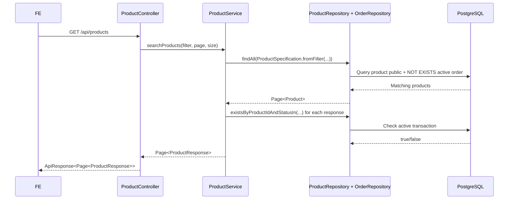

# Product Transaction Lock Và Public Visibility - 2026-03-18

## Bối cảnh

Trong dự án này, một xe có thể đang ở trạng thái:

- đã có buyer tạo order
- seller đã chấp nhận order
- buyer đã đặt cọc
- seller đã báo giao xe nhưng buyer chưa xác nhận nhận xe

Nếu vẫn để xe đó xuất hiện như một món hàng đang bán bình thường ở marketplace public, người dùng khác sẽ hiểu sai rằng xe vẫn còn “rảnh” để mua.

## Khái niệm

### `status` của product là gì?

`status` là trạng thái chính của bản ghi sản phẩm trong database.

Ví dụ:

- `pending`: tin mới đăng, chờ admin duyệt
- `active`: tin đã được duyệt và đang hiển thị
- `sold`: giao dịch đã hoàn tất

### `lockedForTransaction` là gì?

`lockedForTransaction` là một cờ phụ, nghĩa là:

> xe này đang có giao dịch mở, nên không nên cho buyer khác tiếp tục mua nữa

Đây không phải là một enum mới trong database. Nó là dữ liệu backend tính ra khi trả response.

## Vì sao không dùng lại `pending`?

Vì `pending` trong dự án này đã có nghĩa riêng:

> tin đăng đang chờ admin duyệt

Nếu dùng `pending` để biểu diễn “xe đang bị giữ chỗ bởi giao dịch”, nghĩa của dữ liệu sẽ bị lẫn.

Khi dữ liệu bị lẫn nghĩa như vậy, frontend và backend rất dễ hiểu khác nhau.

## Giải pháp đã áp dụng

Thay vì đổi `product.status`, backend làm 2 việc:

1. Khi search public, ẩn các product đang có order mở.
2. Khi trả chi tiết product, thêm cờ `lockedForTransaction`.

Các order được xem là “đang mở” trong fix này là:

- `pending`
- `deposited`
- `awaiting_buyer_confirmation`

## Luồng backend

## Giải thích từng lớp

### 1. Client gửi gì?

Frontend gọi:

- `GET /api/products`
- hoặc `GET /api/products/{id}`

### 2. Controller làm gì?

Controller chỉ nhận request rồi chuyển tiếp xuống service.

Nó không tự quyết định business rule “xe có đang bị giữ bởi giao dịch hay không”.

### 3. Service làm gì?

`ProductService` có 2 việc chính:

- gọi specification để lọc danh sách public
- map entity sang `ProductResponse`

Khi map sang response, service thêm field:

- `lockedForTransaction`

### 4. Repository làm gì?

`OrderRepository` kiểm tra xem product có order mở hay không bằng:

- `existsByProductIdAndStatusIn(...)`

`ProductSpecification` dùng subquery để loại khỏi public list những xe đang có transaction mở.

### 5. Database đổi gì?

Fix này không cần migration hay cột mới.

Nó chỉ đổi cách đọc dữ liệu.

## File nào tham gia?

- [ProductResponse.java](/e:/Old_bicycle_system/BE_old_bicycle_project/old_bicycle_project/src/main/java/com/backend/old_bicycle_project/dto/product/ProductResponse.java)
- [ProductService.java](/e:/Old_bicycle_system/BE_old_bicycle_project/old_bicycle_project/src/main/java/com/backend/old_bicycle_project/service/ProductService.java)
- [ProductSpecification.java](/e:/Old_bicycle_system/BE_old_bicycle_project/old_bicycle_project/src/main/java/com/backend/old_bicycle_project/specification/ProductSpecification.java)
- [OrderRepository.java](/e:/Old_bicycle_system/BE_old_bicycle_project/old_bicycle_project/src/main/java/com/backend/old_bicycle_project/repository/OrderRepository.java)
- [ProductServiceTest.java](/e:/Old_bicycle_system/BE_old_bicycle_project/old_bicycle_project/src/test/java/com/backend/old_bicycle_project/service/ProductServiceTest.java)

## Ví dụ dễ hiểu

Giả sử xe A đang `active`.

1. Buyer tạo order.
2. Order có `status = pending`.
3. Từ lúc đó:
   - buyer khác không nên thấy xe A trong public list nữa
   - nếu có link trực tiếp vào detail page, FE sẽ thấy `lockedForTransaction = true`

Như vậy:

- dữ liệu `status` của product không bị lẫn nghĩa
- nhưng UX vẫn phản ánh đúng là xe đang bị giữ bởi giao dịch

## Hiểu lầm dễ gặp

### Hiểu lầm 1: “Xe phải chuyển sang `pending`”

Không đúng trong dự án này.

`pending` của product là chờ admin duyệt, không phải chờ giao dịch.

### Hiểu lầm 2: “Nếu product còn `active` thì chắc chắn vẫn đang bán”

Không còn đúng nữa.

Sau fix này, một product có thể:

- vẫn có `status = active`
- nhưng `lockedForTransaction = true`
- và bị ẩn khỏi public marketplace

### Hiểu lầm 3: “Chỉ khi buyer đặt cọc xong mới cần khóa”

Trong code hiện tại, ngay từ lúc order mở ra đã xem là có active transaction.

Điều này giúp tránh nhiều buyer cùng tạo order cho một xe.
