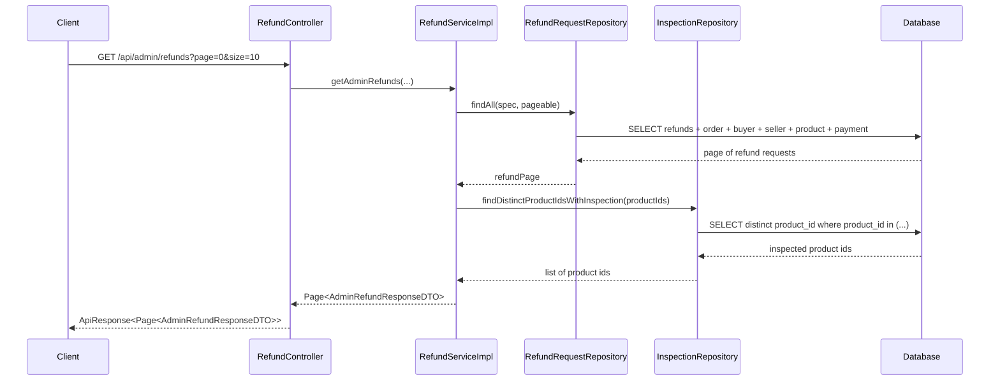

# Tối ưu danh sách tranh chấp của admin: `EntityGraph` và query theo lô

## 1. Bối cảnh

Admin có trang xem danh sách các yêu cầu hoàn tiền hoặc tranh chấp.

Luồng API chính là:

- client gọi `GET /api/admin/refunds`
- controller nhận request
- service lấy danh sách `RefundRequest`
- repository đọc dữ liệu từ database
- backend trả danh sách về cho frontend

Trước khi sửa, tab này bị chậm vì backend rơi vào kiểu lỗi hiệu năng rất hay gặp tên là `N+1 query`.

## 2. `N+1 query` là gì?

`Query` là câu lệnh backend gửi xuống database để lấy dữ liệu.

`N+1 query` nghĩa là:

1. backend gọi 1 query để lấy danh sách chính
2. sau đó với mỗi phần tử trong danh sách, backend lại gọi thêm 1 hoặc nhiều query nữa

Nếu danh sách có 20 dòng, backend có thể tạo:

- 1 query lấy danh sách refund
- 20 query lấy product
- 20 query lấy buyer
- 20 query lấy seller
- 20 query kiểm tra inspection

Kết quả là số lần chạm database tăng rất mạnh.

## 3. Vì sao tab admin tranh chấp bị chậm?

File chính:

- [RefundServiceImpl.java](/e:/Old_bicycle_system/BE_old_bicycle_project/old_bicycle_project/src/main/java/com/backend/old_bicycle_project/service/impl/RefundServiceImpl.java)
- [RefundRequestRepository.java](/e:/Old_bicycle_system/BE_old_bicycle_project/old_bicycle_project/src/main/java/com/backend/old_bicycle_project/repository/RefundRequestRepository.java)
- [InspectionRepository.java](/e:/Old_bicycle_system/BE_old_bicycle_project/old_bicycle_project/src/main/java/com/backend/old_bicycle_project/repository/InspectionRepository.java)

Trước đó, service lấy danh sách `RefundRequest`, rồi khi map từng dòng sang DTO thì lại truy cập tiếp:

- `order`
- `buyer`
- `seller`
- `product`
- `payment`
- `requester`
- `reviewedBy`

Ngoài ra còn kiểm tra `hasInspection` bằng cách gọi:

- `inspectionRepository.existsByProductId(...)`

cho từng dòng.

Đó chính là `N+1`.

## 4. `EntityGraph` là gì?

`EntityGraph` là một cách nói với JPA:

> “Khi lấy entity này, hãy lấy luôn các quan hệ quan trọng đi kèm.”

Ở đây, thay vì lấy `RefundRequest` trước rồi mới đi hỏi tiếp `order`, `buyer`, `seller`, `product`, ta yêu cầu repository lấy sẵn các phần đó cùng lúc.

Ví dụ đơn giản:

```java
@EntityGraph(attributePaths = {
    "order",
    "order.buyer",
    "order.seller",
    "order.product",
    "payment",
    "requester",
    "reviewedBy"
})
Page<RefundRequest> findAll(Specification<RefundRequest> spec, Pageable pageable);
```

Ý nghĩa:

- query chính vẫn lấy `RefundRequest`
- nhưng JPA biết cần load sẵn các quan hệ đi kèm
- service map DTO ít phải chạm thêm database hơn

## 5. Query theo lô là gì?

`Batch query` hay “query theo lô” nghĩa là:

thay vì hỏi database từng item một, ta gom nhiều ID lại rồi hỏi một lần.

Ví dụ sai:

```java
for (RefundRequest item : refundList) {
    inspectionRepository.existsByProductId(productId);
}
```

Ví dụ tốt hơn:

```java
List<UUID> productIds = ...
inspectionRepository.findDistinctProductIdsWithInspection(productIds);
```

Khi đó:

- database chỉ cần xử lý 1 query cho nhiều product
- backend tự biến kết quả thành `Set<UUID>`
- sau đó kiểm tra `contains(...)` trong memory

## 6. Bản sửa lần này làm gì?

### 6.1. Ở repository

Trong [RefundRequestRepository.java](/e:/Old_bicycle_system/BE_old_bicycle_project/old_bicycle_project/src/main/java/com/backend/old_bicycle_project/repository/RefundRequestRepository.java):

- thêm `@EntityGraph` cho `findAll(spec, pageable)`

Trong [InspectionRepository.java](/e:/Old_bicycle_system/BE_old_bicycle_project/old_bicycle_project/src/main/java/com/backend/old_bicycle_project/repository/InspectionRepository.java):

- thêm query:
  - `findDistinctProductIdsWithInspection(...)`

### 6.2. Ở service

Trong [RefundServiceImpl.java](/e:/Old_bicycle_system/BE_old_bicycle_project/old_bicycle_project/src/main/java/com/backend/old_bicycle_project/service/impl/RefundServiceImpl.java):

- lấy `refundPage`
- gom tất cả `productId` trong page hiện tại
- query inspection một lần
- map từng dòng sang `AdminRefundResponseDTO` với cờ `hasInspection`

## 7. Luồng đi sau khi sửa



## 8. Vì sao bản sửa này quan trọng?

Vì nó cải thiện cả 2 thứ:

- tốc độ trả dữ liệu
- độ ổn định khi danh sách dài hơn

Admin có thể chưa thấy chênh lệch quá lớn khi dữ liệu ít, nhưng khi database nhiều refund hơn thì lợi ích rất rõ.

## 9. Hiểu lầm dễ gặp

### Hiểu lầm 1: “Có pagination rồi thì không cần tối ưu query”

Sai.

Pagination giúp giảm số dòng mỗi trang, nhưng nếu mỗi dòng vẫn kéo thêm nhiều query phụ thì page vẫn chậm.

### Hiểu lầm 2: “Chỉ cần tối ưu frontend loading là đủ”

Sai.

Frontend loading chỉ làm trải nghiệm đỡ khó chịu hơn.

Nếu backend vẫn `N+1`, dữ liệu vẫn chậm thật.

### Hiểu lầm 3: “`existsBy...` là query nhỏ nên gọi nhiều lần không sao”

Sai.

Một query nhỏ nhưng lặp lại hàng chục lần vẫn thành tốn kém.

## 10. Chốt ngắn

Bản sửa này giảm chậm cho tab tranh chấp của admin bằng 2 ý chính:

- dùng `EntityGraph` để lấy sẵn các quan hệ quan trọng
- dùng query theo lô để kiểm tra inspection thay vì gọi từng dòng

Đây là một ví dụ rất điển hình của tối ưu backend:

- không đổi business rule
- không đổi API contract
- chỉ đổi cách lấy dữ liệu để phản hồi nhanh hơn
