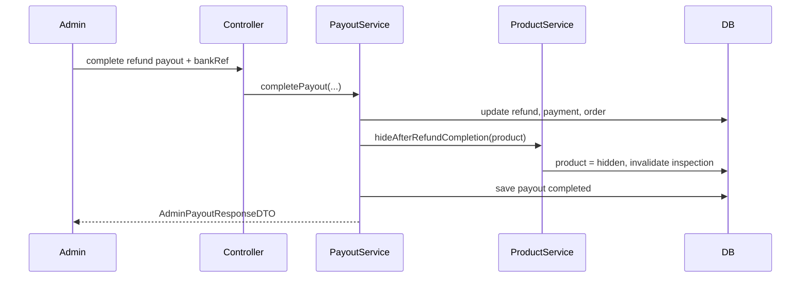

# Refund hoàn tất, ẩn tin đăng và payout bị chặn vì thiếu profile

## Bối cảnh

Trong hệ thống này, khi buyer yêu cầu hoàn tiền và admin duyệt hoàn tất, có hai vấn đề nghiệp vụ quan trọng:

1. Tin đăng của xe có nên tự public lại hay không.
2. Nếu buyer hoặc seller chưa khai tài khoản nhận tiền thì admin phải biết ai đang làm payout bị kẹt.

Slice này chốt hai rule mới:

- `refund complete` thì `listing bị ẩn`
- seller muốn bán lại phải đi lại flow `cập nhật -> admin duyệt -> inspection -> public`
- payout ở trạng thái `profile_required` sẽ notify cả user lẫn admin
- admin có thể bấm nhắc lại user cập nhật payout profile
- seller phải có payout profile trước khi chấp nhận đơn mới

## Khái niệm

### `profile_required` là gì?

Đây là trạng thái của bảng `payouts`.

Nó có nghĩa là:

- hệ thống đã biết cần chuyển tiền cho ai
- nhưng chưa đủ thông tin ngân hàng để tạo QR hoặc để admin chuyển khoản

Ví dụ:

- buyer được duyệt hoàn tiền nhưng chưa khai tài khoản nhận hoàn tiền
- seller đã hoàn tất đơn nhưng chưa khai tài khoản nhận giải ngân

### Vì sao refund complete không nên tự public lại?

Nếu admin đã phải hoàn tiền, điều đó thường cho thấy giao dịch có vấn đề:

- xe không đúng mô tả
- xe có lỗi
- có tranh chấp

Nếu hệ thống tự mở public lại ngay thì:

- seller chưa sửa gì mà xe lại bán tiếp
- inspection cũ vẫn bị hiểu nhầm là còn hợp lệ
- admin mất quyền kiểm soát chất lượng sau tranh chấp

Vì vậy rule mới là:

- hoàn tiền xong thì ẩn tin
- muốn bán lại thì phải qua kiểm soát lại

## Flow backend của slice này

`client -> controller -> service -> repository -> database -> response`

### 1. Admin nhắc user cập nhật payout profile

Client:

- admin bấm `PATCH /api/admin/payouts/{payoutId}/remind-profile`

Controller:

- [AdminPayoutController.java](/e:/Old_bicycle_system/BE_old_bicycle_project/old_bicycle_project/src/main/java/com/backend/old_bicycle_project/controller/AdminPayoutController.java) nhận request
- controller gọi `payoutService.remindProfileRequiredPayout(...)`

Service:

- [PayoutServiceImpl.java](/e:/Old_bicycle_system/BE_old_bicycle_project/old_bicycle_project/src/main/java/com/backend/old_bicycle_project/service/impl/PayoutServiceImpl.java) kiểm tra payout có đang ở `profile_required` không
- nếu đúng, service gửi notification cho recipient
- đồng thời gửi notification cho admin như một log hành động quản trị

Repository:

- đọc payout bằng `payoutRepository.findById(...)`
- đọc danh sách admin bằng `userRepository.findByRole(AppRole.admin)`

Database:

- không đổi trạng thái payout
- chỉ phát sinh notification event

Response:

- trả về `AdminPayoutResponseDTO` để FE refresh lại dòng payout đó

### 2. Admin hoàn tất refund payout

Client:

- admin bấm complete payout và nhập `bankRef`

Controller:

- controller gọi `completePayout(...)`

Service:

- service đi vào nhánh `completeRefundPayout(...)`
- cập nhật:
  - `refundRequest.status = completed`
  - `payment.status = refunded`
  - `order.status = cancelled`
  - `order.fundingStatus = refunded`
- sau đó gọi:
  - `productService.hideAfterRefundCompletion(order.getProduct())`

Product service:

- [ProductService.java](/e:/Old_bicycle_system/BE_old_bicycle_project/old_bicycle_project/src/main/java/com/backend/old_bicycle_project/service/ProductService.java) đổi tin về `hidden`
- đồng thời invalidate inspection cũ

Database:

- refund được đóng
- payment chuyển `refunded`
- order bị `cancelled`
- product bị `hidden`

Response:

- admin nhận lại payout đã `completed`

## Rule seller payout profile sớm hơn

Rule mới không bắt seller phải khai payout profile trước khi đăng tin.

Thay vào đó, hệ thống chặn ở bước:

- `seller accept order`

Lý do:

- đây là lúc seller đã chuẩn bị đi vào giao dịch thật
- nếu chặn ở đây thì tránh trường hợp đi đến cuối đơn mới phát hiện không thể giải ngân
- ít gây friction hơn so với chặn từ lúc đăng tin

Điểm chặn nằm ở:

- [OrderServiceImpl.java](/e:/Old_bicycle_system/BE_old_bicycle_project/old_bicycle_project/src/main/java/com/backend/old_bicycle_project/service/impl/OrderServiceImpl.java)

Nếu seller chưa đủ payout profile:

- backend ném `ErrorCode.PAYOUT_PROFILE_REQUIRED`

## Ví dụ ngắn

### Trước khi sửa

1. buyer yêu cầu hoàn tiền
2. admin hoàn tiền
3. order bị đóng
4. product vẫn còn `active`
5. tin lại có thể public

### Sau khi sửa

1. buyer yêu cầu hoàn tiền
2. admin hoàn tiền
3. order bị đóng
4. product bị `hidden`
5. seller muốn bán lại phải sửa tin, duyệt lại, kiểm định lại

## Sai lầm dễ gặp

### Hiểu nhầm 1: `profile_required` nghĩa là payout lỗi

Không hẳn.

Nó chỉ có nghĩa là:

- payout đã được tạo
- nhưng thiếu dữ liệu nhận tiền

Đây là trạng thái chờ user bổ sung thông tin.

### Hiểu nhầm 2: refund complete thì xe nên tự quay lại marketplace

Không đúng với business rule hiện tại.

Refund complete là tín hiệu phải kiểm soát lại listing, không phải tự mở bán lại.

## File chính của slice này

- [PayoutServiceImpl.java](/e:/Old_bicycle_system/BE_old_bicycle_project/old_bicycle_project/src/main/java/com/backend/old_bicycle_project/service/impl/PayoutServiceImpl.java)
- [PayoutService.java](/e:/Old_bicycle_system/BE_old_bicycle_project/old_bicycle_project/src/main/java/com/backend/old_bicycle_project/service/PayoutService.java)
- [AdminPayoutController.java](/e:/Old_bicycle_system/BE_old_bicycle_project/old_bicycle_project/src/main/java/com/backend/old_bicycle_project/controller/AdminPayoutController.java)
- [OrderServiceImpl.java](/e:/Old_bicycle_system/BE_old_bicycle_project/old_bicycle_project/src/main/java/com/backend/old_bicycle_project/service/impl/OrderServiceImpl.java)
- [ProductService.java](/e:/Old_bicycle_system/BE_old_bicycle_project/old_bicycle_project/src/main/java/com/backend/old_bicycle_project/service/ProductService.java)

## Sơ đồ ngắn

