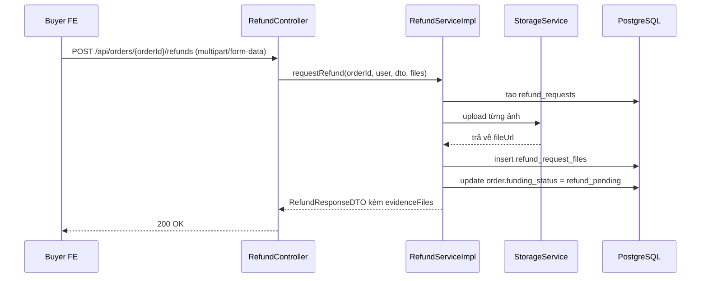

# Refund Request Evidence Files Và Multipart Refund Flow: giải thích cho người mới học

## 1. Bối cảnh

Trước bản sửa này, yêu cầu hoàn tiền chỉ gửi được:

- số tiền hoàn
- lý do hoàn
- ghi chú chữ `evidenceNote`

Điều đó có nghĩa là buyer có thể nói “xe bị lỗi”, nhưng không có chỗ gửi riêng ảnh chứng minh lỗi ngay trong refund request.

Bản sửa ngày `2026-03-26` thêm phần còn thiếu đó:

- refund request có thể đính kèm ảnh bằng chứng riêng
- backend lưu các ảnh này vào bảng mới `refund_request_files`
- admin dispute detail đọc được các ảnh đó khi review

## 2. Khái niệm cần hiểu

### `multipart/form-data` là gì?

Đây là kiểu request dùng khi một form có cả:

- dữ liệu text
- file

Ví dụ:

- `reason = "Xe không giống mô tả"`
- `evidenceNote = "Khung bị nứt"`
- `files = [ảnh1, ảnh2]`

Nếu dùng JSON thuần thì file không đi lên server theo cách bình thường được. Vì vậy controller phải đổi từ `@RequestBody` sang kiểu nhận `multipart`.

### `refund evidence` là gì?

Đây là ảnh bằng chứng gắn với **lần buyer gửi yêu cầu hoàn tiền**.

Nó khác với `order evidence`:

- `order evidence`: ảnh seller bàn giao hoặc buyer xác nhận đã nhận
- `refund evidence`: ảnh buyer gửi để giải thích vì sao muốn hoàn tiền

Hai loại này liên quan cùng một đơn hàng, nhưng không phải cùng một mục đích.

## 3. Vì sao phải tách bảng `refund_request_files`?

Nếu nhét tất cả ảnh vào `refund_requests`, ta sẽ gặp vấn đề:

- một refund request có thể có nhiều ảnh
- mỗi ảnh có tên file, content type, thứ tự hiển thị khác nhau

Vì vậy mô hình đúng hơn là:

- bảng cha: `refund_requests`
- bảng con: `refund_request_files`

Đây là quan hệ `one-to-many`, nghĩa là:

- một refund request
- có thể có nhiều file bằng chứng

## 4. Luồng backend sau bản sửa

Các file chính:

- `src/main/java/com/backend/old_bicycle_project/controller/RefundController.java`
- `src/main/java/com/backend/old_bicycle_project/service/impl/RefundServiceImpl.java`
- `src/main/java/com/backend/old_bicycle_project/entity/RefundRequest.java`
- `src/main/java/com/backend/old_bicycle_project/entity/RefundRequestFile.java`
- `src/main/resources/db/migration/V20__refund_request_evidence_files.sql`

## 5. Giải thích từng lớp

### Bước 1: FE gửi `FormData`

Buyer gửi:

- `amount`
- `reason`
- `evidenceNote`
- `files`

Điểm quan trọng là request này không còn là JSON thuần nữa.

### Bước 2: Controller nhận `@ModelAttribute` và `@RequestPart`

`RefundController` bây giờ nhận:

- DTO text qua `@ModelAttribute`
- danh sách file qua `@RequestPart("files")`

Controller không tự upload file. Nó chỉ chuyển tiếp xuống service.

### Bước 3: Service tạo refund request trước

`RefundServiceImpl` tạo bản ghi `refund_requests` trước để lấy `refundId`.

Lý do:

- đường dẫn storage nên gắn với `refundId`
- file được quản lý dễ hơn

### Bước 4: Service validate và upload file

Service kiểm tra:

- tối đa 3 ảnh
- chỉ nhận `image/*`

Sau đó gọi `StorageService.uploadFile(...)`.

Nếu upload lỗi:

- service xóa các file đã upload thành công trước đó
- transaction rollback để tránh DB và storage lệch nhau

### Bước 5: Lưu bảng con `refund_request_files`

Mỗi ảnh sau khi upload xong sẽ tạo một dòng trong `refund_request_files`.

Thông tin lưu gồm:

- `file_url`
- `file_name`
- `content_type`
- `sort_order`

### Bước 6: Admin đọc lại evidence khi xem tranh chấp

Khi admin gọi danh sách refund:

- repository đọc `refund_requests`
- service map thêm `evidenceFiles` vào `AdminRefundResponseDTO`

Nhờ vậy FE admin có thể render ảnh refund riêng, thay vì chỉ thấy `evidenceNote`.

## 6. Ví dụ nhỏ

Buyer mở hàng và thấy khung xe nứt.

Buyer gửi refund request với:

- `reason = "Xe không giống mô tả"`
- `evidenceNote = "Khung bị nứt ở vị trí mối hàn"`
- 2 ảnh chụp thật

Backend sẽ:

1. tạo một dòng trong `refund_requests`
2. upload 2 ảnh lên storage
3. tạo 2 dòng trong `refund_request_files`
4. đổi `funding_status` của order sang `refund_pending`

## 7. Những hiểu lầm dễ gặp

### Hiểu lầm 1: “Refund evidence cũng là order evidence”

Không đúng.

`order evidence` trả lời câu hỏi:

- lúc giao/nhận xe đã diễn ra thế nào?

`refund evidence` trả lời câu hỏi:

- buyer đang dùng ảnh nào để chứng minh lý do hoàn tiền?

### Hiểu lầm 2: “Chỉ đổi DTO là đủ”

Không đúng.

Slice này phải đổi đồng thời:

- migration
- entity
- controller
- service
- response DTO
- test

Nếu thiếu một mắt xích, feature mới chỉ là `Partial`.

### Hiểu lầm 3: “Có file upload thì chắc chắn phải dùng JSON”

Không đúng.

Khi có file, thông thường phải dùng:

- `multipart/form-data`

chứ không phải JSON thuần.

## 8. Chốt ngắn

Bản sửa này làm cho refund flow thực tế hơn nhiều:

- buyer không chỉ nói bằng chữ
- buyer có thể gửi ảnh bằng chứng riêng cho refund request
- admin có thêm dữ liệu để review tranh chấp

Quan trọng hơn, luồng đã đi đủ các lớp:

- client
- controller
- service
- storage
- database
- response DTO

Nên đây không còn là ý tưởng trên UI nữa, mà là một flow backend hoàn chỉnh.
