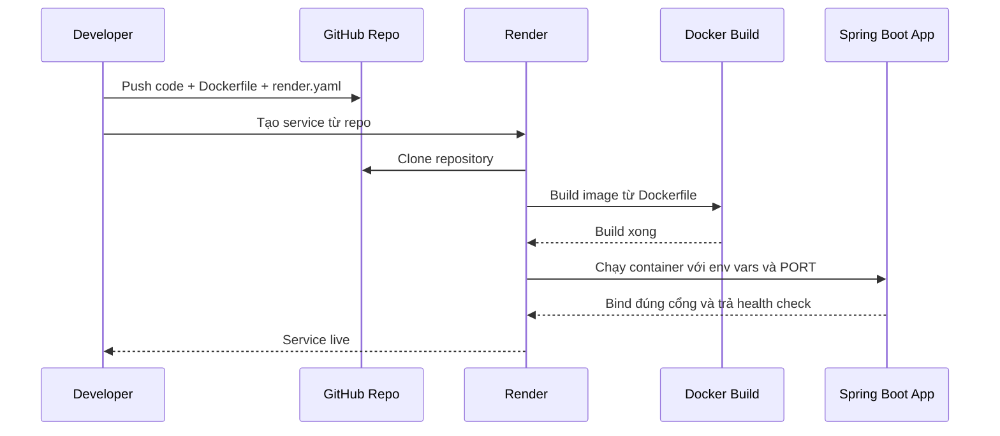

# Deploy backend Spring Boot lên Render cho người mới

## Bối cảnh

Backend của dự án này là Spring Boot Java 21. Khi đưa backend lên Render, có ba ý quan trọng:

1. Ứng dụng phải lắng nghe đúng cổng mà Render cấp qua biến môi trường `PORT`.
2. Render cần biết cách build và chạy ứng dụng Java.
3. File `.jar` cuối cùng phải là **Spring Boot executable JAR**, tức là chạy được bằng `java -jar`.

Trong slice này, project đã được chuẩn bị theo hướng:

- thêm `server.port=${PORT:8080}` trong `application.properties`
- thêm `Dockerfile`
- thêm `render.yaml`
- thêm `spring-boot-maven-plugin` vào `pom.xml`

## `server.port=${PORT:8080}` là gì?

Ở local, backend thường chạy cổng `8080`.

Nhưng trên Render, mỗi web service được cấp một cổng runtime qua biến môi trường `PORT`. Nếu ứng dụng không bind vào đúng cổng đó, health check sẽ fail dù code không sai.

```properties
server.port=${PORT:8080}
```

Điều này có nghĩa:

- nếu Render truyền `PORT=10000` thì app chạy cổng `10000`
- nếu local không có `PORT` thì app quay về `8080`

## `Dockerfile` đang làm gì?

File [Dockerfile](/e:/Old_bicycle_system/BE_old_bicycle_project/old_bicycle_project/Dockerfile) dùng chiến lược 2 giai đoạn:

1. **Build stage**
   - dùng image Maven + Java 21
   - tải dependency
   - build file `.jar`

2. **Runtime stage**
   - dùng image Java runtime nhẹ hơn
   - copy file `.jar` sang container chạy thật
   - chạy:

```bash
java -jar app.jar
```

Lợi ích:

- image cuối nhỏ hơn
- môi trường runtime sạch hơn
- dễ tái hiện trên CI/CD và cloud

## Vì sao phải thêm `spring-boot-maven-plugin`?

Đây là điểm rất quan trọng.

Nếu Maven chỉ tạo ra JAR thường, Render có thể build image thành công nhưng container sẽ chết khi startup với lỗi:

```text
no main manifest attribute, in app.jar
```

Lỗi này có nghĩa là file JAR không có thông tin `Main-Class` để Java biết cần chạy ứng dụng nào.

Trong Spring Boot, cách chuẩn để giải quyết là thêm plugin:

```xml
<plugin>
    <groupId>org.springframework.boot</groupId>
    <artifactId>spring-boot-maven-plugin</artifactId>
</plugin>
```

Plugin này giúp `mvn package` tạo ra **executable JAR** đúng chuẩn Spring Boot.

## `render.yaml` đang làm gì?

File [render.yaml](/e:/Old_bicycle_system/BE_old_bicycle_project/old_bicycle_project/render.yaml) là Blueprint của Render.

Nó mô tả:

- đây là một `web service`
- runtime là `docker`
- plan là `free`
- region là `singapore`
- health check dùng đường dẫn:

```text
/api/groupsets
```

- các biến môi trường nào cần được cấp khi deploy

Ví dụ:

- `DB_URL`
- `DB_USERNAME`
- `DB_PASSWORD`
- `JWT_SECRET`
- `APP_FRONTEND_URL`
- `SEPAY_*`
- `SUPABASE_*`
- `AI_GATEWAY_*`

Những biến có `sync: false` nghĩa là:

- Blueprint có khai báo biến đó
- nhưng giá trị thật không được commit vào Git
- Render sẽ yêu cầu người deploy nhập secret thật

## Flow deploy đơn giản



## Giải thích flow bằng lời dễ hiểu

1. Người phát triển push code lên GitHub.
2. Render đọc cấu hình deploy và clone đúng branch.
3. Render build Docker image.
4. Container khởi động với các biến môi trường thật như `DB_URL`, `JWT_SECRET`, `AI_GATEWAY_API_KEY`...
5. Spring Boot đọc `PORT` và mở đúng cổng.
6. Nếu health check trả về `200`, Render xem service là healthy.

## Vì sao không provision database mới trên Render?

Dự án này đang dùng:

- Supabase Postgres
- Supabase Storage

Vì vậy Render chỉ dùng để host backend app. Database và storage vẫn nằm ở hạ tầng ngoài.

Đó là lý do `render.yaml` không có phần `databases:`.

## Những chỗ dễ sai

### 1. Quên điền `APP_FRONTEND_URL`

Nếu backend dùng email verify hoặc reset password, biến này phải trỏ về frontend thật. Nếu vẫn để `localhost`, link trong email sẽ điều hướng sai.

### 2. Quên đổi webhook SePay

Sau khi backend lên domain mới trên Render, cần cập nhật webhook SePay sang URL mới. Nếu không, thanh toán thật vẫn đổ về backend cũ.

### 3. Quên push cấu hình deploy lên Git

Nếu `Dockerfile` hoặc `render.yaml` chỉ tồn tại ở local thì Render không thể build đúng từ branch remote.

### 4. Quên bind `PORT`

App có thể chạy local bình thường nhưng fail health check trên Render.

### 5. JAR không phải executable JAR

Nếu log Render báo:

```text
no main manifest attribute, in app.jar
```

thì nguyên nhân thường là Maven chỉ tạo JAR thường. Cách sửa đúng là thêm `spring-boot-maven-plugin` để `mvn package` sinh ra executable JAR.

## Áp dụng trong dự án này

Trong project hiện tại:

- [application.properties](/e:/Old_bicycle_system/BE_old_bicycle_project/old_bicycle_project/src/main/resources/application.properties) đã đọc `PORT`
- [Dockerfile](/e:/Old_bicycle_system/BE_old_bicycle_project/old_bicycle_project/Dockerfile) đã dùng multi-stage build
- [render.yaml](/e:/Old_bicycle_system/BE_old_bicycle_project/old_bicycle_project/render.yaml) đã mô tả service backend
- [pom.xml](/e:/Old_bicycle_system/BE_old_bicycle_project/old_bicycle_project/pom.xml) đã thêm `spring-boot-maven-plugin`

Nhờ vậy backend có thể build đúng trên Render và chạy thành một web service Spring Boot hoàn chỉnh.
