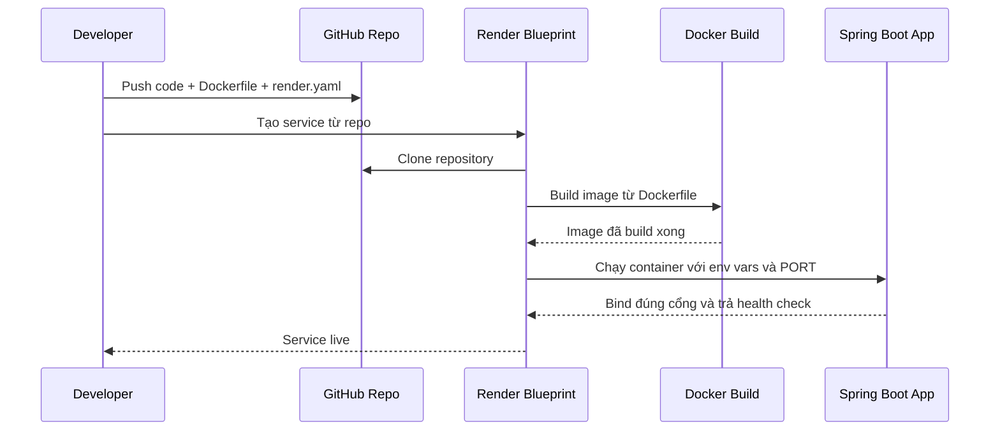

# Deploy backend Spring Boot lên Render cho người mới

## Bối cảnh

Backend của dự án này là Spring Boot Java 21. Trước khi đưa lên Render, có hai yêu cầu kỹ thuật quan trọng:

1. Ứng dụng phải lắng nghe đúng cổng mà Render cấp qua biến môi trường `PORT`.
2. Render cần biết cách build và chạy backend qua `Dockerfile` hoặc runtime native phù hợp.

Trong slice này, dự án được chuẩn bị theo hướng:

- thêm `server.port=${PORT:8080}` trong `application.properties`
- thêm `Dockerfile`
- thêm `render.yaml`

Hướng này phù hợp vì Render Blueprint không có runtime native Java riêng như Node hoặc Python. Với Spring Boot, cách an toàn và dễ hiểu là dùng Docker.

## `server.port=${PORT:8080}` là gì?

Ở local, backend thường chạy cổng `8080`.

Nhưng trên Render, mỗi web service được gán một cổng runtime thông qua biến môi trường `PORT`. Nếu app cứ cố định chạy `8080`, Render có thể xem service là không healthy vì container không bind vào cổng đúng.

Vì vậy:

```properties
server.port=${PORT:8080}
```

có nghĩa là:

- nếu Render truyền vào `PORT=10000` thì app chạy cổng `10000`
- nếu local không có biến `PORT` thì app quay về `8080`

Đây là một ví dụ rất điển hình của cấu hình “vừa chạy được trên cloud, vừa không phá local”.

## `Dockerfile` đang làm gì?

File [Dockerfile](/e:/Old_bicycle_system/BE_old_bicycle_project/old_bicycle_project/Dockerfile) dùng chiến lược 2 bước:

1. **Build stage**
   - dùng image Maven + Java 21
   - tải dependency
   - build file `.jar`

2. **Runtime stage**
   - dùng image Java runtime nhẹ hơn
   - copy file `.jar` từ build stage sang
   - chạy:

```bash
java -jar app.jar
```

Lợi ích:

- image cuối nhỏ hơn
- môi trường chạy sạch hơn
- cách build gần giống CI/CD thực tế hơn

## `render.yaml` đang làm gì?

File [render.yaml](/e:/Old_bicycle_system/BE_old_bicycle_project/old_bicycle_project/render.yaml) là Blueprint của Render.

Nó mô tả:

- đây là một `web service`
- runtime là `docker`
- plan là `free`
- region là `singapore`
- health check dùng đường dẫn:

```text
/api/groupsets
```

- và những biến môi trường nào Render cần yêu cầu người dùng điền

Ví dụ:

- `DB_URL`
- `DB_USERNAME`
- `DB_PASSWORD`
- `JWT_SECRET`
- `APP_FRONTEND_URL`
- `SEPAY_*`
- `SUPABASE_*`
- `AI_GATEWAY_*`

Những biến có `sync: false` nghĩa là:

- file Blueprint có nhắc tới biến này
- nhưng giá trị thật không được commit vào Git
- người deploy sẽ điền nó trong Dashboard của Render

Đây là cách làm đúng khi biến đó là secret.

## Flow deploy đơn giản



## Giải thích flow bằng lời dễ hiểu

1. Người phát triển push code lên GitHub.
2. Render đọc file `render.yaml` để biết cần tạo web service như thế nào.
3. Render dùng `Dockerfile` để build backend thành image.
4. Render chạy image đó và truyền các biến môi trường thật vào.
5. Spring Boot đọc `PORT`, `DB_URL`, `JWT_SECRET`... rồi khởi động.
6. Nếu app trả về `200` ở health check thì Render xem service là sống.

## Vì sao không provision database mới trên Render?

Dự án này đã dùng:

- Supabase Postgres
- Supabase Storage

nên trong slice deploy này, Render chỉ được dùng để host backend app. Database và storage vẫn là hạ tầng bên ngoài.

Đây là lý do `render.yaml` không có phần `databases:`.

## Những chỗ dễ sai

### 1. Quên điền `APP_FRONTEND_URL`

Nếu backend đang dùng verify email hoặc reset password, `APP_FRONTEND_URL` phải trỏ về URL FE thật. Nếu để local host cũ, email link sẽ điều hướng sai.

### 2. Quên đổi webhook SePay

Sau khi backend lên URL mới trên Render, phải đổi webhook SePay sang domain mới. Nếu không, payment thật vẫn đổ về backend cũ.

### 3. Quên push `render.yaml`

Nếu file chỉ tồn tại local mà chưa có trên GitHub, Render Blueprint sẽ không đọc được cấu hình deploy.

### 4. Quên bind `PORT`

Nếu không có `server.port=${PORT:8080}`, app có thể chạy local được nhưng fail health check trên Render.

## Áp dụng trong dự án này

Trong project hiện tại:

- [application.properties](/e:/Old_bicycle_system/BE_old_bicycle_project/old_bicycle_project/src/main/resources/application.properties) đã được sửa để đọc `PORT`
- [Dockerfile](/e:/Old_bicycle_system/BE_old_bicycle_project/old_bicycle_project/Dockerfile) đã được thêm để Render build app Java
- [render.yaml](/e:/Old_bicycle_system/BE_old_bicycle_project/old_bicycle_project/render.yaml) đã được thêm để mô tả service backend trên Render

Như vậy dự án đã có nền tảng cơ bản để deploy backend lên Render theo hướng Git-backed Blueprint.
