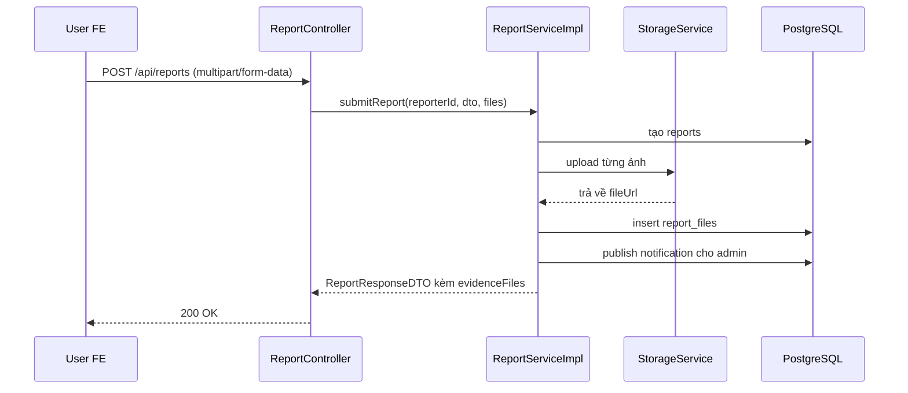

# Report Evidence Files Và Multipart Report Flow: giải thích cho người mới học

## 1. Bối cảnh

Trước bản sửa này, luồng report của dự án chỉ gửi được:

- `targetId`
- `targetType`
- `reason`
- `description`

Điều đó có nghĩa là user có thể nói “tin đăng này đáng ngờ”, nhưng không có chỗ gửi riêng ảnh bằng chứng cho report.

Bản sửa ngày `2026-03-26` bổ sung phần còn thiếu đó:

- report hỗ trợ upload tối đa 3 ảnh bằng chứng
- backend nhận request dạng `multipart/form-data`
- mỗi ảnh được lưu riêng trong bảng `report_files`
- admin và người báo cáo đều đọc lại được danh sách ảnh này

## 2. Khái niệm cần hiểu

### `multipart/form-data` là gì?

Đây là kiểu HTTP request dùng khi một form có cả:

- dữ liệu text
- file

Ví dụ trong report:

- `targetId = product-1`
- `reason = fake`
- `description = "Xe không đúng hình"`
- `files = [ảnh1, ảnh2]`

Nếu chỉ dùng JSON thuần, file sẽ không đi lên server theo cách bình thường.

### `report evidence` là gì?

`Report evidence` là ảnh bằng chứng user gửi kèm khi báo cáo một `product` hoặc `user`.

Nó khác với:

- `refund evidence`: ảnh buyer gửi khi xin hoàn tiền
- `order evidence`: ảnh seller bàn giao hoặc buyer xác nhận đã nhận xe

Ba loại đều là “ảnh chứng cứ”, nhưng phục vụ ba ngữ cảnh khác nhau.

## 3. Vì sao phải có bảng `report_files`?

Một report có thể có nhiều ảnh. Mỗi ảnh lại có:

- URL riêng
- tên file riêng
- kiểu MIME riêng
- thứ tự hiển thị riêng

Vì vậy mô hình đúng là:

- bảng cha: `reports`
- bảng con: `report_files`

Đây là quan hệ `one-to-many`, nghĩa là một report có thể chứa nhiều file.

## 4. Luồng backend sau bản sửa

Các file chính:

- `src/main/java/com/backend/old_bicycle_project/controller/ReportController.java`
- `src/main/java/com/backend/old_bicycle_project/service/impl/ReportServiceImpl.java`
- `src/main/java/com/backend/old_bicycle_project/entity/Report.java`
- `src/main/java/com/backend/old_bicycle_project/entity/ReportFile.java`
- `src/main/resources/db/migration/V21__report_evidence_files.sql`

## 5. Giải thích từng lớp

### Bước 1: Client gửi `FormData`

Frontend tạo `FormData` chứa:

- `targetId`
- `targetType`
- `reason`
- `description`
- `files`

### Bước 2: Controller nhận DTO text và danh sách file

`ReportController` không dùng `@RequestBody` nữa.

Nó nhận:

- phần text qua `@ModelAttribute`
- phần file qua `@RequestPart("files")`

Controller chỉ có nhiệm vụ nhận request và chuyển xuống service.

### Bước 3: Service tạo report trước

`ReportServiceImpl` tạo `Report` trước để lấy `reportId`.

Lý do:

- đường dẫn storage nên gắn với `reportId`
- việc quản lý ảnh theo từng report sẽ rõ ràng hơn

### Bước 4: Service validate file

Service kiểm tra:

- tối đa 3 ảnh
- chỉ chấp nhận `image/*`

Nếu vi phạm, service ném `AppException` với `ErrorCode` riêng cho report evidence.

### Bước 5: Upload ảnh và lưu `report_files`

Sau khi upload qua `StorageService`, service tạo các dòng con trong `report_files`.

Thông tin được lưu:

- `file_url`
- `file_name`
- `content_type`
- `sort_order`

### Bước 6: DTO trả về có `evidenceFiles`

`ReportResponseDTO` bây giờ không chỉ có text.

Nó còn trả về:

- danh sách file ảnh bằng chứng

Nhờ vậy FE không cần gọi API phụ để lấy lại ảnh.

## 6. Ví dụ nhỏ

User thấy một xe đang dùng ảnh của mẫu xe khác.

User gửi report với:

- `targetType = PRODUCT`
- `reason = fake`
- `description = "Ảnh chụp không khớp với tiêu đề"`
- 2 ảnh chụp màn hình

Backend sẽ:

1. tạo một dòng trong `reports`
2. upload 2 ảnh lên storage
3. tạo 2 dòng trong `report_files`
4. gửi notification cho admin
5. trả `ReportResponseDTO` có danh sách `evidenceFiles`

## 7. Những hiểu lầm dễ gặp

### Hiểu lầm 1: “Chỉ cần thêm input file ở FE là đủ”

Không đúng.

Phải đổi đồng thời:

- controller
- service
- entity
- migration
- DTO
- test

Nếu thiếu một mắt xích, feature vẫn chỉ là `Partial`.

### Hiểu lầm 2: “Ảnh report và ảnh refund là một”

Không đúng.

Chúng đều là ảnh chứng cứ, nhưng khác mục đích:

- report: chứng minh nội dung vi phạm
- refund: chứng minh lý do hoàn tiền

### Hiểu lầm 3: “Có upload file thì phải tạo repository riêng cho file”

Không nhất thiết.

Trong slice này, `ReportFile` được quản lý qua quan hệ cascade từ `Report`.

Điều đó đủ tốt vì mọi file đều đi theo vòng đời của report cha.

## 8. Chốt ngắn

Slice này làm cho report flow của backend đi đủ vòng:

- client gửi text + ảnh
- controller nhận multipart request
- service validate và upload file
- database lưu cả report cha và file con
- response trả lại evidence để FE render ngay

Nhờ đó report không còn là form text-only nữa, mà đã trở thành một luồng trust & safety có bằng chứng rõ ràng hơn.
