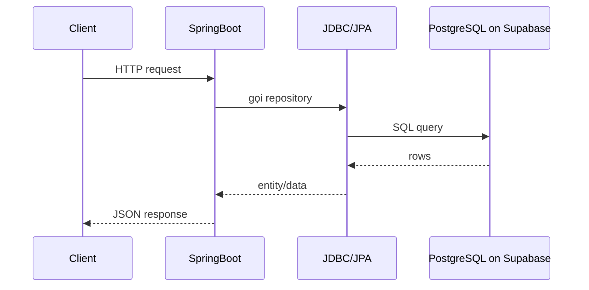

# RLS là gì, thuộc PostgreSQL hay Supabase, và trong dự án này có nên dùng không?

## 1. Bối cảnh của câu hỏi

Trong lúc làm tính năng payout thủ công, dự án đã thêm migration:

- [V12__enable_rls_for_payout_tables.sql](/e:/Old_bicycle_system/BE_old_bicycle_project/old_bicycle_project/src/main/resources/db/migration/V12__enable_rls_for_payout_tables.sql)

Điều này dễ làm mọi người thắc mắc:

- `RLS` có phải là tính năng riêng của Supabase không?
- nếu dự án nói “Supabase chỉ để chứa data”, vậy bật `RLS` có bị lệch kiến trúc không?

Đây là chỗ người mới rất hay nhầm.

## 2. `RLS` là gì?

`RLS` là viết tắt của:

- `Row Level Security`

Có thể hiểu đơn giản là:

- cơ chế bảo vệ dữ liệu **theo từng dòng dữ liệu**

Thay vì chỉ nói:

- bảng này được đọc
- bảng kia không được đọc

thì `RLS` cho phép nói chi tiết hơn:

- user A chỉ được đọc các dòng thuộc về user A
- admin thì được đọc nhiều hơn
- user thường không được sửa dòng của người khác

Nói ngắn gọn:

- `permission theo bảng` = bảo vệ ở mức thô
- `RLS` = bảo vệ sâu hơn, tới từng record

## 3. `RLS` là của PostgreSQL hay của Supabase?

`RLS` là **tính năng của PostgreSQL**.

Supabase không tạo ra `RLS`. Supabase chỉ:

- host sẵn PostgreSQL
- cho bạn dashboard/tooling/advisor dễ dùng hơn
- nhắc bạn bật `RLS` khi thấy các bảng nhạy cảm

Ví dụ SQL:

```sql
alter table public.payouts enable row level security;
```

Câu lệnh trên là SQL của PostgreSQL. Nếu bạn tự cài Postgres trên máy riêng hoặc VPS riêng, bạn vẫn dùng được y như vậy.

## 4. Vì sao nhiều người lại tưởng `RLS` là của Supabase?

Vì trong hệ sinh thái Supabase:

- `Auth`
- `PostgREST`
- client-side query
- dashboard security advisor

đều nhắc đến `RLS` rất nhiều.

Khi nhìn từ ngoài, người ta dễ có cảm giác:

- “dùng Supabase thì mới có RLS”

Nhưng thật ra đúng hơn phải hiểu là:

- Supabase **dựa trên** PostgreSQL
- PostgreSQL có sẵn `RLS`
- Supabase chỉ làm trải nghiệm cấu hình `RLS` nổi bật hơn

## 5. Ví dụ nhỏ để dễ hình dung

Giả sử có bảng:

```text
orders
```

Trong đó có 3 dòng:

- order của buyer A
- order của buyer B
- order của buyer C

Nếu không có `RLS`, một role được cấp quyền đọc bảng có thể nhìn thấy cả 3 dòng.

Nếu có `RLS`, ta có thể đặt rule kiểu:

- buyer A chỉ thấy order của buyer A
- buyer B chỉ thấy order của buyer B
- admin thấy hết

Tức là `RLS` không chỉ hỏi:

- “có được vào bảng này không?”

mà còn hỏi thêm:

- “nếu được vào bảng rồi, được nhìn **dòng nào**?”

## 6. Trong dự án này, Supabase đang đóng vai trò gì?

Theo các note hiện có của dự án:

- [env-migration-sepay-basics-2026-03-13.md](/e:/Old_bicycle_system/BE_old_bicycle_project/old_bicycle_project/docs/knowledge/env-migration-sepay-basics-2026-03-13.md)
- [env-and-migration-checklist-2026-03-13.md](/e:/Old_bicycle_system/BE_old_bicycle_project/old_bicycle_project/docs/ai/deployment/env-and-migration-checklist-2026-03-13.md)

kiến trúc hiện tại là:

- Spring Boot là backend chính
- Supabase chủ yếu dùng như:
  - PostgreSQL host
  - Storage

Tức là dự án này hiện **không lấy dữ liệu trực tiếp từ Supabase client API ở FE**.

Luồng thật đang là:



Giải thích đơn giản:

1. FE không nói chuyện trực tiếp với Supabase database.
2. FE gọi Spring Boot.
3. Spring Boot dùng JDBC/JPA để query Postgres.
4. Postgres đó đang được host trên Supabase.

Cho nên:

- Supabase ở đây vẫn chỉ là nơi host data
- việc có bật `RLS` hay không **không tự động biến Supabase thành backend chính**

## 7. Vậy bật `RLS` trong dự án này có mâu thuẫn với kiến trúc không?

Không mâu thuẫn hoàn toàn.

Lý do:

- `RLS` là cấu hình ở tầng PostgreSQL
- còn kiến trúc “backend chính là Spring Boot” vẫn giữ nguyên

Nhưng có một điểm cần nói thật:

- theo scope ban đầu của dự án, `RLS` **không phải requirement bắt buộc**
- vì hệ thống chưa dùng Supabase theo kiểu:
  - FE query trực tiếp
  - Supabase Auth
  - Edge Functions làm nghiệp vụ chính

Nên trong dự án này, bật `RLS` nên được hiểu là:

- một bước `hardening` nhỏ để siết dữ liệu nhạy cảm

chứ không phải:

- thay đổi kiến trúc sang “dựa vào Supabase”

## 8. Nó đã được áp dụng thế nào trong project này?

Lần này `RLS` được bật cho 2 bảng mới:

- `payout_profiles`
- `payouts`

vì đây là các bảng nhạy cảm, có chứa dữ liệu như:

- số tài khoản
- thông tin nhận tiền
- trạng thái giải ngân/hoàn tiền

File thực hiện là:

- [V12__enable_rls_for_payout_tables.sql](/e:/Old_bicycle_system/BE_old_bicycle_project/old_bicycle_project/src/main/resources/db/migration/V12__enable_rls_for_payout_tables.sql)

## 9. Một hiểu lầm rất hay gặp

### Hiểu lầm 1: “Bật RLS là đang dùng tính năng đặc biệt của Supabase”

Không đúng.

Đúng hơn phải nói:

- đang dùng tính năng của PostgreSQL
- chỉ là PostgreSQL này đang chạy trên Supabase

### Hiểu lầm 2: “Nếu dự án chỉ dùng Supabase để chứa data thì không được bật RLS”

Không đúng.

Bạn vẫn có thể bật `RLS`, vì đó là một phần của database.

Điều đúng hơn là:

- nếu scope dự án không cần tới nó, thì có thể không bật
- nếu có bảng nhạy cảm và muốn siết hơn, thì bật cũng hợp lý

### Hiểu lầm 3: “Bật RLS là FE sẽ tự nhiên không truy cập được backend”

Không đúng.

Trong dự án này:

- FE gọi Spring Boot
- Spring Boot mới gọi database

Nên ảnh hưởng lớn hay nhỏ còn tùy:

- backend đang kết nối bằng role nào
- có policy hay chưa
- có dùng direct Supabase API hay không

## 10. Chốt ngắn

- `RLS` là tính năng của **PostgreSQL**
- Supabase chỉ là nền tảng host Postgres và cung cấp tooling để bạn nhìn thấy hoặc cấu hình nó dễ hơn
- Dự án này vẫn đang dùng Supabase chủ yếu như:
  - nơi host PostgreSQL
  - nơi lưu file trên Storage
- Bật `RLS` cho vài bảng nhạy cảm không làm đổi kiến trúc chính, nhưng cũng không phải requirement bắt buộc của scope ban đầu

Nếu muốn nói thật ngắn để nhớ:

> `RLS` là của Postgres. Supabase chỉ làm nó dễ thấy hơn.
